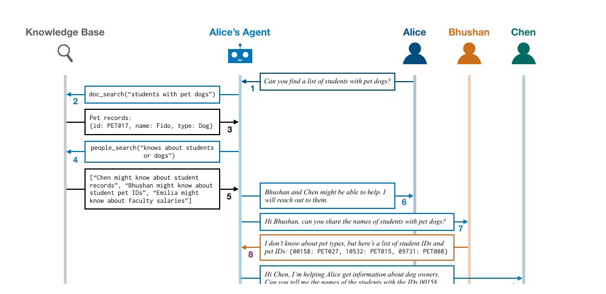
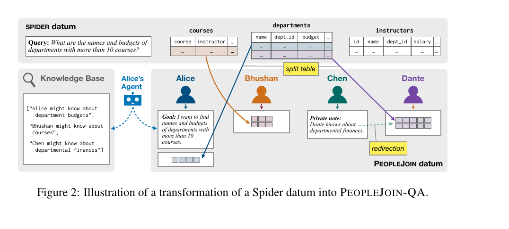
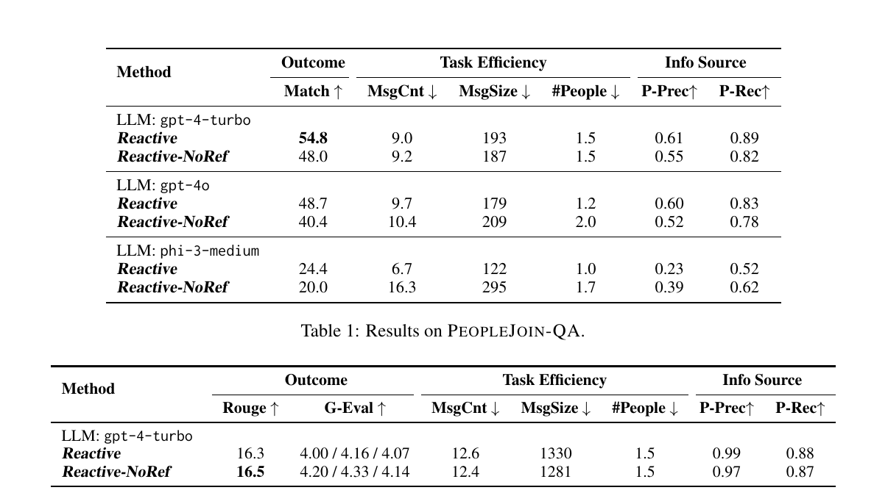

# `jhamtaniLLMAgentsCoordinating2025` 深度解读

## 0. 文献信息

- citation key：`jhamtaniLLMAgentsCoordinating2025`
- 题名：LLM Agents for Coordinating Multi-User Information Gathering
- 作者：Jhamtani Harsh; Andreas Jacob; Van Durme Benjamin
- 发表：Findings of the Association for Computational Linguistics: ACL 2025
- 页码：17800--17826
- DOI：`10.18653/v1/2025.findings-acl.916`
- Zotero PDF：`/Users/edy/Zotero/storage/EMGP5MQN/Jhamtani 等 - 2025 - LLM Agents for Coordinating Multi-User Information Gathering.pdf`

## 1. 一句话定位

这篇论文提出 **PeopleJoin**，一个用于评估 LM Agent 如何协调多用户信息收集的 benchmark。它把协作问题形式化为：用户提出请求后，Agent 需要判断哪些队友可能掌握信息，和这些队友对话收集信息，最后把分散信息整合成对原始用户有用的答案或总结。

对本课题而言，它最有价值的地方是把多人协作中的“谁知道什么、该问谁、怎么问、问多少、如何整合”转化为可计算、可评测的 Agent coordination 问题。

## 2. 研究问题：多人协作不是单用户问答

传统 LLM Agent 很多任务假设信息可以通过单个用户、单个数据库或单个文档集合获得。但在真实组织和多人协作中，信息通常分散在不同人手中。一个人不知道答案，不代表组织没有答案。

PeopleJoin 的问题设定是：

```text
给定一个用户请求
Agent 先查当前用户可见文档
如果信息不足，则判断谁可能知道
Agent 与相关队友对话
收集、追问、整合信息
最后回复原始用户
```

这与多人决策高度相关。多人决策中的 hidden profile 问题，本质上也是信息分布在不同成员之间，但讨论过程未必能把关键信息整合出来。PeopleJoin 把这种分布式信息问题拆成了 Agent 可以执行和评估的步骤。

## 3. PeopleJoin 的基本交互流程

论文 Figure 1 展示了一个 PeopleJoin 任务中的 conversation sequence。Alice 提出请求，Alice 的 Agent 发现自己的知识库不足，于是调用 people search，判断 Bhushan 和 Chen 可能有帮助，再分别发消息询问信息，最后整合结果。



图 1 来自论文第 2 页。这个图可以抽象成四个动作：

1. 理解用户请求；
2. 检索当前用户资料或文档；
3. 搜索并选择相关队友；
4. 通过消息收集信息并汇总。

这里的关键不是“多 Agent 聊天”本身，而是 **信息源选择与沟通成本控制**。Agent 既不能只看当前用户资料而放弃协作，也不能盲目群发给所有人。

## 4. Benchmark 构造：两个任务域

PeopleJoin 包含两个评价域：

- PeopleJoin-QA：基于表格数据问答；
- PeopleJoin-DocCreation：基于多文档摘要或文档创建。

论文强调，这两个任务改编自既有 NLP benchmark，但把完成任务所需的信息分布到 synthetic organizations 中，从而模拟自然的多用户协作场景。

### 4.1 PeopleJoin-QA

PeopleJoin-QA 基于 SPIDER text-to-SQL benchmark。论文把数据库表转化为一个组织中的多人信息环境。某些表会被拆分到不同成员手中，或者某个成员只能把 Agent 转向另一个真正掌握信息的人。

Figure 2 展示了从 Spider datum 转换为 PeopleJoin-QA 的过程。



图 2 来自论文第 4 页。它体现了两类关键变换：

- split table：同一问题需要的信息被拆到不同用户处；
- redirection：某个用户不直接掌握信息，但知道谁可能掌握信息。

这两类变换很像真实多人决策中的信息分布：有人掌握部分事实，有人知道找谁问，有人只能提供间接线索。

### 4.2 PeopleJoin-DocCreation

PeopleJoin-DocCreation 改编自 MultiNews 多文档摘要任务。不同用户掌握不同主题或不同来源的文章，Agent 需要找到相关用户，收集文本信息，再生成目标总结。

这比单纯 QA 更接近真实协作写作或报告生成，但仍主要是信息收集与整合任务，而不是价值冲突或偏好协商任务。

## 5. Agent 架构与工具

论文实现并比较了几种参考 Agent 架构。核心工具包括：

- document search：检索发起用户可见文档；
- people search：搜索可能相关的组织成员；
- send message：向组织成员发消息；
- person resolution：把人名解析为可发送消息的用户；
- turn/session completion：标记当前轮次或整个会话完成。

主要 Agent 变体包括：

- Reactive：基于 ReAct 风格的完整架构，会在事件触发后进行行动、观察和 reflection；
- Reactive-NoRef：去掉 reflection 的变体；
- MessageAllOnce：鼓励 Agent 给每个人发一次同样的问题；
- MessageNone：只使用当前用户文档，不联系其他人；
- IdealAgent：理想上总能联系最优成员、提出完美问题。

这说明论文并不只是提出任务，而是把多用户协作拆成了可比较的 agent architecture evaluation。

## 6. 评估指标

PeopleJoin 的评估指标分为三类。

### 6.1 Outcome metrics

用于衡量最终答案或总结是否正确。

- PeopleJoin-QA 使用 Match 分数；
- PeopleJoin-DocCreation 使用 ROUGE-L 和 G-Eval。

### 6.2 Task efficiency metrics

用于衡量完成任务的沟通成本。

- MsgCnt：任务中交换的消息数量；
- MsgSize：交换消息的总词数；
- #People：Agent 联系的人数。

这些指标很重要，因为多用户协作的目标不是“问得越多越好”。有效 Agent 应该用尽量少的沟通成本获得足够信息。

### 6.3 Information source metrics

用于衡量 Agent 是否联系了正确的信息源。

- P-Prec：联系的人中有多少是正确相关的人；
- P-Rec：需要联系的人中有多少被联系到了。

这组指标对本课题尤其有价值。多人决策动态介入也需要类似指标：Agent 是否找到了真正掌握信息的人，是否过度打扰无关成员。

## 7. 实验结果

论文 Table 1 和 Table 2 给出 PeopleJoin-QA 与 PeopleJoin-DocCreation 的结果。



表格来自论文第 6 页。

### 7.1 PeopleJoin-QA

论文报告，在 PeopleJoin-QA 中，Reactive + gpt-4-turbo 的 Match 最高，为 54.8。作者指出这说明任务整体具有挑战性。

同一配置下，P-Prec 为 0.61，P-Rec 为 0.89。这说明 Agent 经常能找到不少相关人，但联系人选择还不够精确。

从模型比较看，gpt-4-turbo 优于 gpt-4o，phi-3-medium 整体更弱。Reactive 通常比 Reactive-NoRef 更好，说明 reflection 对 QA 场景有帮助。

### 7.2 PeopleJoin-DocCreation

在文档创建任务中，gpt-4-turbo 同样表现最好，gpt-4o 次之，phi-3-medium 较弱。与 QA 不同，Reactive 和 Reactive-NoRef 的差异不明显，作者认为 reflection 在这个任务中没有显示出同样的价值。

这个结果提醒我们：同一个 Agent 策略在不同协作任务中可能作用不同。动态介入系统也不能假设某种介入策略通用。

## 8. 失败模式

论文对 PeopleJoin-QA 中 imperfect Match 的样本做了错误分析，提到常见失败包括：

- 没有联系所有相关用户，导致答案不完整；
- 问题表述不好或过度具体，导致其他用户判断自己没有相关信息；
- 没有正确规划工具调用，例如没有先搜索相关人或文档；
- 即使联系到了对的人，也没有根据对方回复重新组织问题。

这些失败模式对多人决策介入非常有启发：

```text
找错人
问错问题
问得太早或太晚
没有追问
没有整合多个成员的信息
```

这些都是动态介入系统必须处理的问题。

## 9. 论文自己的局限

论文的 Limitations 部分指出，PeopleJoin 目前只包含两个任务，并且只覆盖一种多人交互场景。它没有考虑真实组织中的很多复杂因素，例如：

- 合作者回复的速度和可靠性；
- 某个人是否忙碌；
- 组织中的社会动态；
- 更复杂的协作规范和责任分配。

此外，论文虽然包含 human evaluation study，但主要基准仍建立在 synthetic organizations 和 simulator 之上。它适合评估 Agent 的协调能力，但不能直接等同于真实多人决策现场。

## 10. 技术性评价

这篇论文也不是模型训练论文。Zotero 摘要和 PDF 中能确认的是：

- 构建了 PeopleJoin benchmark；
- 实现并评估了几种 LM Agent 架构；
- 使用多个 LLM 作为 agent 或 simulator；
- 使用准确性、效率和信息源选择指标进行评估；
- 代码可生成额外 organizations 用于 training and evaluation，但这不等于论文训练了新模型。

因此，更准确的定位是：**多用户协作 Agent benchmark 与架构评估论文**。

它的技术性强于很多 HCI 用户实验论文，因为它给出了任务构造、工具接口、agent architecture、metrics 和定量结果。

## 11. 对本课题的启发

### 11.1 显式建模“谁知道什么”

多人决策中的一个核心状态是信息分布：

- 谁掌握关键事实；
- 谁只掌握部分信息；
- 谁知道应该问谁；
- 哪些信息还没有进入公共讨论；
- 哪些信息被提到但没有被整合。

PeopleJoin 将这一问题形式化为 information source selection。本课题可以借鉴这种建模方式，把多人讨论转化为成员-信息-任务需求之间的关系图。

### 11.2 把介入看成协调行为

动态介入不一定是 Agent 直接给答案。它也可以是：

- 提醒某个成员补充信息；
- 向群体指出当前还缺哪些证据；
- 请求某人澄清理由；
- 将多个成员的分散信息汇总给群体；
- 判断当前是否需要继续收集信息，还是可以进入方案比较。

PeopleJoin 的启发是：Agent 的核心能力不是“更会说”，而是“更会协调信息流动”。

### 11.3 评估应包含过程效率

多人决策 Agent 的评估不能只看最终方案是否正确，还需要看：

- 介入次数；
- 打扰了多少成员；
- 是否找到了真正相关的信息源；
- 是否减少无效讨论；
- 是否提高信息覆盖率；
- 是否保持用户控制感。

PeopleJoin 的 MsgCnt、MsgSize、#People、P-Prec、P-Rec 可以为本课题的实验指标提供参考。

## 12. 可迁移到本课题的技术路线

可以将 PeopleJoin 的思想迁移为：

```text
实时转写与发言记录
  → 抽取任务需求与信息槽位
  → 维护成员-信息状态图
  → 检测信息缺口
  → 判断应联系/提示的成员
  → 生成介入话语
  → 评估信息覆盖率与打扰成本
```

这条路线可以与 Social-RAG 互补：

- PeopleJoin 更强调“找谁、问什么、怎么收集”；
- Social-RAG 更强调“如何让生成内容符合群体语境和社会规范”。

本课题可以把二者结合起来：先判断信息分布与介入对象，再用群体语境约束介入表达。

## 13. 适合在综述中支撑的论点

- `jhamtaniLLMAgentsCoordinating2025` 可支撑“多用户协作任务中，Agent 需要判断谁拥有信息、谁能够帮助当前问题，而不是只基于单一上下文生成回答”。
- 它可支撑“多人协作 Agent 的评估应同时考虑最终任务表现、沟通成本和信息源选择质量”。
- 对本课题而言，它是把多人决策中的信息分布问题转化为可计算 Agent 协调问题的重要参考。

## 14. 需要谨慎表述的点

- 不应把 PeopleJoin 说成真实多人决策实验；它是 synthetic organizations 上的 benchmark。
- 不应说它解决了群体共识、权力关系或心理安全问题；它主要关注信息收集和整合。
- 不应把它表述为模型训练论文；现有证据支持的是 benchmark 构建与 Agent 架构评估。
- 不应直接把 QA / DocCreation 的结果外推到老年人多人决策场景；真实用户状态、语音交互、负荷和控制感还需要额外验证。

