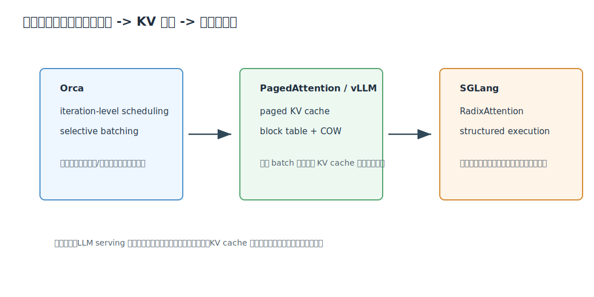
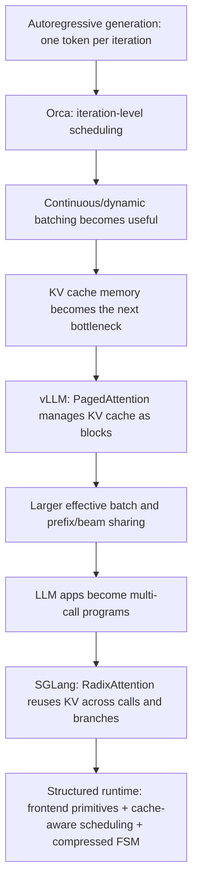

# LLM Serving Systems 专题精讲

专题 key: `llmServingSystems`

整合文献：

- `yuOrcaDistributedServing`: *Orca: A Distributed Serving System for Transformer-Based Generative Models*.
- `kwonEfficientMemoryManagement2023`: *Efficient Memory Management for Large Language Model Serving with PagedAttention*.
- `zhengSGLangEfficientExecution`: *SGLang: Efficient Execution of Structured Language Model Programs*.

来源：三篇文章均来自 Zotero collection `01_ToRead`，对应单篇精讲保留在本专题目录下各自的 citation key 子目录中。

说明：这是三篇 LLM serving / inference systems 论文的统一精讲入口。本文档按“调度 -> KV cache 内存管理 -> 程序级 KV 复用”的系统演进线索组织。

## 1. 总览

这三篇论文共同回答一个问题：

> LLM serving 的瓶颈不只是单个模型 forward 慢，而是请求动态性、KV cache 生命周期和多调用程序结构没有被系统充分利用。

| 论文 | 主要对象 | 核心问题 | 核心机制 |
| --- | --- | --- | --- |
| Orca | 自回归请求调度 | request-level batch 不能处理早完成/晚加入请求 | iteration-level scheduling + selective batching |
| PagedAttention/vLLM | KV cache 内存 | 连续 KV cache 导致碎片、预留和无法共享 | block table + paged KV + copy-on-write |
| SGLang | LM programs | 多调用程序重复 prefill，结构化输出慢 | RadixAttention + compressed FSM + frontend/runtime co-design |

## 2. 第一层：Orca 重新定义调度粒度

Orca 的核心观察是：生成式模型是一轮一轮生成 token 的 workload。

传统 serving 把一个 batch 固定到所有请求都完成，造成：

- 早结束请求继续占 batch slot；
- 新请求必须等整批结束；
- 不同输出长度导致空算和排队。

Orca 改成每个 iteration 调度一次：

这让 serving system 能连续维护一个动态 batch。后来的 continuous batching 基本沿着这个方向发展。

## 3. 第二层：vLLM 解决 batch 放不下的问题

Orca 让更多请求“调度上可以一起跑”，但这些请求的 KV cache 必须能装进 GPU。

PagedAttention 的核心是把 KV cache 分页：

它解决：

- reserved waste；
- internal fragmentation；
- external fragmentation；
- prompt / beam / parallel sampling 的 block-level sharing。

因此 vLLM 的吞吐提升主要来自：同样显存下能维持更大的 effective batch。

## 4. 第三层：SGLang 解决程序级复用

Orca/vLLM 主要处理“单个 generation request”的 serving。SGLang 进一步面对 LM programs：

- 一个应用内部多次 LLM calls；
- fork/join 分支；
- few-shot / chat / RAG 共享长 prefix；
- JSON/regex 结构化输出。

SGLang 用 RadixAttention 自动复用共享 prefix：

这比 vLLM 的 request-level block sharing 更高一层：它把程序结构暴露给 runtime，让 runtime 知道哪些 prefix 值得保留、匹配、复用和驱逐。

## 5. 三篇的依赖关系

## 6. 对比表

| 维度 | Orca | vLLM / PagedAttention | SGLang |
| --- | --- | --- | --- |
| 抽象层 | serving scheduler + distributed engine | serving engine + KV memory manager | programming frontend + runtime |
| 关注粒度 | decode iteration | KV block | prompt prefix / LM program stream |
| 核心资源 | batch slot、模型参数读取 | GPU KV cache memory | KV cache across calls、structured decoding path |
| 关键优化 | iteration-level scheduling | paging + COW + preemption | radix-tree prefix cache + cache-aware scheduling |
| 解决的浪费 | 空算、排队、固定 batch | 碎片、过度预留、无法共享 | 重复 prefill、重复多调用、逐 token 结构化解码 |

## 7. 实现上如何串起来

一个现代 LLM serving runtime 可以同时吸收三篇思想：

1. 调度层使用 Orca 式 iteration-level scheduling/continuous batching。
2. KV memory manager 使用 vLLM 式 block table 和 physical block pool。
3. attention kernel 支持从 block table 读取非连续 KV。
4. request lifecycle 支持 `append/fork/free`。
5. 程序 runtime 使用 SGLang 式 radix tree 做 prefix match。
6. scheduler 同时考虑 arrival time、batch size、KV memory、prefix cache hit。
7. structured output 使用 FSM/grammar 解码，并尽量跳过确定性路径。

这三篇拼起来，基本就是现代高吞吐 LLM serving 的系统轮廓。

## 8. 单篇精讲入口

- [Orca](/Users/edy/Desktop/xxxx_xyx/research/notes/deep_dives/llmServingSystems/yuOrcaDistributedServing/analysis.md)
- [PagedAttention / vLLM](/Users/edy/Desktop/xxxx_xyx/research/notes/deep_dives/llmServingSystems/kwonEfficientMemoryManagement2023/analysis.md)
- [SGLang](/Users/edy/Desktop/xxxx_xyx/research/notes/deep_dives/llmServingSystems/zhengSGLangEfficientExecution/analysis.md)

## 9. 关键结论

这三篇的共同主线是：LLM serving 的性能来自系统对“动态性”的处理能力。

- 请求动态到达和结束，所以需要 iteration-level scheduling。
- KV cache 动态增长和释放，所以需要 paged memory management。
- LM programs 动态分支和共享前缀，所以需要 radix-tree KV reuse。

如果只优化单个 GEMM 或单个 attention kernel，而忽略这些生命周期和结构信息，serving 系统很快会被排队、碎片、重复 prefill 和内存容量卡住。
