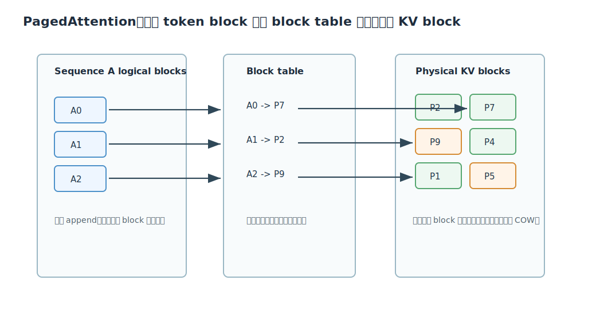

# PagedAttention / vLLM 深度解析

Citation key: `kwonEfficientMemoryManagement2023`

文献：Woosuk Kwon et al., *Efficient Memory Management for Large Language Model Serving with PagedAttention*, SOSP 2023.

来源：Zotero collection `01_ToRead`；PDF 路径来自 `research/data/zotero/01_ToRead.bib`。

说明：本文档聚焦 PagedAttention 的原理与实现：为什么 KV cache 是 LLM serving 的核心瓶颈、PagedAttention 如何借鉴操作系统分页、vLLM 如何用 block table、copy-on-write 和调度策略提高吞吐。

## 1. 一句话总结

PagedAttention 的核心贡献是把每个请求的 KV cache 从“连续大块内存”改成“固定大小物理 block + 每请求 block table”的分页式管理，从而减少 KV cache 的内部/外部碎片，并支持 prompt、parallel sampling、beam search 等场景的 block-level sharing；vLLM 在此基础上把可并发 batch size 做大，因此实现更高 serving throughput。

## 2. 为什么 KV Cache 是瓶颈

LLM serving 的 GPU 显存大致分成三类：

1. model weights：常驻，通常占大头；
2. activations：临时，通常相对较小；
3. KV cache：随请求数量和上下文长度动态增长。

对一个 decoder-only Transformer，每个 token 要保存每层的 key/value：

$$
\text{KV per token}
=2\times hidden\_size\times num\_layers\times bytes
$$

论文以 OPT-13B 为例，一个 token 的 KV cache 约 800KB；如果最大长度 2048，一个请求最多可占约 1.6GB。由于请求长度未知、输出动态增长，KV cache 的内存管理会直接决定同一时刻能 batch 多少请求。

Orca 解决了“哪些请求每轮一起跑”的调度问题，但如果 KV cache 内存被碎片和过度预留吃掉，batch size 仍然上不去。

## 3. 连续 KV Cache 的浪费

传统系统通常为每个请求预留一个连续 KV cache 区间，大小按最大可能长度或预测长度分配。这会造成三种浪费：

| 浪费类型 | 含义 |
| --- | --- |
| reserved waste | 为未来 token 预留但当前尚未使用 |
| internal fragmentation | 请求实际结束长度短于预留长度 |
| external fragmentation | 不同大小连续块分配/释放后留下无法使用的空洞 |

论文指出，已有系统在实验中实际用于有效 token state 的 KV cache 可能只有约 20.4% 到 38.2%。

## 4. PagedAttention 的核心抽象

PagedAttention 借鉴操作系统虚拟内存：

| OS 概念 | PagedAttention 概念 |
| --- | --- |
| process | request / sequence |
| virtual page | logical KV block |
| physical page | physical KV block |
| page table | block table |
| copy-on-write | shared KV block 写时复制 |

每个 sequence 的 KV cache 被切成固定 token 数的 logical blocks。logical blocks 通过 block table 映射到物理 KV blocks。物理 blocks 不要求连续。



这样做的效果：

1. 固定 block size 消除外部碎片。
2. 按需分配 block，减少 reserved waste。
3. 最后一个 block 才可能有内部碎片，浪费上界受 block size 控制。
4. 多个 sequence 可以共享同一组 physical blocks。
5. 发生分叉后写新 token 时，对共享 block 做 copy-on-write。

## 5. PagedAttention 算法如何算 attention

普通 decode attention 对一个 query token 需要看完整上下文：

$$
o_i=\sum_{t=1}^{i}\operatorname{softmax}(q_iK_{1:i}^T)_tV_t
$$

PagedAttention 中，$K,V$ 不再连续，而是分散在多个 physical blocks。于是 attention kernel 需要：

1. 读取当前 sequence 的 block table；
2. 对 logical block id 找到 physical block id；
3. 从 `k_cache`、`v_cache` 的物理块地址读取 K/V；
4. 对所有上下文 token 做 QK、softmax、PV。

也就是说，PagedAttention 不是改变 attention 数学，而是改变 KV cache 的寻址方式。

## 6. vLLM 的系统设计

vLLM 在 PagedAttention 之上构建 serving engine，包括：

- centralized scheduler；
- GPU workers；
- KV cache manager；
- physical block allocator；
- block table；
- preemptive scheduling；
- swapping / recomputation recovery；
- decoding algorithm support。

核心 API 可以抽象成：

- `append`: sequence 增加新 token，必要时分配新 block；
- `fork`: 从已有 sequence 派生新 sequence，共享已有 blocks；
- `free`: 请求结束，释放或减少 block ref count。

这三个操作足以表达 parallel sampling、beam search、prefix sharing 等复杂 decoding 场景。

## 7. Copy-on-Write 与共享

当多个 sequence 共享同一 prompt blocks 时，这些 blocks 的 ref count 大于 1。生成阶段如果某个 sequence 要写入共享的最后 block，vLLM 需要：

1. 分配一个新的 physical block；
2. 把旧 block 内容复制过去；
3. 更新该 sequence 的 block table；
4. 对新 block 写入新 token；
5. 减少旧 block ref count。

这样 prompt 部分可以共享，生成分叉后的部分保持独立。

论文实验中，beam search 的共享收益很高，因为不同 beam 长时间共享相同前缀；parallel sampling 也能共享 prompt 部分。

## 8. CUDA Kernel 层面的实现

工作区中的 vLLM 代码和设计文档展示了 PagedAttention kernel 的实现思路：

- [paged_attention.md](/Users/edy/Desktop/xxxx_xyx/week1/vllm/docs/design/paged_attention.md)
- [paged_attention_v1.cu](/Users/edy/Desktop/xxxx_xyx/week1/vllm/csrc/attention/paged_attention_v1.cu)

kernel 输入包括：

```cpp
out
query
key_cache      // [num_blocks, num_kv_heads, head_size/x, block_size, x]
value_cache    // [num_blocks, num_kv_heads, head_size, block_size]
block_tables   // [num_seqs, max_num_blocks_per_seq]
seq_lens
```

grid 通常按：

```cpp
grid(num_heads, num_seqs, max_num_partitions)
```

每个 CUDA thread block 负责一个 sequence、一个 head、一个 partition 的 attention。

主要流程：

1. 读取 query 到 shared memory；
2. 遍历该 sequence 的 block table；
3. 对每个 physical KV block 读取 key，计算 qk；
4. 在 thread block 内归约得到 softmax max 和 exp sum；
5. 再遍历 value blocks，计算 softmax 权重乘 V；
6. warp/block reduction 得到输出；
7. 写回 `out`。

相比连续 KV kernel，PagedAttention 多了 block table lookup 和非连续访问，因此单个 attention kernel latency 可能更高。论文的关键判断是：这个 kernel overhead 只影响 attention，而 vLLM 通过更高 batch size 提高端到端吞吐，收益远大于寻址开销。

## 9. Block Size 权衡

block size 太小：

- block table 更长；
- kernel 间接寻址更多；
- 小块 copy/swap overhead 更大；
- GPU 内存访问效率可能下降。

block size 太大：

- 最后一个 block 内部碎片变大；
- 共享粒度变粗；
- 短序列浪费更多。

论文实验认为 16 是较好的默认 block size：足够小以减少碎片，又足够大以维持 kernel 效率。

## 10. 与 Orca 的关系

论文明确说 Orca 和 vLLM 是互补的：

- Orca 通过 iteration-level scheduling 让更多请求可以动态组成 batch；
- vLLM 通过 PagedAttention 让更多请求的 KV cache 能装进 GPU。

换句话说，Orca 解决“调度上能不能 batch”，vLLM 解决“内存上能不能放得下这个 batch”。

## 11. 关键结论

PagedAttention 的本质是把 KV cache 变成系统级资源，而不是普通张量。它把 OS 中成熟的 paging、block table、copy-on-write 引入 LLM serving，使得 continuous batching 的潜力不再被 KV cache 碎片和过度预留卡住。
