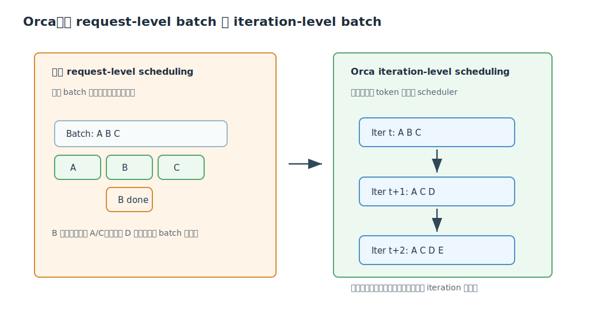

# Orca 深度解析

Citation key: `yuOrcaDistributedServing`

文献：Gyeong-In Yu, Joo Seong Jeong, Geon-Woo Kim, Byung-Gon Chun, *Orca: A Distributed Serving System for Transformer-Based Generative Models*.

来源：Zotero collection `01_ToRead`；PDF 路径来自 `research/data/zotero/01_ToRead.bib`。

说明：本文档聚焦 Orca 的系统设计：为什么传统 request-level batching 不适合自回归生成、iteration-level scheduling 如何工作、selective batching 为什么可行，以及它和后续 vLLM/SGLang 的关系。

## 1. 一句话总结

Orca 的核心贡献是把 LLM serving 的调度粒度从“一个请求完整生成结束”改成“每生成一个 token 的 iteration”，让已完成请求可以立即离开，新请求可以在下一轮加入；同时用 selective batching 解决不同请求处在不同 token 位置时 attention 形状不一致的问题，从而显著提升吞吐并降低排队延迟。

## 2. 问题背景：生成式模型不是一次性推理

传统推理服务系统，如 Triton + FasterTransformer 的典型组合，通常按 request-level batch 工作：

1. scheduler 从队列取一批请求。
2. execution engine 接收整个 batch。
3. engine 连续执行多轮生成，直到 batch 中所有请求都完成。
4. engine 把整批结果返回给 scheduler。

这对 BERT 这类“一次 forward 得到结果”的模型还可以，但对 GPT 这类自回归生成模型很别扭。生成式请求要经历多轮：

$$
x_{n+1}\sim p(x_{n+1}\mid x_1,\ldots,x_n)
$$

然后继续：

$$
x_{n+2}\sim p(x_{n+2}\mid x_1,\ldots,x_n,x_{n+1})
$$

每一轮只生成一个 token。论文把“跑完整个模型、生成一个新 token”的过程称为一次 iteration。

问题在于，同一批请求可能：

- prompt 长度不同；
- 输出长度不同；
- 有些请求早早遇到 EOS；
- 新请求持续到达。

request-level batch 会把这些动态性冻结住：早完成的请求不能立即返回，新来的请求不能立刻加入。

## 3. Orca 的核心设计一：Iteration-level Scheduling

Orca 的 scheduler 每次只让 engine 执行一个 iteration：

1. 从 request pool 中选出当前要运行的一组请求。
2. 调用 engine 运行一轮模型。
3. 每个请求得到一个新 token。
4. scheduler 检查哪些请求完成，把它们返回给客户端。
5. scheduler 把新到达请求纳入下一轮候选。

这样做带来两个直接收益：

- early-finished requests 可以立即离开，降低尾部浪费和用户可见延迟；
- late-joining requests 只需等一个 iteration，而不是等当前 batch 全部生成完。

可以把 Orca 看成后续 continuous batching 的先驱：它意识到 LLM serving 的自然调度单位不是 request，而是 decode iteration。

## 4. 核心设计二：Selective Batching

iteration-level scheduling 让 batch 内请求处在不同 token 位置。例如：

- 请求 A 已经生成到第 120 个 token；
- 请求 B 刚完成 prompt prefill；
- 请求 C 只生成了 3 个 token。

这会导致 attention 的 KV cache 长度不同。若所有操作都强行 batch，attention 输入 shape 不一致，难以高效执行。

Orca 的答案是 selective batching：

| Transformer 组件 | 是否 batch | 原因 |
| --- | --- | --- |
| LayerNorm | batch | shape 相对统一，且适合批处理 |
| QKV Linear | batch | 读模型参数是主要成本，batch 可复用权重读取 |
| Attention | 不强制 batch，按请求分开/选择性融合 | 每个请求 KV 长度不同，且 attention 本身无模型参数可复用 |
| Attention output linear | batch | 有模型参数，batch 复用权重 |
| MLP | batch | 参数量大，batch 收益明显 |

关键洞察是：attention 本身不含模型权重，batch attention 的收益不如 batch linear/MLP 那么大。为了支持动态 iteration batch，牺牲一点 attention batching 是划算的。

## 5. KV Cache 与状态管理

Orca 论文已经明确指出，Transformer 的 internal state 与 RNN 不同：

- RNN 的 hidden state 大小基本固定；
- Transformer 的 KV cache 随生成 token 数线性增长。

第 $t$ 个 token 的 attention 需要此前所有 key/value：

$$
K_{1:t}, V_{1:t}
$$

因此 serving 系统必须维护每个请求、每层、每个 attention head 的 KV cache。Orca 主要解决的是“怎么调度这些请求”，但它已经暴露出后续 vLLM 论文要解决的问题：当更多请求通过 iteration-level scheduling 同时驻留系统，KV cache 内存管理会成为瓶颈。

## 6. 分布式执行

Orca 还面向超大模型，支持：

- intra-layer parallelism：层内张量并行；
- inter-layer parallelism：层间流水并行；
- control plane / data plane 分离；
- NCCL 通信；
- pipelined execution。

相比 request-level batch，iteration-level scheduling 更适合流水。因为每个 iteration 都是一个可调度单位，scheduler 可以把请求流持续灌入 pipeline，而不是等待一整个 request batch。

## 7. 实现层面的抓手

论文实现约 13K 行 C++，基于 CUDA 生态。它特别提到 fused kernels：

- fused LayerNorm；
- fused Attention；
- fused GeLU；
- Attention 中 query-key dot、softmax、value weighted average 融合成一个 CUDA kernel。

更特别的是 selective batching 下的 attention：不同请求的 attention shape 可能不同，Orca 会把这些分裂出的 attention kernel 做进一步融合，把不同请求的 thread blocks 拼在一个 kernel launch 中，以减少 kernel launch overhead 并提升 GPU 利用率。

这在 CUDA 编程中并不“教科书”，因为一个 kernel 中不同 thread block 的执行时间可能差异很大；但 serving 场景下，减少小 kernel launch 和提高 occupancy 可能更重要。

## 8. 论文实验结论

论文报告：

- 在纯 engine microbenchmark 中，Orca 与 FasterTransformer 接近，有时略慢，因为 attention 不完全 batch。
- 在端到端 serving 中，Orca 明显优于 FasterTransformer，因为调度粒度更细。
- 对 GPT-3 175B 模型，在相似 latency 下，Orca 报告了 36.9x throughput improvement。

这里要注意：36.9x 主要不是单个 kernel 比 FasterTransformer 快 36.9x，而是系统调度避免了 request-level batch 的巨大排队和空算浪费。

## 9. 局限与后续影响

Orca 的局限：

1. KV cache 仍然是连续或预分配式管理，容易产生碎片和过度预留。
2. 对 prefix sharing、beam search、parallel sampling 的内存共享没有系统性解决。
3. 关注单次 generation serving，而不是复杂多调用 LM programs。

这正好导向后续两篇：

- vLLM/PagedAttention 解决 KV cache memory management；
- SGLang/RadixAttention 解决 LM programs 中跨调用的 prefix/KV cache reuse。

## 10. 关键结论

Orca 的最大价值是提出了 LLM serving 的基本调度模型：generation 是多 iteration workload，serving system 必须在 iteration 粒度动态调整 batch。后续 vLLM 的 continuous batching、SGLang 的 runtime scheduling，都可以看成沿着这条路线继续解决更细的内存和程序结构问题。
