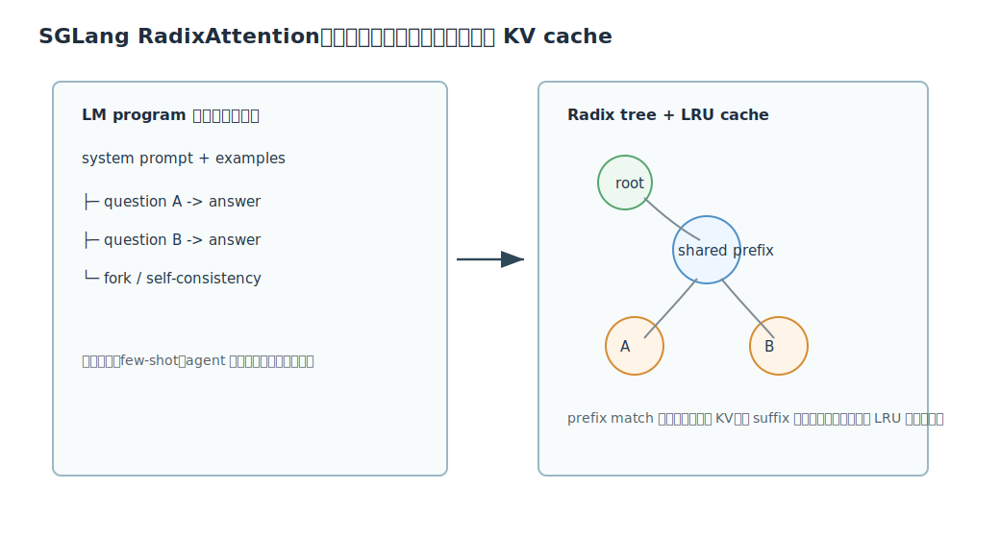

# SGLang 深度解析

Citation key: `zhengSGLangEfficientExecution`

文献：Lianmin Zheng et al., *SGLang: Efficient Execution of Structured Language Model Programs*.

来源：Zotero collection `01_ToRead`；PDF 路径来自 `research/data/zotero/01_ToRead.bib`。

说明：本文档聚焦 SGLang 的系统贡献：为什么 LLM 应用从单请求变成 LM programs，前端语言如何表达多调用/分支/结构化输出，runtime 如何用 RadixAttention、compressed FSM 和 API speculative execution 提升效率。

## 1. 一句话总结

SGLang 的核心贡献是把复杂 LLM 应用视为 language model programs，并进行语言和运行时协同设计：前端用 `gen/select/fork/join` 等 primitive 简化多调用程序表达，后端用 RadixAttention 自动复用跨调用共享前缀的 KV cache，用 compressed FSM 加速结构化输出解码，从而提升复杂 prompting/agent/RAG/JSON workloads 的吞吐。

## 2. 背景：LLM 调用从单轮聊天变成程序

现代 LLM 应用常常不是一次 `prompt -> response`，而是：

- 多次 generation；
- 多分支并行；
- few-shot prompt 模板；
- tree-of-thought / self-consistency；
- RAG pipeline；
- agent 工具调用；
- JSON / regex / schema 约束输出；
- 多模态输入。

论文称这类应用为 LM Programs。它们有两个共同特点：

1. 包含多个 LLM calls，并夹杂控制流；
2. 输入输出高度结构化，需要能组合进软件系统。

通用 inference engine 如 vLLM、TGI、TensorRT-LLM 已经能高效处理单次请求，但它们通常不了解一个应用内部多次调用之间的结构，因此会漏掉跨调用优化机会。

## 3. SGLang 前端语言

SGLang 是嵌入 Python 的 DSL，核心 primitive 包括：

| Primitive | 作用 |
| --- | --- |
| `extend` / `+=` | 向 prompt state 追加文本或多模态输入 |
| `gen` | 调用模型生成，并把结果保存到变量 |
| `select` | 在候选项中选择概率最高者 |
| `fork` | 复制 prompt state，创建并行分支 |
| `join` | 合并并行分支 |
| `regex` constraint | 对输出做结构约束 |

SGLang interpreter 把 prompt state 当成异步 stream。`gen`、`select` 等 primitive 可以异步提交，Python 代码继续执行，只有读取结果时才同步。这类似 CUDA kernel launch 的异步模型。

这使得前端可以表达程序结构，后端 runtime 可以利用结构信息做优化。

## 4. RadixAttention：跨调用 KV Cache 复用

LLM 的 KV cache 有一个关键性质：

> 某段 prefix 的 KV cache 只依赖这段 prefix 本身。

因此，如果两个请求或两个 generation calls 共享 prompt prefix，它们可以复用 prefix 的 KV cache。

vLLM/PagedAttention 已经支持一些 block sharing，但 SGLang 面对的是更复杂的程序级共享：

- 多轮聊天共享 system prompt 和历史；
- few-shot batch 共享 examples；
- self-consistency 多分支共享 question；
- tree-of-thought 共享搜索历史；
- fork 后的多个 prompt state 共享已有上下文。

SGLang 使用 radix tree 组织 token prefix 到 KV cache 的映射。

RadixAttention 的基本操作：

1. `match_prefix`: 对新请求 token 序列做最长前缀匹配；
2. reuse: 命中的 prefix KV cache 直接复用；
3. insert: 新生成或新 prefill 的 suffix 插入 radix tree；
4. split: 当新 key 与已有 edge 部分匹配时拆分节点；
5. evict: 内存不足时按 LRU 叶子优先驱逐；
6. lock/ref count: 正在运行的请求引用的节点不能驱逐。

工作区中对应实现可见：

- [radix_cache.py](/Users/edy/Desktop/xxxx_xyx/week1/sglang/python/sglang/srt/mem_cache/radix_cache.py)

其中 `RadixCache` 包含 `match_prefix`、`insert`、`cache_finished_req`、`evict`、`_split_node` 等方法；`TreeNode` 保存 children、parent、key、value、lock ref、last access time 等状态。

## 5. Cache-aware Scheduling

如果等待队列中有多个请求，执行顺序会影响 cache hit rate。SGLang 提出 cache-aware scheduling：优先选择与当前 cache 有最长共享前缀的请求。

论文给出一个理论结果：在 batch 请求的 radix tree 上，当 cache size 至少能容纳最长请求时，DFS 顺序可以达到最优 cache hit rate；longest-shared-prefix-first 与 DFS 顺序等价。

直觉是：处理完一个共享 prefix 后，马上处理它的子树，可以持续命中这段 prefix，避免刚算好的 KV cache 被驱逐后又重算。

## 6. Compressed FSM：结构化输出加速

结构化输出如 JSON schema 或 regex decoding，通常通过 FSM 约束下一 token：

1. 当前 FSM state 决定允许哪些 token；
2. mask 掉不允许 token；
3. decode 一个 token；
4. 更新 FSM state。

问题是很多结构化字符串是确定性的，例如 JSON 的固定字段名、引号、冒号、逗号。普通 constrained decoding 仍一 token 一 forward，浪费。

SGLang 把 FSM 中只有单一路径的连续边压缩成一条长边，称为 compressed FSM。若当前位置接下来是一段确定字符串，就可以 jump forward，一次性追加多个 token 或跳过多轮 decode。

收益集中在 JSON、固定格式输出等场景。

局限也很重要：字符串级 FSM 和 tokenizer 之间存在缝隙；压缩边可能改变候选 token 序列概率的解释，因此论文也提示了概率偏斜问题。

## 7. API Speculative Execution

对于 OpenAI/Anthropic 这类 API-only model，runtime 不能直接访问 KV cache 或 logits。SGLang 仍可以利用程序结构做 speculative execution：

- 预先发起可能会用到的 API calls；
- 如果控制流走到对应分支，就复用结果；
- 如果没有走到，则浪费一次 API 调用，但减少关键路径延迟。

这体现了 SGLang 的核心思想：即使不能控制模型 kernel，也可以通过程序级调度优化多调用工作流。

## 8. 与 vLLM / Orca 的关系

SGLang 是站在 Orca 和 vLLM 之后的一层：

- Orca 解决 generation request 的 iteration-level scheduling；
- vLLM 解决 KV cache block-level memory management；
- SGLang 解决 LM program 里跨请求、跨调用、跨分支的 prefix reuse 和结构化执行。

论文也强调 RadixAttention 与 continuous batching、paged attention、tensor parallelism 兼容。也就是说，SGLang 不是替代 vLLM，而是把 vLLM 这类 runtime 能力提升到程序级。

## 9. 实现层面的要点

SGLang runtime 的关键状态包括：

- prompt stream；
- request queue；
- radix tree；
- KV memory pool；
- ref count / lock count；
- eviction policy；
- scheduler 的 cache hit 估计；
- constrained decoding FSM state。

Radix tree 存在 CPU 侧，KV cache tensors 在 GPU memory pool 中。请求进入 runtime 时，CPU 侧做 prefix matching，命中后把对应 KV indices 绑定给请求；未命中的 suffix 进入 prefill/decode。

这种设计的好处是 radix tree 操作相对轻量，不在 GPU hot path 上做复杂树遍历。

## 10. 关键结论

SGLang 的价值不只是“写 prompt 更方便”，而是把 LLM 应用中的程序结构显式暴露给 runtime。当前缀共享、并行分支、结构化输出成为工作负载常态时，runtime 如果仍把每次 LLM call 当独立请求，就会重复 prefill、浪费 KV cache、错过调度机会。SGLang 的 RadixAttention 和 compressed FSM 正是针对这些程序级冗余的系统优化。
