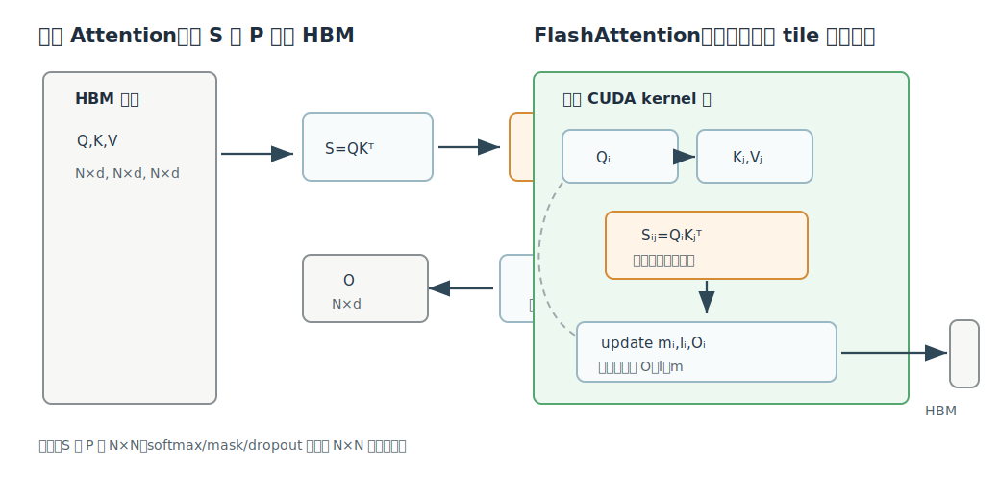
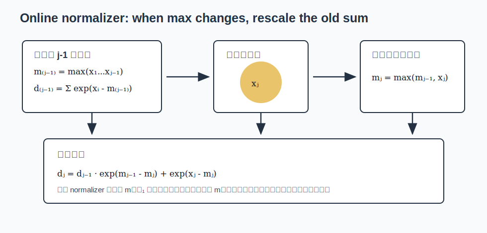
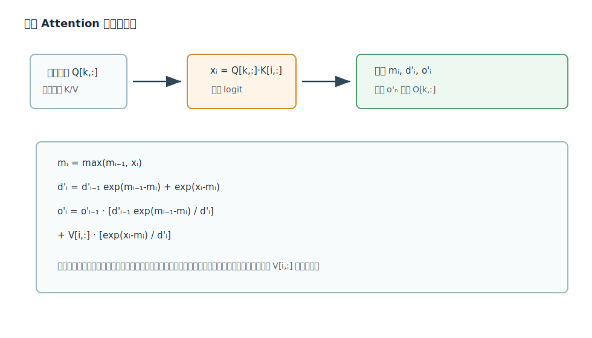
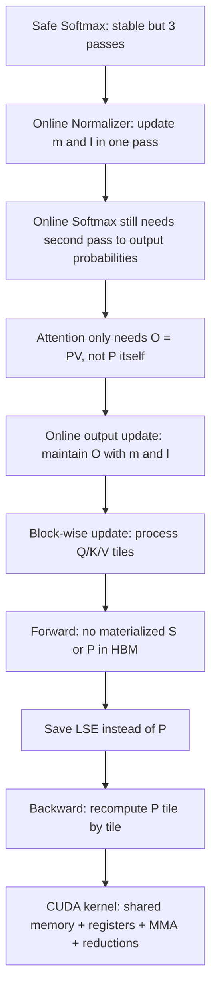

# Online Softmax 到 FlashAttention 专题精讲

专题 key: `onlineSoftmaxToFlashAttention`

整合文献：

- `milakovOnlineNormalizerCalculation`: Maxim Milakov and Natalia Gimelshein, *Online Normalizer Calculation for Softmax*, 2018.
- `yeOnlineSoftmaxFlashAttention`: Zihao Ye, *From Online Softmax to FlashAttention*, 2023.
- `daoFlashAttentionFastMemoryEfficient2022`: Tri Dao et al., *FlashAttention: Fast and Memory-Efficient Exact Attention with IO-Awareness*, 2022.

来源：三篇文章均来自 Zotero collection `01_ToRead`，对应单篇精讲保留在本专题目录下各自的 citation key 子目录中。

说明：这是三篇强关联论文的统一精讲入口。本文档不是简单拼接三篇笔记，而是按“稳定 softmax -> online normalizer -> block-wise online softmax -> FlashAttention forward -> FlashAttention backward -> CUDA kernel 实现”的知识链重组。`figures/` 中集中保存三篇单篇精讲已使用的自绘图。

## 1. 总览：这三篇文章共同回答什么问题

三篇文章围绕同一个核心问题展开：

> 如何在保持 softmax/attention 数学结果不变的情况下，减少真实硬件上的内存访问？

它们的关系可以看成三层递进：

| 层次 | 论文 | 解决的问题 | 关键状态 |
| --- | --- | --- | --- |
| 1 | Online Normalizer Calculation for Softmax | stable softmax 为什么能少一遍扫描 | running max $m$ 与 normalizer $\ell$ |
| 2 | From Online Softmax to FlashAttention | online softmax 如何变成 attention 的流式输出 | running output $O$ |
| 3 | FlashAttention | 如何把这个推导落到 GPU tiling、backward 和 CUDA kernel | tile、SRAM、LSE、recomputation |

最短理解路线是：

1. Safe Softmax 需要先求最大值，再求分母，再输出概率。
2. Online Softmax 发现最大值和分母可以一边扫一边更新。
3. 但普通 softmax 仍要第二遍输出所有概率。
4. Attention 最终不需要输出 $P=\operatorname{softmax}(QK^T)$，只需要 $O=PV$。
5. 因此可以把 $O$ 也写成在线状态。
6. FlashAttention 把这个在线状态按 tile 放进 SRAM/register，避免把完整 $N\times N$ 的 $S$ 和 $P$ 写到 HBM。
7. Backward 不保存 $P$，而是保存 LSE，在 backward 中按 tile 重算 $P$。



## 2. 第一篇：Online Softmax 的基本问题

Softmax 定义为：

$$
y_i=\frac{e^{x_i}}{\sum_j e^{x_j}}
$$

直接算可能数值溢出，所以实际常用 safe softmax：

$$
y_i=\frac{e^{x_i-m}}{\sum_j e^{x_j-m}},\quad m=\max_j x_j
$$

这个版本稳定，但直接实现需要三遍：

1. 第一遍求 $m$。
2. 第二遍求分母 $\ell=\sum_j e^{x_j-m}$。
3. 第三遍输出 $y_i=e^{x_i-m}/\ell$。


Online Normalizer 的关键，是把分母改成前缀状态：

$$
m_i=\max_{j\le i}x_j
$$

$$
\ell_i=\sum_{j\le i}e^{x_j-m_i}
$$

当新元素 $x_i$ 进来时：

$$
m_i=\max(m_{i-1},x_i)
$$

旧分母要从旧最大值 $m_{i-1}$ 的基准换到新最大值 $m_i$：

$$
\ell_i
=
\ell_{i-1}e^{m_{i-1}-m_i}
+
e^{x_i-m_i}
$$



这一步的意义非常大：softmax 的 normalizer 不再必须等整行看完才能开始算，它可以随着输入流式更新。

但这还不是 FlashAttention。原因是普通 softmax 要输出每个 $y_i$，而每个 $y_i$ 都依赖最终的 $m_N,\ell_N$。所以 Online Softmax 将 safe softmax 从三遍降到两遍，而不是一遍。

## 3. 第二篇：为什么 Attention 可以继续降到一遍

Zihao Ye 的 note 抓住了一个关键转折：

> Attention 的最终目标不是保存 softmax 概率矩阵 $P$，而是输出 $O=PV$。

对某一行 attention：

$$
O=\sum_i p_iV_i
$$

其中：

$$
p_i=\frac{e^{x_i-m_N}}{\ell_N}
$$

如果定义前缀输出状态：

$$
O_i=\sum_{j\le i}\frac{e^{x_j-m_i}}{\ell_i}V_j
$$

当加入新元素时，旧输出也可以像旧分母一样换基准：

$$
O_i=
O_{i-1}\frac{\ell_{i-1}e^{m_{i-1}-m_i}}{\ell_i}
+
V_i\frac{e^{x_i-m_i}}{\ell_i}
$$



这就是从 Online Softmax 到 FlashAttention 的最小数学桥梁：

1. Online Softmax 维护 $m,\ell$。
2. Attention 还能维护 $O$。
3. 如果 $O$ 也能在线更新，就不需要显式保存完整概率向量 $p$。
4. 推广到矩阵，就是不需要保存完整 attention matrix $P$。

## 4. 第三篇：FlashAttention 把单元素递推变成 block 递推

FlashAttention 不会一个元素一个元素地处理，而是按 tile 处理：

$$
S_{ij}=Q_iK_j^T
$$

其中 $Q_i$ 是一个 $B_r\times d$ 的 Q block，$K_j,V_j$ 是 $B_c\times d$ 的 K/V block。

当前 tile 的局部统计量为：

$$
\tilde{m}_{ij}=\operatorname{rowmax}(S_{ij})
$$

$$
\tilde{P}_{ij}=e^{S_{ij}-\tilde{m}_{ij}}
$$

$$
\tilde{\ell}_{ij}=\operatorname{rowsum}(\tilde{P}_{ij})
$$

把当前 tile 合并到旧状态：

$$
m_i^{new}=\max(m_i,\tilde{m}_{ij})
$$

$$
\ell_i^{new}
=
e^{m_i-m_i^{new}}\ell_i
+
e^{\tilde{m}_{ij}-m_i^{new}}\tilde{\ell}_{ij}
$$

$$
O_i^{new}
=
\frac{
e^{m_i-m_i^{new}}\ell_iO_i
+
e^{\tilde{m}_{ij}-m_i^{new}}\tilde{P}_{ij}V_j
}{
\ell_i^{new}
}
$$


这就是 FlashAttention forward 的核心公式。它保证了分块计算结果和标准 attention 完全一致。

## 5. Forward 的完整数据流

FlashAttention forward 的嵌套循环是：

1. 外层遍历 K/V blocks。
2. 把一个 $K_j,V_j$ block 从 HBM 读到 SRAM。
3. 内层遍历 Q blocks。
4. 把 $Q_i,O_i,m_i,\ell_i$ 读到片上。
5. 计算 $S_{ij}=Q_iK_j^T$。
6. 片上完成 mask、softmax 统计、$\tilde{P}_{ij}V_j$。
7. 用 online update 更新 $O_i,m_i,\ell_i$。
8. 写回 $O_i,m_i,\ell_i$。


这里有一个非常重要的实现直觉：

> $S_{ij}$ 和 $\tilde{P}_{ij}$ 只在当前 tile 中短暂存在。它们不进入 HBM。

因此 FlashAttention 的显存从标准 attention 的 $O(N^2)$ 中间矩阵，变成 $O(N)$ 的行统计量和输出。

## 6. Backward：为什么需要 recomputation

训练时 backward 通常需要 attention matrix $P$。标准做法是在 forward 保存 $P$，但 $P$ 是 $N\times N$，这正是 FlashAttention 要避免的。

FlashAttention 的做法是：

1. Forward 只保存 $O$ 和 softmax 统计量，通常保存为每行 LSE：

$$
\operatorname{LSE}_i=m_i+\log \ell_i
$$

2. Backward 时重新计算 tile：

$$
S_{ij}=Q_iK_j^T
$$

3. 用 LSE 重建：

$$
P_{ij}=e^{S_{ij}-\operatorname{LSE}_i}
$$

4. 在片上计算 $dV,dP,dS,dQ,dK$。


softmax backward 的关键是：

$$
dS_{ij}=P_{ij}(dP_{ij}-D_i)
$$

其中标准形式里的：

$$
D_i=\sum_kP_{ik}dP_{ik}
$$

可以改写为：

$$
D_i=\operatorname{rowsum}(dO_i\odot O_i)
$$

这个改写让 backward 不需要完整的 $P_{i:}$ 和 $dP_{i:}$，只需要 $O_i$ 和 $dO_i$ 两个 $d$ 维向量。

## 7. CUDA kernel 层面的统一理解

FlashAttention 的 CUDA 实现可以看成把论文变量映射到 GPU 资源：

| 论文变量 | CUDA 中的典型位置 |
| --- | --- |
| $Q_i,K_j,V_j$ tile | shared memory，部分 fragment 放 registers |
| $S_{ij}=Q_iK_j^T$ | Tensor Core MMA accumulator registers |
| tile 内 max/sum | FP32 registers + warp/block reduction |
| running $O_i$ | registers accumulator |
| LSE | forward 末尾写 HBM，backward 读取 |
| mask/dropout | tile 内融合处理 |


一个教学版 forward kernel 的核心伪代码是：

```cuda
for each Q block:
  m = -inf
  l = 0
  O = 0

  for each K/V block:
    S = Q_tile @ K_tile.T
    S = apply_mask_and_scale(S)

    m_tile = rowmax(S)
    m_new = max(m, m_tile)

    P = exp(S - m_new)
    l_new = exp(m - m_new) * l + rowsum(P)

    O = O * (exp(m - m_new) * l / l_new) + (P @ V_tile) / l_new

    m = m_new
    l = l_new

  store O
  store LSE = m + log(l)
```

真实 CUDA kernel 会做更多事情：

1. 用 Tensor Core MMA 做两个矩阵乘：$QK^T$ 和 $PV$。
2. 用 shared memory 做 Q/K/V/O 的 tile staging 和 swizzle。
3. 用 registers 保存 fragment、softmax 统计量和 running output。
4. 用 double buffering 预取下一个 K/V tile。
5. 用 warp-level reduction 计算 rowmax/rowsum。
6. 针对 head dimension、dtype、GPU 架构生成不同 specialization。
7. backward 中处理 dQ 的跨 tile 累积，以及 dK/dV 的 tile 内累积。

## 8. 三篇论文的知识依赖图



## 9. 放在一起读时的重点顺序

建议阅读顺序：

1. 先读 `milakovOnlineNormalizerCalculation`，目标是彻底理解：

$$
\ell_i=\ell_{i-1}e^{m_{i-1}-m_i}+e^{x_i-m_i}
$$

2. 再读 `yeOnlineSoftmaxFlashAttention`，目标是理解为什么 attention 可以把 $O$ 也在线更新：

$$
O_i=
O_{i-1}\frac{\ell_{i-1}e^{m_{i-1}-m_i}}{\ell_i}
+
V_i\frac{e^{x_i-m_i}}{\ell_i}
$$

3. 最后读 `daoFlashAttentionFastMemoryEfficient2022`，目标是理解：

- 为什么要以 HBM/SRAM IO 为优化目标；
- block-wise online softmax 如何写成 Algorithm 1；
- backward 为什么重算比保存 $P$ 更划算；
- CUDA kernel 如何把 tile、MMA、softmax reduction 和 output accumulator 融合。

## 10. 统一结论

这三篇文章合起来讲的是同一件事：

1. Softmax 的最大值和分母可以在线维护。
2. Attention 的输出也可以在线维护。
3. 在线维护使得 attention 能按 tile 计算。
4. 按 tile 计算使得 $N\times N$ 中间矩阵可以不写 HBM。
5. 不写 HBM 是 FlashAttention 真正的性能来源。
6. Backward 通过保存 LSE 和重算 tile，延续了 forward 的 IO 优势。
7. CUDA 实现的本质是在 shared memory/register 中承载这些 tile 状态，并用 Tensor Core 高效完成两个 GEMM。

因此，FlashAttention 不是“更聪明的 softmax 小技巧”这么简单；它是一条从数值稳定公式、在线算法、IO 复杂度到 GPU kernel 设计完整闭合的优化链。

## 11. 单篇精讲入口

- [Online Normalizer Calculation for Softmax](/Users/edy/Desktop/xxxx_xyx/research/notes/deep_dives/onlineSoftmaxToFlashAttention/milakovOnlineNormalizerCalculation/analysis.md)
- [From Online Softmax to FlashAttention](/Users/edy/Desktop/xxxx_xyx/research/notes/deep_dives/onlineSoftmaxToFlashAttention/yeOnlineSoftmaxFlashAttention/analysis.md)
- [FlashAttention: Fast and Memory-Efficient Exact Attention with IO-Awareness](/Users/edy/Desktop/xxxx_xyx/research/notes/deep_dives/onlineSoftmaxToFlashAttention/daoFlashAttentionFastMemoryEfficient2022/analysis.md)
