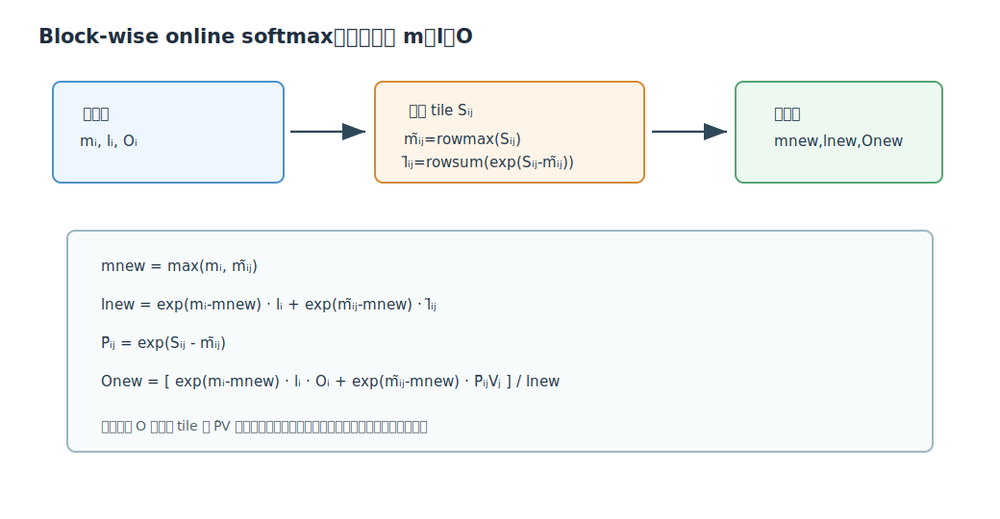
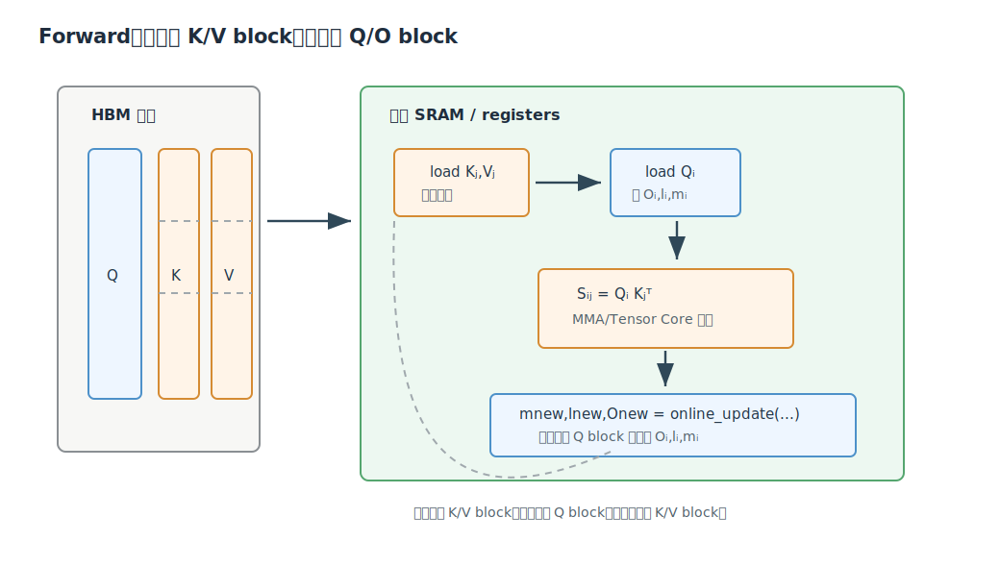
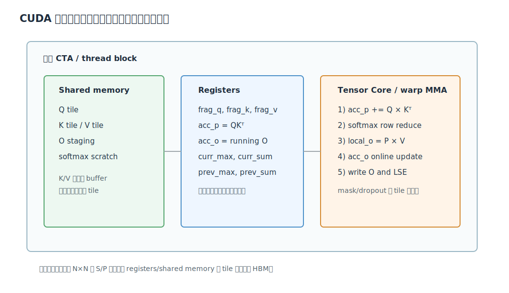
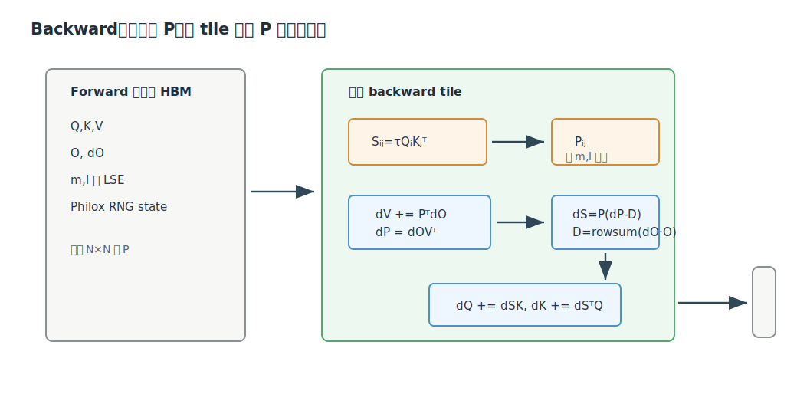

# FlashAttention 深度解析

Citation key: `daoFlashAttentionFastMemoryEfficient2022`

文献：Tri Dao, Daniel Y. Fu, Stefano Ermon, Atri Rudra, Christopher Ré, *FlashAttention: Fast and Memory-Efficient Exact Attention with IO-Awareness*, arXiv:2205.14135, 2022.

来源：Zotero collection `01_ToRead`；PDF 路径来自 `research/data/zotero/01_ToRead.bib`。

说明：本文档是对 FlashAttention 论文的中文深度解析，重点展开原理、数学推导、forward/backward 算法、IO 复杂度和 CUDA kernel 实现思路。本文档中的图是为理解论文而自绘的解释图，不是论文原图。代码层面的讨论参考了工作区中的 TensorRT-LLM FMHA/FlashAttention kernel 文件，用来解释论文算法如何落到 CUDA 资源上。

## 1. 一句话总结

FlashAttention 的核心贡献是：在不近似 attention 的前提下，用 tiling + online softmax + backward recomputation，把 $QK^T$、mask、softmax、dropout、乘 $V$ 融合到少量 CUDA kernel 中，使 $N\times N$ 的 logits/attention 矩阵只在片上 SRAM/register 的 tile 中短暂存在，而不写入 HBM；因此它的加速主要来自大幅减少 HBM 读写，而不是减少 attention 的理论 FLOPs。

## 2. 背景：为什么标准 Attention 慢

标准 self-attention 是：

$$
S = QK^T \in \mathbb{R}^{N\times N}
$$

$$
P = \operatorname{softmax}(S)
$$

$$
O = PV \in \mathbb{R}^{N\times d}
$$

其中 $N$ 是序列长度，$d$ 是 head dimension。

标准实现通常分三步：

1. 计算 $S=QK^T$，把 $S$ 写到 HBM。
2. 从 HBM 读 $S$，做 mask/softmax/dropout，把 $P$ 写到 HBM。
3. 从 HBM 读 $P$ 和 $V$，计算 $O=PV$，把 $O$ 写到 HBM。


这会带来两个问题：

1. $S$ 和 $P$ 都是 $N\times N$，显存占用随序列长度平方增长。
2. softmax、mask、dropout 等操作本身通常是 memory-bound，反复读写 $N\times N$ 中间矩阵会让 HBM 带宽成为主要瓶颈。

论文强调的关键判断是：现代 GPU 的计算速度增长快于 HBM 带宽增长。以 A100 为例，片上 SRAM 带宽远高于 HBM，但容量很小。因此，如果算法能把中间矩阵留在片上，并尽量少碰 HBM，就可能在 FLOPs 没有减少的情况下显著更快。

## 3. FlashAttention 的两个技术点

论文用两个老技术解决 attention 的两个难点：

| 难点 | 解决技术 | 效果 |
| --- | --- | --- |
| softmax 分母依赖整行，难以分块 | tiling + online softmax statistics | 分块处理 $S_{ij}$ 后仍能得到 exact softmax |
| backward 需要 $P$，但不想保存 $N\times N$ attention matrix | recomputation | forward 只保存 $O$ 和 softmax 统计量，backward 重算 tile-level $P$ |

这两个点结合起来，forward 不保存 $S/P$，backward 也不读取 $S/P$。代价是 backward 多做一些重算 FLOPs，但收益是 HBM 访问大幅下降。

## 4. 核心数学：block-wise online softmax

为了数值稳定，softmax 通常写成：

$$
\operatorname{softmax}(x)_i=\frac{e^{x_i-m(x)}}{\ell(x)}
$$

其中：

$$
m(x)=\max_i x_i
$$

$$
\ell(x)=\sum_i e^{x_i-m(x)}
$$

现在把一整行 logits 切成两个块 $x^{(1)},x^{(2)}$。拼接后的最大值是：

$$
m(x)=\max(m(x^{(1)}),m(x^{(2)}))
$$

拼接后的 normalizer 可以由两个块的 normalizer 合成：

$$
\ell(x)=
e^{m(x^{(1)})-m(x)}\ell(x^{(1)})
+
e^{m(x^{(2)})-m(x)}\ell(x^{(2)})
$$

这就是 FlashAttention 能分块 softmax 的核心。

对 attention 的第 $i$ 个 Q block 和第 $j$ 个 K/V block，论文定义：

$$
S_{ij}=Q_iK_j^T \in \mathbb{R}^{B_r\times B_c}
$$

当前 block 的行最大值：

$$
\tilde{m}_{ij}=\operatorname{rowmax}(S_{ij})
$$

当前 block 的未归一化概率：

$$
\tilde{P}_{ij}=e^{S_{ij}-\tilde{m}_{ij}}
$$

当前 block 的行分母：

$$
\tilde{\ell}_{ij}=\operatorname{rowsum}(\tilde{P}_{ij})
$$

假设此前已经处理过若干 K/V blocks，并保存旧状态 $m_i,\ell_i,O_i$。加入当前 block 后：

$$
m_i^{new}=\max(m_i,\tilde{m}_{ij})
$$

$$
\ell_i^{new}
=
e^{m_i-m_i^{new}}\ell_i
+
e^{\tilde{m}_{ij}-m_i^{new}}\tilde{\ell}_{ij}
$$

输出更新为：

$$
O_i^{new}
=
\frac{
e^{m_i-m_i^{new}}\ell_i O_i
+
e^{\tilde{m}_{ij}-m_i^{new}}\tilde{P}_{ij}V_j
}{
\ell_i^{new}
}
$$



这个式子的意思很朴素：

1. 旧输出 $O_i$ 已经是旧概率下的加权平均。
2. 当前 tile 的 $\tilde{P}_{ij}V_j$ 是当前 tile 内未归一化概率对 $V_j$ 的加权和。
3. 两边都要换到同一个新最大值 $m_i^{new}$ 的基准。
4. 再用新的总分母 $\ell_i^{new}$ 归一化。

因此 FlashAttention 是 exact attention。它没有丢掉任何 $QK^T$ 项，只是改变了计算顺序和中间状态保存方式。

## 5. Forward Algorithm 1 的逐行理解

论文 Algorithm 1 的输入是 $Q,K,V\in\mathbb{R}^{N\times d}$，这些矩阵在 HBM 中。片上 SRAM 大小记为 $M$。

论文设置 block size：

$$
B_c=\left\lceil \frac{M}{4d}\right\rceil
$$

$$
B_r=\min\left(\left\lceil \frac{M}{4d}\right\rceil,d\right)
$$

这里不是一个必须照抄的工程参数，而是为了 IO 分析给出的可行块大小。真实 kernel 会按 GPU 架构、head dimension、数据类型、寄存器压力、shared memory 限制、Tensor Core tile 形状来调参。

forward 的嵌套循环是：

1. 外层遍历 K/V blocks：$j=1,\ldots,T_c$。
2. 把 $K_j,V_j$ 从 HBM 读到 SRAM。
3. 内层遍历 Q blocks：$i=1,\ldots,T_r$。
4. 把 $Q_i,O_i,\ell_i,m_i$ 读到 SRAM/register。
5. 计算 $S_{ij}=Q_iK_j^T$。
6. 在片上做 rowmax、exp、rowsum。
7. 用上面的 online update 更新 $O_i,\ell_i,m_i$。
8. 把更新后的 $O_i,\ell_i,m_i$ 写回 HBM。



注意外层先固定 $K_j,V_j$，再扫所有 $Q_i$。这样 $K_j,V_j$ 被加载到片上后可以被多个 $Q_i$ block 复用，减少 HBM 访问。

如果是 causal attention，还可以跳过上三角无效块：当当前 Q block 只能看过去 token 时，未来的 K/V block 不需要计算。这也是 causal mask 场景常有额外收益的原因之一。

## 6. Forward 的 CUDA 实现骨架

论文说 “one CUDA kernel” 的意思是：在同一个 kernel 内完成以下流程：

```cuda
// 示意代码，不是可直接编译的完整 kernel
__global__ void flash_attn_fwd(
    half* Q, half* K, half* V,
    half* O, float* lse,
    int N, int D) {

  // blockIdx 选择 batch/head/Q-block 或 K/V-block，真实实现会更复杂
  extern __shared__ char smem[];

  // 1. 从 HBM 搬 Q/K/V tile 到 shared memory
  load_Q_tile_to_smem(...);
  load_KV_tile_to_smem(...);

  // 每行的在线 softmax 状态
  float m[ROWS_PER_THREAD] = {-INFINITY};
  float l[ROWS_PER_THREAD] = {0.0f};
  Accumulator O_acc = 0;

  for (int kv = 0; kv < num_kv_tiles; ++kv) {
    // 2. Tensor Core / MMA: S_tile = Q_tile * K_tile^T
    Accumulator S = mma(Q_frag, K_frag);

    // 3. mask / scale
    apply_scale_mask(S, ...);

    // 4. row-wise max and sum on tile
    float m_tile = rowmax(S);
    float m_new = max(m, m_tile);
    S = exp(S - m_new);      // 或先 exp(S-m_tile)，再缩放
    float l_tile = rowsum(S);
    float l_new = exp(m - m_new) * l + l_tile;

    // 5. local_o = P_tile * V_tile
    Accumulator local_o = mma(S, V_frag);

    // 6. online 更新 running O
    O_acc = (exp(m - m_new) * l * O_acc + local_o) / l_new;
    m = m_new;
    l = l_new;

    // 7. 预取下一个 K/V tile，双缓冲隐藏 HBM latency
    prefetch_next_KV_tile(...);
  }

  // 8. 写 O 和 logsumexp 回 HBM，供 backward 使用
  store(O, O_acc);
  store(lse, m + log(l));
}
```

真实 CUDA kernel 会比这复杂很多，但核心状态就是这些：

| 论文变量 | CUDA 实现中的常见位置 |
| --- | --- |
| $Q_i,K_j,V_j$ tile | shared memory，部分 fragment 进 registers |
| $S_{ij}$ | MMA accumulator registers |
| $\tilde{m}_{ij},\tilde{\ell}_{ij}$ | 每线程/每 warp 的 FP32 registers，配合 warp/block reduction |
| $O_i$ running accumulator | registers，必要时 shared memory 做 swizzle/store |
| $\ell,m$ 或 LSE | forward 结束写 HBM，backward 用来重建 $P$ |
| mask/dropout | 在 tile 内应用，不物化完整 mask/dropout matrix |



### 6.1 TensorRT-LLM kernel 中的实现锚点

工作区中可以看到类似的实现结构：

- `week1/TensorRT-LLM/cpp/kernels/fmha_v2/src/fused_multihead_flash_attention_kernel.h`
- `week1/TensorRT-LLM/cpp/kernels/fmha_v2/train_ops/fused_multihead_attention_flash_attention_fprop_kernel.h`
- `week1/TensorRT-LLM/cpp/kernels/fmha_v2/src/fmha/fragment.h`
- `week1/TensorRT-LLM/cpp/kernels/fmha_v2/train_ops/fused_multihead_attention_dgrad_kernel_1xN_flash.h`

这些文件不是论文官方 FlashAttention 源码，但它们很好地展示了 FlashAttention/Fused MHA 在 CUDA 中的实际形态。

在 `fused_multihead_attention_flash_attention_fprop_kernel.h` 中，shared memory 注释直接列出了布局：

```text
Q, K, V, O, Softmax scratch
```

这对应论文里的“把 Q/K/V block 搬到 SRAM，片上计算 $S$、softmax、$PV$”。

在 forward loop 中，代码结构大致是：

```cpp
// 1. acc_p = Q * K^T
fmha::gemm(acc_p, ...);

// 2. accumulator 解包到 FP32 softmax buffer
softmax.unpack(acc_p);

// 3. mask / alibi
softmax.apply_mask(...);

// 4. tile 内 max/sum reduction
softmax.template reduce<fmha::Max_>(acc_o_updater.prev_max_);
acc_o_updater.update_acc_max();
softmax.apply_exp(acc_o_updater.curr_max_);
softmax.template reduce<fmha::Sum_>(acc_o_updater.prev_sum_);
acc_o_updater.update_acc_sum();

// 5. P tile pack 后进入第二个 GEMM: O = P * V
softmax.pack(frag_p);
fmha::gemm(acc_o, frag_p, frag_v);
acc_o_updater.update_o(acc_o);
```

最关键的类是 `Fragment_updater`。它维护：

```cpp
float curr_max_[ROWS_PER_THREAD];
float curr_sum_[ROWS_PER_THREAD];
float prev_max_[ROWS_PER_THREAD];
float prev_sum_[ROWS_PER_THREAD];
```

这些就是论文中的 $m,\ell$。它的 `update_o` 做的事情对应：

$$
O^{new}
=
\frac{
\alpha O^{old} + O^{tile}
}{
\ell^{new}
}
$$

其中：

$$
\alpha = \ell^{old}e^{m^{old}-m^{new}}
$$

代码中能看到类似：

```cpp
alpha = prev_sum * exp(prev_max - curr_max);
beta = 1 / curr_sum;
acc_o = (alpha * acc_o + local_o) * beta;
```

这正是论文 line 12 的工程版本。

### 6.2 为什么要保存 LSE 而不是完整 P

forward 结束时，训练版 kernel 会保存：

$$
\operatorname{LSE}_i = m_i + \log \ell_i
$$

这比同时保存 $m_i,\ell_i$ 更紧凑，也更常见。backward 重建 softmax 时：

$$
P_{ij}=e^{S_{ij}-\operatorname{LSE}_i}
$$

所以每行只需要一个 FP32 LSE，而不是一整行 $P_{i:}$。

在代码里可以看到 `params.lse_ptr`、`Softmax_statistics`、`store_lse_` 等逻辑。forward 存 LSE，backward 按 Q/K tile 重算 $S_{ij}$ 后读取对应行的 LSE 来恢复 $P_{ij}$。

## 7. Backward：为什么 recomputation 反而更快

标准 attention backward 需要 $P$：

$$
dV=P^TdO
$$

$$
dP=dOV^T
$$

softmax backward：

$$
dS_{ij}=P_{ij}\left(dP_{ij}-\sum_k P_{ik}dP_{ik}\right)
$$

然后：

$$
dQ=dSK
$$

$$
dK=dS^TQ
$$

标准实现为了 backward，forward 通常保存 $P\in\mathbb{R}^{N\times N}$。FlashAttention 不保存 $P$，而是保存 $O$ 和 softmax 统计量。backward 时，对每个 tile：

1. 重算 $S_{ij}=\tau Q_iK_j^T$。
2. 用 mask 和 forward 保存的 $m,\ell$ 或 LSE 重建：

$$
P_{ij}=e^{S_{ij}-m_i}/\ell_i
$$

或：

$$
P_{ij}=e^{S_{ij}-\operatorname{LSE}_i}
$$

3. 若有 dropout，用 forward 保存的 RNG state 重新生成同一个 dropout mask。
4. 累积：

$$
dV_j \mathrel{+}=P_{ij}^TdO_i
$$

5. 计算：

$$
dP_{ij}=dO_iV_j^T
$$

6. softmax backward 中的行归约项论文改写为：

$$
D_i=\operatorname{rowsum}(dO_i\odot O_i)
$$

这里的 $\odot$ 是逐元素乘，随后沿 head dimension 求和。这个式子非常重要，因为它避免了在 backward 中为了求 $\sum_kP_{ik}dP_{ik}$ 而需要完整 $P_{i:}$。

7. 得到：

$$
dS_{ij}=P_{ij}(dP_{ij}-D_i)
$$

8. 累积：

$$
dQ_i \mathrel{+}=dS_{ij}K_j
$$

$$
dK_j \mathrel{+}=dS_{ij}^TQ_i
$$



这就是 FlashAttention backward 的核心：多做一次 $QK^T$ tile 重算，但不从 HBM 读写 $N\times N$ 的 $P,dP,dS$。在内存带宽是瓶颈时，这个重算是值得的。

## 8. Backward 的 CUDA 实现骨架

简化后的 CUDA 风格伪代码如下：

```cuda
__global__ void flash_attn_bwd(
    half* Q, half* K, half* V,
    half* O, half* dO,
    float* lse,
    half* dQ, half* dK, half* dV,
    int N, int D) {

  extern __shared__ char smem[];

  // 一个 CTA 固定一块 K/V，遍历 Q blocks
  load_KV_tile_to_smem(...);
  Accumulator dK_acc = 0;
  Accumulator dV_acc = 0;

  for (int q = 0; q < num_q_tiles; ++q) {
    load_Q_O_dO_lse_tile(...);

    // 1. 重算 logits
    Accumulator S = mma(Q_frag, K_frag);
    apply_scale_mask(S);

    // 2. 用 LSE 重建 P
    P = exp(S - lse_row);

    // 3. dV += P^T dO
    dV_acc += mma(transpose(P), dO_frag);

    // 4. dP = dO V^T
    dP = mma(dO_frag, transpose(V_frag));

    // 5. D = rowsum(dO * O)
    D = row_dot(dO_frag, O_frag);

    // 6. dS = P * (dP - D)
    dS = P * (dP - D);

    // 7. dQ += dS K
    dQ_tile = mma(dS, K_frag);
    atomic_or_reduce_store(dQ, dQ_tile);

    // 8. dK += dS^T Q
    dK_acc += mma(transpose(dS), Q_frag);
  }

  store(dK, dK_acc);
  store(dV, dV_acc);
}
```

在 TensorRT-LLM 的 backward 文件中，也能看到这些步骤：

```cpp
// 重算 P = Q * K^T
fmha::gemm(acc_p, frag_q, frag_kt);

// 读取 forward 保存的 LSE / softmax sum
lse_array.load(step);
sum_array.load(step);

// 用 LSE 和 mask 重建 softmax
softmax.unpack_noscale(acc_p);
softmax.apply_mask(...);
softmax.apply_scale_exp(lse_regs, params.fscale_bmm1);

// dP = dO * V^T
fmha::gemm(acc_dp, frag_do, frag_vt);

// dS = P * (dP - D)
// 之后用 dS 算 dQ、dK、dV
```

实现上比较麻烦的点包括：

1. `dQ` 可能由多个 K/V tile 的 CTA 共同贡献，需要跨 CTA 累积，代码中可能用 FP32 atomics 或两阶段 reduction。
2. `dK,dV` 对于固定 K/V tile 可以先在寄存器/shared memory 中累积，最后一次性写回。
3. dropout 不能保存完整 mask，因此需要保存 Philox RNG state，并在 backward 里复现相同随机序列。
4. mask、causal mask、padding mask、ALiBi 等都必须和 forward 完全一致。

## 9. IO 复杂度：论文为什么说它更快

标准 attention 的 HBM 访问量是：

$$
\Theta(Nd+N^2)
$$

其中 $N^2$ 来自写/读 $S$ 和 $P$。

FlashAttention 的 HBM 访问量是：

$$
\Theta\left(\frac{N^2d^2}{M}\right)
$$

这里 $M$ 是 SRAM 大小。直观推导如下：

1. 每次把一个 $K,V$ block 放进 SRAM。
2. 对每个 $K,V$ block，要扫一遍所有 $Q,O,\ell,m$ blocks。
3. 如果 $B_c\approx M/d$，那么 K/V blocks 数量约为：

$$
T_c\approx \frac{N}{B_c}\approx \frac{Nd}{M}
$$

4. 每扫一遍 Q/O 相关数据，访问量约为 $Nd$。
5. 总访问量约为：

$$
Nd\cdot T_c
=
Nd\cdot \frac{Nd}{M}
=
\frac{N^2d^2}{M}
$$

当 $d=64$ 或 $128$，而 $M$ 远大于 $d^2$ 的常见 GPU 上，FlashAttention 的 HBM 访问会比标准实现少很多。论文实验中，即使 forward/backward 的 FLOPs 因 recomputation 变多，整体仍然更快。

需要注意：FlashAttention 没有把 exact dense attention 的计算复杂度从 $O(N^2d)$ 改成线性。它降低的是 IO 复杂度和显存占用。若计算本身成为瓶颈，继续增大 tile 或减少 HBM 访问就不会无限加速。

## 10. Block-sparse FlashAttention

论文还提出 block-sparse FlashAttention。思想很直接：

1. 把 attention matrix 切成 blocks。
2. 给定 block-level sparsity mask。
3. 对 mask 为 0 的 blocks，直接跳过 $S_{ij}$、softmax contribution、$P_{ij}V_j$。
4. 对 mask 为 1 的 blocks，使用和 FlashAttention 相同的 online update。

如果非零 block 比例是 $s$，论文给出的 IO 复杂度近似变为：

$$
\Theta\left(Nd+s\frac{N^2d^2}{M}\right)
$$

这说明 block sparsity 的收益不仅减少 FLOPs，也减少 HBM 访问。但它是 approximate attention；标准 FlashAttention 是 exact attention。

## 11. 具体实现路线：从 PyTorch 到 CUDA kernel

如果要自己实现一个教学版 FlashAttention，可以分成四层。

### 11.1 先写 PyTorch 参考实现

目标不是快，而是验证公式：

```python
def reference_attention(q, k, v, mask=None):
    s = q @ k.transpose(-1, -2)
    if mask is not None:
        s = s.masked_fill(mask == 0, float("-inf"))
    p = torch.softmax(s, dim=-1)
    return p @ v
```

### 11.2 写 block-wise CPU/PyTorch 实现

用 Python loop 验证 online update：

```python
def block_flash_attention(q, k, v, block_n):
    n, d = q.shape
    o = torch.zeros_like(q)
    m = torch.full((n,), -float("inf"), device=q.device)
    l = torch.zeros((n,), device=q.device)

    for start in range(0, n, block_n):
        kj = k[start:start + block_n]
        vj = v[start:start + block_n]
        s = q @ kj.T

        m_tile = s.max(dim=-1).values
        p_tilde = torch.exp(s - m_tile[:, None])
        l_tile = p_tilde.sum(dim=-1)

        m_new = torch.maximum(m, m_tile)
        l_new = torch.exp(m - m_new) * l + torch.exp(m_tile - m_new) * l_tile

        o = (
            torch.exp(m - m_new)[:, None] * l[:, None] * o
            + torch.exp(m_tile - m_new)[:, None] * (p_tilde @ vj)
        ) / l_new[:, None]

        m, l = m_new, l_new

    return o
```

这一步能验证数学正确性，但没有 IO 优势，因为 PyTorch 的矩阵和临时张量仍会物化。

### 11.3 写 Triton 教学 kernel

Triton 更适合教学，因为可以直接表达 block：

```python
@triton.jit
def flash_fwd_kernel(Q, K, V, O, LSE, N: tl.constexpr, D: tl.constexpr,
                     BLOCK_M: tl.constexpr, BLOCK_N: tl.constexpr):
    pid_m = tl.program_id(0)
    offs_m = pid_m * BLOCK_M + tl.arange(0, BLOCK_M)
    offs_d = tl.arange(0, D)

    q = tl.load(Q + offs_m[:, None] * D + offs_d[None, :])
    m = tl.full((BLOCK_M,), -float("inf"), tl.float32)
    l = tl.zeros((BLOCK_M,), tl.float32)
    acc = tl.zeros((BLOCK_M, D), tl.float32)

    for start_n in range(0, N, BLOCK_N):
        offs_n = start_n + tl.arange(0, BLOCK_N)
        k = tl.load(K + offs_n[:, None] * D + offs_d[None, :])
        v = tl.load(V + offs_n[:, None] * D + offs_d[None, :])

        s = tl.dot(q, tl.trans(k))
        m_tile = tl.max(s, axis=1)
        m_new = tl.maximum(m, m_tile)
        p = tl.exp(s - m_new[:, None])
        l_new = l * tl.exp(m - m_new) + tl.sum(p, axis=1)

        acc = acc * (l * tl.exp(m - m_new) / l_new)[:, None] \
              + tl.dot(p, v) / l_new[:, None]

        m = m_new
        l = l_new

    tl.store(O + offs_m[:, None] * D + offs_d[None, :], acc)
    tl.store(LSE + offs_m, m + tl.log(l))
```

这段省略了 batch/head、mask、causal、boundary checks、dropout、不同 D 的 specialization，但它已经表达了 FlashAttention forward 的核心。

### 11.4 写 CUDA/CUTLASS/CUTE 级 kernel

CUDA 版本要处理更多硬件细节：

1. 选择 CTA tile：例如 `BLOCK_M x BLOCK_N x HEAD_DIM`。
2. 用 vectorized global load 把 Q/K/V 搬进 shared memory。
3. shared memory layout 要避免 bank conflict，并适配 Tensor Core fragment layout。
4. 用 warp-level MMA 计算 $QK^T$。
5. 对每行做 warp/block reduction 得到 max/sum。
6. 用 FP32 做 softmax 统计和 accumulator 更新。
7. `P` tile 转回 half/bfloat16 fragment，继续 MMA 计算 $PV$。
8. 使用 double buffering 预取下一 K/V tile。
9. 写回 O 和 LSE。
10. backward 里重算 P，并处理 dQ 的跨 tile 累积。

工程上一般还会按以下维度做 specialization：

| 维度 | 常见选择 |
| --- | --- |
| head dimension | 32, 64, 80, 96, 128, 160, 192, 256 |
| dtype | FP16, BF16, FP8 |
| mask | no mask, causal, padding, ALiBi |
| dropout | training only |
| 架构 | Turing, Ampere, Ada, Hopper |
| KV layout | contiguous KV, paged KV cache, GQA/MQA |

这就是为什么工业实现通常会有大量模板、trait、预编译 cubin 或架构分支。

## 12. 和已有 deep dive 的关系

本目录里已有：

- `milakovOnlineNormalizerCalculation/analysis.md`
- `yeOnlineSoftmaxFlashAttention/analysis.md`

它们分别解释了 Online Softmax 的 normalizer，以及从 Online Softmax 到 FlashAttention 的教学推导。本文档的定位更偏原论文：

1. 补全 IO-aware 的动机和复杂度分析。
2. 补全 backward recomputation。
3. 补全 CUDA kernel 层面的实现映射。
4. 补全 block-sparse、dropout、mask、LSE 等工程细节。

## 13. 常见误解

**误解 1：FlashAttention 是近似 attention。**

不是。标准 FlashAttention 是 exact attention。只有 block-sparse FlashAttention 是稀疏近似版本。

**误解 2：FlashAttention 把复杂度从 $O(N^2)$ 降到了 $O(N)$。**

不是。dense exact FlashAttention 仍然需要计算所有有效 $Q_iK_j$，FLOPs 仍是 $O(N^2d)$。它降低的是 HBM IO 和显存占用。

**误解 3：只要 kernel fusion 就能得到 FlashAttention。**

不够。简单 fusion 仍可能需要保存 backward 需要的 $P$。FlashAttention 的关键是 online softmax + recomputation，使 forward/backward 都不需要 HBM 中的 $N\times N$ attention matrix。

**误解 4：recomputation 一定会更慢。**

不一定。若瓶颈是 HBM 访问，少读写 $N^2$ 中间矩阵比多做一些 Tensor Core GEMM 更划算。

## 14. 实现检查清单

如果要判断一个实现是不是抓住了 FlashAttention 的关键，可以检查：

1. forward 是否没有把完整 $S$ 或 $P$ 写入 HBM。
2. forward 是否保存每行 LSE 或等价的 $m,\ell$。
3. softmax 是否以 block-wise online 方式合并，而不是对完整行物化后 softmax。
4. backward 是否用 Q/K/V 和 LSE 重算 $P$。
5. backward 是否避免物化完整 $dP,dS$。
6. causal/mask/dropout 是否在 tile 内处理。
7. dropout backward 是否用保存的 RNG state 复现 mask。
8. accumulation 是否用 FP32 保存数值稳定性。
9. shared memory 布局是否支持 Q/K/V/O/softmax scratch，并避免不必要 bank conflict。
10. block size 是否按 head dimension、GPU shared memory、register pressure 和 Tensor Core tile 调参。

## 15. 关键结论

1. FlashAttention 的本质是 IO-aware exact attention，不是稀疏化或低秩近似。
2. 它把 attention 的中间 $N\times N$ 矩阵从 HBM 中拿掉，只让 tile 级 $S/P$ 在片上短暂存在。
3. online softmax 统计量 $(m,\ell)$ 或 LSE 是 forward 正确分块和 backward 重算的桥梁。
4. backward 的关键公式是 $D_i=\operatorname{rowsum}(dO_i\odot O_i)$，它避免了完整行 $P,dP$ 的归约。
5. CUDA 实现的难点不在公式，而在把 tile、MMA、shared memory、register accumulator、warp reduction、mask/dropout、double buffering 全部协调起来。

## 16. 参考与本地代码线索

- Tri Dao et al., *FlashAttention: Fast and Memory-Efficient Exact Attention with IO-Awareness*, arXiv:2205.14135, 2022.
- Maxim Milakov and Natalia Gimelshein, *Online Normalizer Calculation for Softmax*, 2018.
- Zihao Ye, *From Online Softmax to FlashAttention*, 2023.
- 本地实现参考：[fused_multihead_flash_attention_kernel.h](/Users/edy/Desktop/xxxx_xyx/week1/TensorRT-LLM/cpp/kernels/fmha_v2/src/fused_multihead_flash_attention_kernel.h)
- 本地训练 forward 参考：[fused_multihead_attention_flash_attention_fprop_kernel.h](/Users/edy/Desktop/xxxx_xyx/week1/TensorRT-LLM/cpp/kernels/fmha_v2/train_ops/fused_multihead_attention_flash_attention_fprop_kernel.h)
- 本地 backward 参考：[fused_multihead_attention_dgrad_kernel_1xN_flash.h](/Users/edy/Desktop/xxxx_xyx/week1/TensorRT-LLM/cpp/kernels/fmha_v2/train_ops/fused_multihead_attention_dgrad_kernel_1xN_flash.h)
- 本地在线更新状态参考：[fragment.h](/Users/edy/Desktop/xxxx_xyx/week1/TensorRT-LLM/cpp/kernels/fmha_v2/src/fmha/fragment.h)
