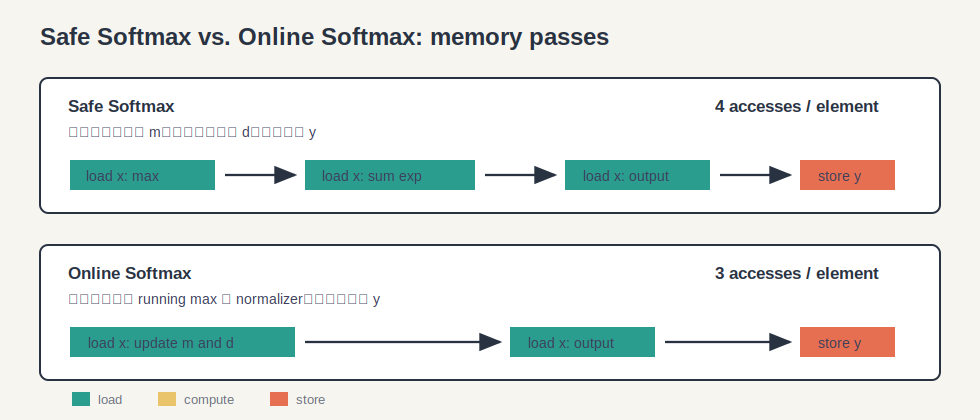
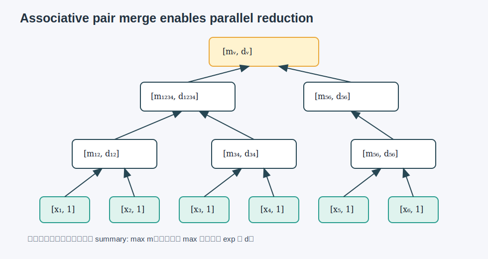
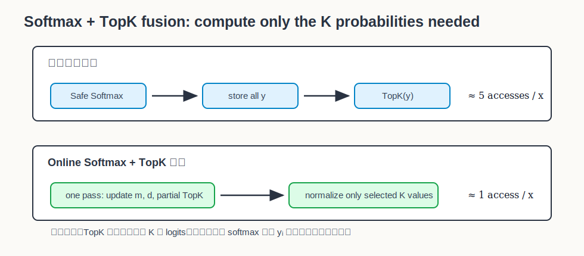

# Online Normalizer Calculation for Softmax 深度解析

Citation key: `milakovOnlineNormalizerCalculation`

文献：Maxim Milakov and Natalia Gimelshein, *Online Normalizer Calculation for Softmax*, arXiv:1805.02867v2, 2018.

来源：Zotero collection `01_ToRead`；PDF 路径来自 `research/data/zotero/references.bib`。

说明：本文档是对论文的中文深度解析，重点展开 softmax normalizer 的数学推导、online 更新公式、并行归约形式，以及 Softmax+TopK 融合为什么能减少访存。本文档中的图是为理解论文而自绘的解释图，不是论文原图。Zotero 导出的该条目未包含 DOI，故 DOI 标记为待核查。

## 1. 一句话总结

这篇论文的核心贡献是：把稳定 softmax 中“先求最大值、再求归一化分母”的两遍扫描，改写为一遍在线更新 `max` 和 normalizer 的形式；进一步把这个在线更新写成可结合的二元运算，从而支持并行归约，并让 Softmax+TopK 可以融合成更少访存的实现。

## 2. 论文要解决的问题

Softmax 定义为：

$$
y_i = \frac{e^{x_i}}{\sum_{j=1}^{V} e^{x_j}}
$$

其中 $x \in \mathbb{R}^{V}$ 是 logits，$y \in \mathbb{R}^{V}$ 是概率分布。

问题不在于公式本身复杂，而在于真实硬件上的两个事实：

1. 指数函数可能上溢或下溢，所以实际实现通常使用稳定版本。
2. Softmax 的计算量相对访存量很低，性能常常受内存带宽限制，而不是受浮点计算能力限制。

论文的目标不是近似 softmax，而是在保持原始 softmax 数值含义的前提下，减少内存访问次数。



## 3. 从 Naive Softmax 到 Safe Softmax

### 3.1 Naive Softmax

直接计算：

$$
y_i = \frac{e^{x_i}}{d_V}, \quad d_V = \sum_{j=1}^{V}e^{x_j}
$$

朴素实现通常需要：

1. 扫描一遍 $x$，计算 $d_V=\sum_j e^{x_j}$。
2. 再扫描一遍 $x$，计算每个 $y_i$ 并写出。

从访存角度看，每个元素大约经历：

$$
2 \text{ loads} + 1 \text{ store} = 3 \text{ memory accesses}
$$

但是这个版本不安全。若某个 $x_i$ 很大，$e^{x_i}$ 可能上溢；若某个 $x_i$ 很小，$e^{x_i}$ 可能下溢。

### 3.2 Safe Softmax

稳定 softmax 使用全局最大值：

$$
m_V = \max_{k=1}^{V} x_k
$$

然后写成：

$$
y_i = \frac{e^{x_i-m_V}}{\sum_{j=1}^{V} e^{x_j-m_V}}
$$

这个变换不改变 softmax 结果，因为：

$$
\frac{e^{x_i-m_V}}{\sum_{j=1}^{V} e^{x_j-m_V}}
=
\frac{e^{-m_V}e^{x_i}}{\sum_{j=1}^{V} e^{-m_V}e^{x_j}}
=
\frac{e^{-m_V}e^{x_i}}{e^{-m_V}\sum_{j=1}^{V}e^{x_j}}
=
\frac{e^{x_i}}{\sum_{j=1}^{V}e^{x_j}}
$$

Safe Softmax 的典型实现需要三次逻辑扫描：

1. 扫描 $x$，得到 $m_V$。
2. 再扫描 $x$，得到 $d_V=\sum_j e^{x_j-m_V}$。
3. 再扫描 $x$，计算并写出 $y_i=e^{x_i-m_V}/d_V$。

所以每个元素大约是：

$$
3 \text{ loads} + 1 \text{ store} = 4 \text{ memory accesses}
$$

论文指出主流深度学习框架采用的是这类 safe softmax 思路；论文的改进目标就是把其中前两遍合并。

## 4. Online Normalizer 的核心推导

Online Softmax 维护两个量：

$$
m_j = \max_{k=1}^{j}x_k
$$

$$
d_j = \sum_{i=1}^{j}e^{x_i-m_j}
$$

注意 $d_j$ 的基准是当前前缀最大值 $m_j$，不是最终最大值，也不是固定常数。

### 4.1 已知前缀时的状态

假设已经处理完前 $j-1$ 个元素，并且已经得到：

$$
m_{j-1} = \max_{k=1}^{j-1}x_k
$$

$$
d_{j-1} = \sum_{i=1}^{j-1}e^{x_i-m_{j-1}}
$$

现在读入新元素 $x_j$。新的最大值为：

$$
m_j = \max(m_{j-1}, x_j)
$$

关键问题是：如何用旧的 $d_{j-1}$ 推出新的 $d_j$？


### 4.2 旧 normalizer 为什么要重新缩放

新的 normalizer 定义为：

$$
d_j = \sum_{i=1}^{j}e^{x_i-m_j}
$$

拆成旧元素和新元素：

$$
d_j = \sum_{i=1}^{j-1}e^{x_i-m_j} + e^{x_j-m_j}
$$

旧的 $d_{j-1}$ 是：

$$
d_{j-1} = \sum_{i=1}^{j-1}e^{x_i-m_{j-1}}
$$

两者只差一个指数基准。对旧元素部分做变形：

$$
e^{x_i-m_j}
= e^{x_i-m_{j-1}+m_{j-1}-m_j}
= e^{x_i-m_{j-1}} \cdot e^{m_{j-1}-m_j}
$$

因此：

$$
\sum_{i=1}^{j-1}e^{x_i-m_j}
=
\sum_{i=1}^{j-1}
\left(
e^{x_i-m_{j-1}} \cdot e^{m_{j-1}-m_j}
\right)
$$

由于 $e^{m_{j-1}-m_j}$ 与 $i$ 无关，可以提出求和：

$$
\sum_{i=1}^{j-1}e^{x_i-m_j}
=
e^{m_{j-1}-m_j}
\sum_{i=1}^{j-1}e^{x_i-m_{j-1}}
$$

代入 $d_{j-1}$：

$$
\sum_{i=1}^{j-1}e^{x_i-m_j}
=
d_{j-1} \cdot e^{m_{j-1}-m_j}
$$

于是得到 online 更新公式：

$$
d_j
=
d_{j-1}\cdot e^{m_{j-1}-m_j}
+
e^{x_j-m_j}
$$

这正是论文 Algorithm 3 的第 5 行。

### 4.3 两种情况直观理解

情况 A：新元素没有超过旧最大值。

若 $x_j \le m_{j-1}$，则：

$$
m_j=m_{j-1}
$$

所以：

$$
e^{m_{j-1}-m_j}=e^0=1
$$

更新退化为：

$$
d_j=d_{j-1}+e^{x_j-m_j}
$$

也就是普通地把新元素贡献加进去。

情况 B：新元素成为新的最大值。

若 $x_j > m_{j-1}$，则：

$$
m_j=x_j
$$

新元素项：

$$
e^{x_j-m_j}=e^0=1
$$

旧 normalizer 必须缩放：

$$
d_{j-1}\cdot e^{m_{j-1}-x_j}
$$

因为原来所有旧项都是以较小的 $m_{j-1}$ 为基准，现在基准抬高到了 $x_j$，所以旧项整体变小。

## 5. 归纳证明：Online Softmax 计算的是同一个 normalizer

要证明 Algorithm 3 最终得到：

$$
m_V = \max_{k=1}^{V}x_k
$$

$$
d_V = \sum_{j=1}^{V}e^{x_j-m_V}
$$

### 5.1 基础情形

当 $V=1$：

$$
m_1 = \max(-\infty, x_1)=x_1
$$

$$
d_1 = d_0e^{m_0-m_1}+e^{x_1-m_1}
$$

其中 $d_0=0$，所以：

$$
d_1 = 0 + e^{x_1-x_1}=1
$$

同时：

$$
\sum_{j=1}^{1}e^{x_j-m_1}=e^{x_1-x_1}=1
$$

基础情形成立。

### 5.2 归纳假设

假设处理完前 $S-1$ 个元素时成立：

$$
m_{S-1}=\max_{k=1}^{S-1}x_k
$$

$$
d_{S-1}=\sum_{j=1}^{S-1}e^{x_j-m_{S-1}}
$$

### 5.3 归纳步骤

处理第 $S$ 个元素：

$$
m_S=\max(m_{S-1},x_S)
$$

代入归纳假设：

$$
m_S=\max\left(\max_{k=1}^{S-1}x_k,x_S\right)
=\max_{k=1}^{S}x_k
$$

再看 $d_S$：

$$
d_S=d_{S-1}e^{m_{S-1}-m_S}+e^{x_S-m_S}
$$

代入归纳假设：

$$
d_S
=
\left(
\sum_{j=1}^{S-1}e^{x_j-m_{S-1}}
\right)
e^{m_{S-1}-m_S}
+
e^{x_S-m_S}
$$

将指数相乘：

$$
e^{x_j-m_{S-1}}e^{m_{S-1}-m_S}
=
e^{x_j-m_S}
$$

所以：

$$
d_S
=
\sum_{j=1}^{S-1}e^{x_j-m_S}
+
e^{x_S-m_S}
=
\sum_{j=1}^{S}e^{x_j-m_S}
$$

归纳完成。因此 Online Softmax 的 normalizer 与 Safe Softmax 的 normalizer 一致。

## 6. 一个完整数值例子

设：

$$
x=[1,3,2]
$$

Safe Softmax 先求：

$$
m=3
$$

然后：

$$
d=e^{1-3}+e^{3-3}+e^{2-3}
=e^{-2}+1+e^{-1}
$$

近似值：

$$
d\approx 0.1353+1+0.3679=1.5032
$$

输出：

$$
y_1=\frac{e^{-2}}{1.5032}\approx 0.0900
$$

$$
y_2=\frac{1}{1.5032}\approx 0.6652
$$

$$
y_3=\frac{e^{-1}}{1.5032}\approx 0.2447
$$

现在看 Online Softmax：

初始：

$$
m_0=-\infty,\quad d_0=0
$$

第 1 个元素 $x_1=1$：

$$
m_1=\max(-\infty,1)=1
$$

$$
d_1=0+e^{1-1}=1
$$

第 2 个元素 $x_2=3$：

$$
m_2=\max(1,3)=3
$$

$$
d_2=d_1e^{m_1-m_2}+e^{x_2-m_2}
=1\cdot e^{1-3}+e^{3-3}
=e^{-2}+1
\approx 1.1353
$$

第 3 个元素 $x_3=2$：

$$
m_3=\max(3,2)=3
$$

$$
d_3=d_2e^{m_2-m_3}+e^{x_3-m_3}
=1.1353\cdot e^0+e^{-1}
\approx 1.1353+0.3679=1.5032
$$

最终得到的 $m_3$ 和 $d_3$ 与 Safe Softmax 完全一致。

这个例子展示了 online 公式的关键：当最大值从 1 变成 3 时，旧的和必须乘上 $e^{1-3}$，也就是把“以 1 为基准”的旧分母改写成“以 3 为基准”的分母。

## 7. “无法并行”如何变成“可以并行”

严格说，Safe Softmax 的 max reduction 和 sum reduction 本身都可以并行；真正的问题是它们之间存在顺序依赖：

```text
必须先得到全局 max m
然后才能计算 sum exp(x_i - m)
```

也就是说，第二个归约依赖第一个归约的结果。Online 公式先把这两件事合并成一个状态更新：

$$
(m,d)
$$

但如果只看 Algorithm 3，它仍然像是一个顺序递推：

$$
(m_j,d_j) = f((m_{j-1},d_{j-1}),x_j)
$$

论文真正让它适合并行的关键，是定义了一个二元合并运算 $\oplus$。



### 7.1 把单个元素表示成一个 summary

对每个元素 $x_i$，定义一个二元组：

$$
\begin{bmatrix}
x_i \\
1
\end{bmatrix}
$$

这里的含义是：只看一个元素时，最大值就是 $x_i$，而 normalizer 是：

$$
e^{x_i-x_i}=1
$$

### 7.2 合并两个 summary

设左边一段的 summary 是：

$$
\begin{bmatrix}
m_i \\
d_i
\end{bmatrix}
$$

右边一段的 summary 是：

$$
\begin{bmatrix}
m_j \\
d_j
\end{bmatrix}
$$

合并后新的最大值：

$$
m=\max(m_i,m_j)
$$

左段的 normalizer 原来以 $m_i$ 为基准，合并后要改成以 $m$ 为基准：

$$
d_i \cdot e^{m_i-m}
$$

右段同理：

$$
d_j \cdot e^{m_j-m}
$$

所以二元运算定义为：

$$
\begin{bmatrix}
m_i \\
d_i
\end{bmatrix}
\oplus
\begin{bmatrix}
m_j \\
d_j
\end{bmatrix}
=
\begin{bmatrix}
\max(m_i,m_j) \\
d_i e^{m_i-\max(m_i,m_j)}
+
d_j e^{m_j-\max(m_i,m_j)}
\end{bmatrix}
$$

这就是论文式 (4) 的含义。

### 7.3 为什么这个运算可以并行

考虑任意一组元素集合 $A$，它的 summary 为：

$$
\Phi(A)=
\left(
m_A,\ d_A
\right)
$$

其中：

$$
m_A=\max_{x\in A}x
$$

$$
d_A=\sum_{x\in A}e^{x-m_A}
$$

对两个不相交分块 $A$ 和 $B$，合并集合 $A\cup B$：

$$
m_{A\cup B}=\max(m_A,m_B)
$$

$$
d_{A\cup B}
=
\sum_{x\in A}e^{x-m_{A\cup B}}
+
\sum_{x\in B}e^{x-m_{A\cup B}}
$$

对 $A$ 的部分：

$$
\sum_{x\in A}e^{x-m_{A\cup B}}
=
\sum_{x\in A}
e^{x-m_A}
e^{m_A-m_{A\cup B}}
=
d_Ae^{m_A-m_{A\cup B}}
$$

对 $B$ 的部分同理：

$$
\sum_{x\in B}e^{x-m_{A\cup B}}
=
d_Be^{m_B-m_{A\cup B}}
$$

所以：

$$
\Phi(A\cup B)=\Phi(A)\oplus\Phi(B)
$$

这说明 $\oplus$ 实际上是在合并“集合 summary”。集合并集满足结合律：

$$
(A\cup B)\cup C = A\cup (B\cup C)
$$

因此对应的 summary 合并也满足结合律：

$$
(\Phi(A)\oplus\Phi(B))\oplus\Phi(C)
=
\Phi(A)\oplus(\Phi(B)\oplus\Phi(C))
$$

这就是它能并行的数学原因。

### 7.4 与普通并行 reduction 的关系

普通 sum reduction 可以这样并行：

```text
(a + b) + (c + d)
```

因为加法满足结合律。

Online normalizer 的贡献在于：它把“max + shifted exponential sum”包装成一个同样满足结合律的二元运算：

```text
([x1,1] ⊕ [x2,1]) ⊕ ([x3,1] ⊕ [x4,1])
```

于是原来必须等全局 max 出来后才能开始的 normalizer 计算，变成了每个分块都可以先独立计算 summary，最后通过树形归约合并。

## 8. Online Softmax 为什么仍然需要第二遍

Online normalizer 把 $m_V$ 和 $d_V$ 的计算合并成一遍，但最终每个输出仍然是：

$$
y_i=\frac{e^{x_i-m_V}}{d_V}
$$

这里的 $m_V$ 和 $d_V$ 是全局结果。除非你在第一遍保存所有中间信息或直接融合后续算子，否则要写出完整 $y$ 仍然需要再读一遍 $x$。

所以普通 Online Softmax 是：

1. 第一遍：读 $x$，同时得到 $m_V$ 和 $d_V$。
2. 第二遍：读 $x$，计算并写出 $y$。

访存约为：

$$
2 \text{ loads} + 1 \text{ store} = 3 \text{ accesses}
$$

相比 Safe Softmax 的 4 次访问，理论访存减少比例为：

$$
\frac{4}{3}\approx 1.33
$$

论文实验中，在 Tesla V100 上，当向量大小足够大、进入内存带宽受限区间时，Online Softmax 相对 Safe Softmax 最高接近 1.3 倍加速，这与访存减少的理论比例相符。

## 9. Softmax + TopK 融合为什么更强

自回归模型 beam search 中经常有：

```text
logits -> softmax -> top-k
```

如果先完整计算 softmax，就会写出整个 $y$ 向量，然后 TopK 再读这个 $y$ 向量找最大的 K 个概率。

但 softmax 是单调变换：对于 logits $x_i$ 和 $x_j$，如果：

$$
x_i > x_j
$$

那么在同一个 normalizer 下：

$$
\frac{e^{x_i-m}}{d} > \frac{e^{x_j-m}}{d}
$$

因此 TopK 的索引可以直接从 logits 的 TopK 得到，不必先生成所有概率。



论文的 Algorithm 4 在扫描输入时同时维护：

1. running max $m$
2. running normalizer $d$
3. 当前最大的 K 个 logits $u$
4. 它们的索引 $p$

等扫描结束后，只对这 K 个 logits 做归一化：

$$
v_i=\frac{e^{u_i-m_V}}{d_V}
$$

$$
z_i=p_i
$$

这样就不需要把完整 softmax 向量 $y$ 写回内存。论文将 Safe Softmax + TopK 分离执行估为每元素约 5 次访问，而 Online Softmax + TopK 融合后可以接近每元素 1 次输入访问。实验中，K=5 时在 Tesla V100 上观察到最高约 5 倍的性能提升。

## 10. 论文结果整理

| 任务 | 传统方式 | Online 方式 | 论文报告的效果 |
|---|---|---|---|
| Softmax | Safe Softmax，约 4 次访存/元素 | Online Softmax，约 3 次访存/元素 | 向量较大时最高约 1.3x |
| 小 batch Softmax | GPU 利用率低，延迟暴露 | 减少访存仍有帮助 | 约 1.15x |
| Softmax+TopK | 先写完整 softmax，再 TopK | 一遍维护 normalizer 和 partial TopK | K=5 时最高约 5x |
| 数值稳定性 | 稳定 | 同样稳定 | $1 \le d_j \le j$ |

## 11. 和 FlashAttention 的关系

这篇论文对后来的高性能 attention 实现很重要，因为 attention 中每一行本质上都需要类似：

$$
\text{softmax}(q_iK^T)V
$$

其中 softmax normalizer 如果按传统方式计算，需要先知道整行 score 的最大值和分母。FlashAttention 的 IO-aware 思路会分块处理 attention scores，而分块时就需要能够把不同块的 softmax 统计量合并起来。

Online normalizer 的 pair summary：

$$
(m,d)
$$

和分块合并公式：

$$
d_{\text{new}}
=
d_{\text{old}}e^{m_{\text{old}}-m_{\text{new}}}
+
d_{\text{block}}e^{m_{\text{block}}-m_{\text{new}}}
$$

正是这类分块 softmax 的核心数学工具之一。直观说，它让 softmax 不再要求一次性持有完整向量，而是可以对不同块分别算 summary，再把 summary 合并。

放到 FlashAttention 里看，Online normalizer 解决的是“每个 attention score tile 的 softmax 分母如何合并”。FlashAttention 进一步把状态从：

$$
(m,d)
$$

扩展成：

$$
(m,d,o)
$$

其中 $o$ 表示当前已经处理过的 $V$ 的归一化加权输出。也就是说，FlashAttention 不只是用二元合并得到 softmax normalizer，还把对 $V$ 的加权和一起纳入同一个流式更新过程。

这也是理解 FlashAttention 中 online softmax / block-wise softmax 的前置概念：Online Normalizer Calculation 给出可合并的 softmax summary，FlashAttention 则把这个 summary 扩展到完整 attention 输出。

## 12. 局限与注意事项

1. 论文实验主要在 NVIDIA Tesla V100 上完成。作者在讨论中提到 CPU 等其他设备可能也受益，但没有做实验验证。
2. Online Softmax 增加了少量浮点运算，例如每个元素多出缩放旧 normalizer 的指数操作；收益依赖于任务是否主要受访存限制。
3. Softmax+TopK 融合对小 K 更有效。论文报告 K 增大时，维护 partial TopK 的成本会上升，收益下降。
4. 该方法不改变 softmax 的数学定义，因此不是近似方法；它优化的是计算组织方式和访存路径。

## 13. 我对这篇论文的理解

这篇论文最值得记住的不是“softmax 快了 1.3 倍”这个数字，而是它给出了一个很通用的计算模式：

```text
原来需要全局信息才能计算的归一化问题
如果能写成可合并的局部 summary
就可以变成分块、并行、融合友好的算法
```

对 softmax 来说，这个 summary 是：

$$
(m,d)
$$

其中 $m$ 控制数值稳定性，$d$ 保存以 $m$ 为基准的指数和。只要每次合并时把不同基准下的 $d$ 重新缩放到共同基准，就可以安全地合并任意分块。

这使得 softmax 从一个“必须先全局 max、再全局 sum”的两阶段过程，变成一个可以在工程上灵活调度的归约过程。

## 14. 后续可补充内容

- 补充与 FlashAttention 论文中 online softmax 的公式对照。
- 补充 CUDA reduction 层面的实现注释。
- 从 Zotero PDF 中截取论文 Figure 1-4，放入 `figures/` 并在本文中加入实验图解读。
- 将本文内容压缩成 paper card。
- 将核心推导整理成 3-5 页 slides outline。
