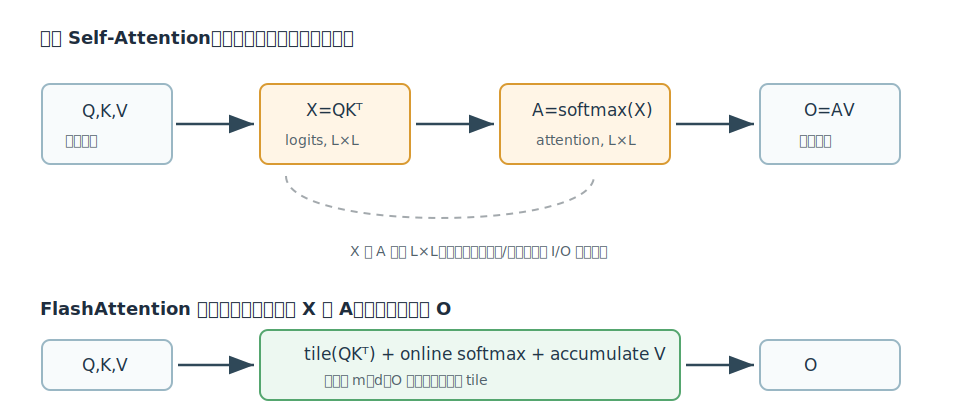
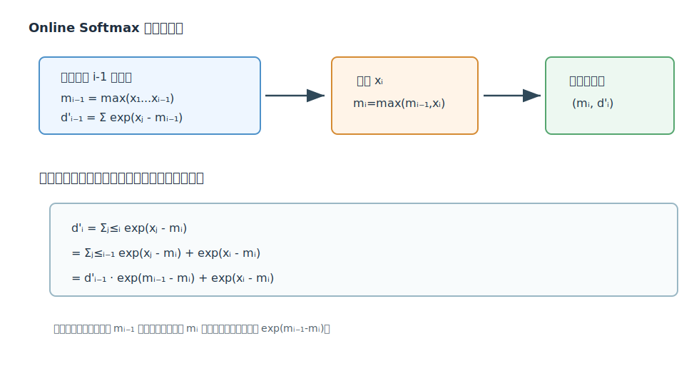
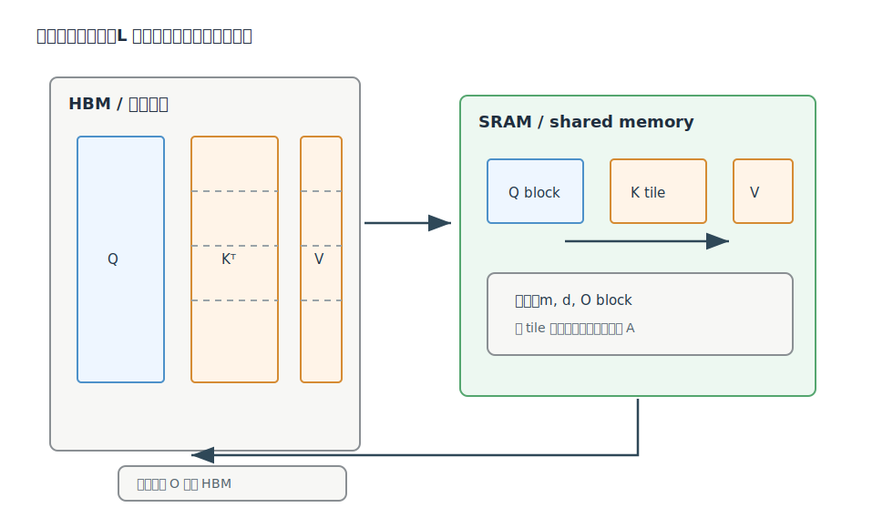

# From Online Softmax to FlashAttention 深度解析

Citation key: `yeOnlineSoftmaxFlashAttention`

文献：Zihao Ye, *From Online Softmax to FlashAttention*, 2023-05-11.

来源：Zotero collection `01_ToRead`；PDF 路径来自 `research/data/zotero/01_ToRead.bib`。

说明：这篇文章是一篇教学型 note，目标是解释 FlashAttention 的关键思想如何从 Online Softmax 推导出来。本文档中的图是为理解文章而自绘的解释图，不是原文截图。

## 1. 一句话总结

这篇文章的核心观点是：FlashAttention 能把完整 self-attention 融合到一个 CUDA kernel 中，根本原因不是 softmax 被近似了，而是 softmax 的归一化状态可以像 Online Softmax 那样在线更新；进一步地，attention 的最终目标是 $O=\operatorname{softmax}(QK^T)V$，而不是中间的 attention matrix $A$，所以可以把“归一化分母”和“对 $V$ 的加权和”一起改写成流式递推。

## 2. 文章要回答的问题

标准 self-attention 通常写成：

$$
O=\operatorname{softmax}(QK^T)V
$$

其中 $Q,K,V,O\in\mathbb{R}^{L\times D}$，$L$ 是序列长度，$D$ 是单个 head 的维度。文章为了突出核心思想，省略了 batch、head、mask、scale factor 等细节。

标准实现会分成三步：

$$
X=QK^T
$$

$$
A=\operatorname{softmax}(X)
$$

$$
O=AV
$$

这里的 $X$ 是 pre-softmax logits，$A$ 是 attention score。问题在于 $X$ 和 $A$ 都是 $L\times L$ 矩阵。长上下文时，哪怕 $D$ 不大，$L^2$ 规模的中间矩阵也会带来非常重的 HBM 读写。

文章的问题可以精确表述为：

> 能不能像矩阵乘法那样分块计算 self-attention，只把当前小块放在片上内存中，并且不把完整 $X$ 和 $A$ 写回全局内存？

矩阵乘法容易分块，因为：

$$
C_{ij}=\sum_k A_{ik}B_{kj}
$$

求和满足结合律。我们可以按 $k$ 维度分块，逐块累加 partial sum，最后得到同一个 $C_{ij}$。

但 self-attention 中间夹着 softmax：

$$
\operatorname{softmax}(x_i)=\frac{e^{x_i}}{\sum_j e^{x_j}}
$$

每个元素的分母依赖整行所有 logits。只看一个 tile 时，不知道全局分母，也不知道全局最大值。因此，朴素分块会卡在 softmax 这一层。

## 3. Safe Softmax：为什么需要三遍

普通 softmax 是：

$$
a_i=\frac{e^{x_i}}{\sum_{j=1}^{N}e^{x_j}}
$$

如果 $x_i$ 很大，$e^{x_i}$ 可能溢出。稳定实现使用最大值平移：

$$
m_N=\max_{j=1}^{N}x_j
$$

$$
a_i=\frac{e^{x_i-m_N}}{\sum_{j=1}^{N}e^{x_j-m_N}}
$$

这个变换不改变结果，因为分子分母同时乘了 $e^{-m_N}$：

$$
\frac{e^{x_i-m_N}}{\sum_j e^{x_j-m_N}}
=
\frac{e^{-m_N}e^{x_i}}{e^{-m_N}\sum_j e^{x_j}}
=
\frac{e^{x_i}}{\sum_j e^{x_j}}
$$

Safe Softmax 的直接算法是三遍：

1. 第一遍求 $m_N$。
2. 第二遍求 $d_N=\sum_j e^{x_j-m_N}$。
3. 第三遍输出 $a_i=e^{x_i-m_N}/d_N$。

在 attention 里，$x_i$ 不是已经廉价存在的一维数组，而是：

$$
x_i=Q[k,:]\cdot K[i,:]
$$

如果不保存整行 logits，就要反复读取 $Q$ 和 $K$ 重新计算。若保存，则又回到 $L\times L$ 中间矩阵的 HBM 压力。文章由此引出 Online Softmax：能不能在看到元素时就更新归一化状态？

## 4. Online Softmax：把最大值和分母合成一遍

Online Softmax 的状态是两个量：

$$
m_i=\max_{j=1}^{i}x_j
$$

$$
d'_i=\sum_{j=1}^{i}e^{x_j-m_i}
$$

注意 $d'_i$ 的基准是当前前缀最大值 $m_i$，不是最终最大值 $m_N$。这个选择是整个推导的入口。

假设已经处理到 $i-1$，我们知道：

$$
m_{i-1}=\max(x_1,\ldots,x_{i-1})
$$

$$
d'_{i-1}=\sum_{j=1}^{i-1}e^{x_j-m_{i-1}}
$$

读入 $x_i$ 后，新最大值为：

$$
m_i=\max(m_{i-1},x_i)
$$

新的分母定义是：

$$
d'_i=\sum_{j=1}^{i}e^{x_j-m_i}
$$

拆成旧元素和新元素：

$$
d'_i=\sum_{j=1}^{i-1}e^{x_j-m_i}+e^{x_i-m_i}
$$

旧元素部分需要把基准从 $m_{i-1}$ 换成 $m_i$：

$$
e^{x_j-m_i}
=e^{x_j-m_{i-1}}e^{m_{i-1}-m_i}
$$

所以：

$$
\sum_{j=1}^{i-1}e^{x_j-m_i}
=
e^{m_{i-1}-m_i}\sum_{j=1}^{i-1}e^{x_j-m_{i-1}}
=
d'_{i-1}e^{m_{i-1}-m_i}
$$

得到递推式：

$$
d'_i=d'_{i-1}e^{m_{i-1}-m_i}+e^{x_i-m_i}
$$

这个式子只依赖旧状态 $(m_{i-1},d'_{i-1})$ 和新输入 $x_i$，因此可以一遍扫描得到最终 $m_N,d'_N$。由于 $m_N$ 就是最终最大值，$d'_N$ 等于 safe softmax 里的分母：

$$
d'_N=\sum_{j=1}^{N}e^{x_j-m_N}
$$

不过，普通 softmax 要输出每个 $a_i$，仍然需要第二遍：

$$
a_i=\frac{e^{x_i-m_N}}{d'_N}
$$

也就是说，Online Softmax 把 safe softmax 从三遍变成两遍，但无法单独把 softmax 输出矩阵压到一遍。

## 5. 关键转折：Attention 的目标不是 A，而是 O

文章最重要的推理点在这里：FlashAttention 不是要输出 attention score $A$，而是要输出：

$$
O=AV
$$

对第 $k$ 行单独看：

$$
O[k,:]=\sum_{i=1}^{N} a_i V[i,:]
$$

其中：

$$
a_i=\frac{e^{x_i-m_N}}{d'_N}
$$

$$
x_i=Q[k,:]\cdot K[i,:]
$$

如果我们坚持先得到所有 $a_i$，就必须等 $m_N,d'_N$ 出来后再扫一遍。但如果最终只需要加权和 $O[k,:]$，就可以把“输出向量”也做成随前缀变化的在线状态。

定义前缀输出状态：

$$
o'_i=\sum_{j=1}^{i}\frac{e^{x_j-m_i}}{d'_i}V[j,:]
$$

它表示：只看前 $i$ 个 logits 时，以当前最大值 $m_i$ 和当前分母 $d'_i$ 归一化后，对 $V$ 做出的加权和。

最终当 $i=N$ 时：

$$
o'_N=\sum_{j=1}^{N}\frac{e^{x_j-m_N}}{d'_N}V[j,:]=O[k,:]
$$

因此，只要能推导出 $o'_i$ 对 $o'_{i-1}$ 的递推，就能一遍扫完一行 attention。

## 6. 推导 FlashAttention 的单元素递推

从定义出发：

$$
o'_i=\sum_{j=1}^{i}\frac{e^{x_j-m_i}}{d'_i}V[j,:]
$$

拆成旧元素和新元素：

$$
o'_i=
\sum_{j=1}^{i-1}\frac{e^{x_j-m_i}}{d'_i}V[j,:]
+
\frac{e^{x_i-m_i}}{d'_i}V[i,:]
$$

现在处理旧元素部分。旧状态 $o'_{i-1}$ 是：

$$
o'_{i-1}=
\sum_{j=1}^{i-1}\frac{e^{x_j-m_{i-1}}}{d'_{i-1}}V[j,:]
$$

我们要把它改写成新基准 $m_i,d'_i$ 下的形式：

$$
\frac{e^{x_j-m_i}}{d'_i}
=
\frac{e^{x_j-m_{i-1}}e^{m_{i-1}-m_i}}{d'_i}
$$

为了和 $o'_{i-1}$ 对齐，乘除 $d'_{i-1}$：

$$
\frac{e^{x_j-m_i}}{d'_i}
=
\frac{e^{x_j-m_{i-1}}}{d'_{i-1}}
\cdot
\frac{d'_{i-1}e^{m_{i-1}-m_i}}{d'_i}
$$

因此旧元素整体为：

$$
\sum_{j=1}^{i-1}\frac{e^{x_j-m_i}}{d'_i}V[j,:]
=
o'_{i-1}\cdot\frac{d'_{i-1}e^{m_{i-1}-m_i}}{d'_i}
$$

加入新元素贡献：

$$
o'_i=
o'_{i-1}\cdot\frac{d'_{i-1}e^{m_{i-1}-m_i}}{d'_i}
+
V[i,:]\cdot\frac{e^{x_i-m_i}}{d'_i}
$$

再配合：

$$
m_i=\max(m_{i-1},x_i)
$$

$$
d'_i=d'_{i-1}e^{m_{i-1}-m_i}+e^{x_i-m_i}
$$

就得到文章中的 FlashAttention 单行递推：

$$
x_i=Q[k,:]K[i,:]^T
$$

$$
m_i=\max(m_{i-1},x_i)
$$

$$
d'_i=d'_{i-1}e^{m_{i-1}-m_i}+e^{x_i-m_i}
$$

$$
o'_i=
o'_{i-1}\frac{d'_{i-1}e^{m_{i-1}-m_i}}{d'_i}
+
V[i,:]\frac{e^{x_i-m_i}}{d'_i}
$$

最终：

$$
O[k,:]=o'_N
$$

这个推导说明：FlashAttention 的精确性来自代数等价，不是来自近似 softmax。

## 7. 从单元素到 tile：为什么能映射到 GPU

单元素递推解释了数学可行性，但 GPU 上不会真的每次只处理一个 $K[i,:]$ 和 $V[i,:]$。实际会按 block/tile 处理。

这一节本质上是在把 Online Normalizer Calculation 里的二元合并思想从“单个元素”推广到“一个 tile”。tile 内先归约出局部 summary，tile 间再用同一个 rescale 规则把新旧 summary 合并起来。

设一个 tile 大小为 $b$。第 $t$ 个 tile 包含一段 logits：

$$
x^{(t)}=Q[k,:]K[(t-1)b:tb,:]^T
$$

先求 tile 内局部最大值：

$$
m_{\text{local}}^{(t)}=\max_j x^{(t)}_j
$$

再更新全局前缀最大值：

$$
m_t=\max(m_{t-1},m_{\text{local}}^{(t)})
$$

分母更新从单元素求和变成 tile 内求和：

$$
d'_t=d'_{t-1}e^{m_{t-1}-m_t}
+
\sum_{j=1}^{b}e^{x^{(t)}_j-m_t}
$$

输出更新也变成 tile 内加权和：

$$
o'_t=
o'_{t-1}\frac{d'_{t-1}e^{m_{t-1}-m_t}}{d'_t}
+
\sum_{j=1}^{b}
V[(t-1)b+j,:]\frac{e^{x^{(t)}_j-m_t}}{d'_t}
$$

这就是文章说的：状态 $x,m,d,o$ 的 footprint 很小，可以放在片上内存里；一块一块扫过 $K,V$，持续更新 $m,d,O$，最后只把 $O$ 写回 HBM。

这里的关键不是时间复杂度从 $O(L^2D)$ 变成了别的量。FlashAttention 仍然计算精确 attention，计算量本质上还是二次的。关键变化是 I/O：

| 实现方式 | HBM 中间结果 | 主要问题 |
| --- | --- | --- |
| 标准 Attention | 写出 $X=QK^T$，写出 $A=\operatorname{softmax}(X)$，再读回做 $AV$ | $L\times L$ 中间矩阵访存昂贵 |
| FlashAttention | 不物化完整 $X$ 和 $A$，只流式保存当前 tile 与状态 | 降低 HBM 读写，增加片上复用 |

这也是文章标题中 “From Online Softmax to FlashAttention” 的含义：Online Softmax 解决的是 softmax 分母的在线更新；FlashAttention 进一步意识到，在 attention 中可以连输出加权和一起在线更新。

## 8. 逐步推理链

下面把整篇文章的逻辑压成一条推理链，便于复盘：

1. 标准 attention 可以写成 $O=\operatorname{softmax}(QK^T)V$。
2. 若直接实现，会物化 $X=QK^T$ 和 $A=\operatorname{softmax}(X)$。
3. $X,A$ 都是 $L\times L$，长序列时写入/读出 HBM 的成本很高。
4. 矩阵乘法可以分块，因为求和可结合；attention 难分块，因为 softmax 分母依赖整行。
5. Safe Softmax 为了数值稳定，需要先知道全局最大值 $m_N$，再求分母 $d_N$，最后输出概率。
6. Online Softmax 把分母定义为前缀版本 $d'_i=\sum_{j\le i}e^{x_j-m_i}$，从而用状态 $(m_i,d'_i)$ 一遍更新。
7. 但是仅计算 softmax 输出仍要第二遍，因为每个 $a_i$ 都依赖最终 $m_N,d'_N$。
8. Attention 的最终输出不是 $a_i$ 本身，而是 $\sum_i a_iV[i,:]$。
9. 因此定义前缀输出状态 $o'_i=\sum_{j\le i}\frac{e^{x_j-m_i}}{d'_i}V[j,:]$。
10. 通过把旧权重从 $(m_{i-1},d'_{i-1})$ 换基准到 $(m_i,d'_i)$，得到 $o'_i$ 的递推。
11. 单元素递推可以推广到 tile 递推。
12. tile 递推让每次只需在 SRAM 中保存当前 $Q/K/V$ tile、局部 logits、以及 $m,d,O$ 状态。
13. 因此完整 attention 可以融合在一个 kernel 中，不把 $X,A$ 写到 HBM。

## 9. 一个小例子：为什么旧输出要缩放

假设已经处理两个 logits：

$$
x_1=1,\quad x_2=2
$$

此时：

$$
m_2=2
$$

$$
d'_2=e^{1-2}+e^{2-2}=e^{-1}+1
$$

$$
o'_2=
\frac{e^{-1}}{e^{-1}+1}V[1,:]
+
\frac{1}{e^{-1}+1}V[2,:]
$$

现在加入一个更大的 $x_3=5$。最大值从 $2$ 变成 $5$，旧元素的指数都要从 “减 2” 改成 “减 5”。旧分母整体缩放：

$$
d'_2 e^{m_2-m_3}
=
(e^{-1}+1)e^{2-5}
=
e^{-4}+e^{-3}
$$

新分母：

$$
d'_3=e^{-4}+e^{-3}+1
$$

旧输出 $o'_2$ 里已经包含了 $V[1,:]$ 和 $V[2,:]$ 的相对比例，但它们在新分母下的总质量变小了。因此旧输出整体乘：

$$
\frac{d'_2e^{m_2-m_3}}{d'_3}
$$

新元素 $V[3,:]$ 的质量是：

$$
\frac{e^{x_3-m_3}}{d'_3}=\frac{1}{d'_3}
$$

于是：

$$
o'_3=
o'_2\frac{d'_2e^{m_2-m_3}}{d'_3}
+
V[3,:]\frac{1}{d'_3}
$$

这个例子直观解释了 FlashAttention 递推式中两个权重的含义：

- 旧输出的缩放项：旧概率质量在新归一化基准下还剩多少。
- 新值向量的权重项：当前 token 在新归一化基准下占多少概率质量。

## 10. 与 FlashAttention 原论文的关系

Zihao Ye 这篇 note 主要做的是“从数学推导理解 FlashAttention”。它没有展开 FlashAttention 原论文中的全部工程细节，例如：

- backward pass 如何保存/重算中间状态；
- CUDA kernel 的线程块布局；
- causal mask、dropout、multi-head、batch 的工程处理；
- IO complexity 的形式化最优性证明；
- block-sparse FlashAttention。

但它抓住了最核心的一点：FlashAttention 的 exactness 来自 online normalizer 与 online output accumulator 的等价变换；它的速度优势来自减少 HBM 访问，而不是改变 attention 的数学定义。

## 11. 读完后的关键结论

1. FlashAttention 的“flash”不只是少存一个矩阵，而是把 $QK^T$、softmax、乘 $V$ 三个阶段融合成流式状态更新。
2. Online Softmax 是理解 FlashAttention 的最短路径，因为它解释了如何在不知道最终最大值之前稳定地维护归一化分母。
3. 普通 softmax 即使用 online normalizer 也不能一遍输出所有概率；attention 可以一遍，是因为最终需要的是概率加权和，而不是概率矩阵本身。
4. 分块递推成立后，FlashAttention 就能把长序列维度切成 tile，让 SRAM footprint 与 tile 大小和 head dimension 相关，而不直接随完整序列长度 $L$ 增长。
5. 这篇文章适合作为 FlashAttention 原论文前的桥梁：先理解公式递推，再去读 IO-aware tiling、kernel implementation 和 backward pass，会顺很多。

## 12. 参考文献

- Zihao Ye, *From Online Softmax to FlashAttention*, 2023.
- Tri Dao, Daniel Y. Fu, Stefano Ermon, Atri Rudra, Christopher Ré, *FlashAttention: Fast and Memory-Efficient Exact Attention with IO-Awareness*, 2022.
- Maxim Milakov, Natalia Gimelshein, *Online Normalizer Calculation for Softmax*, 2018.
