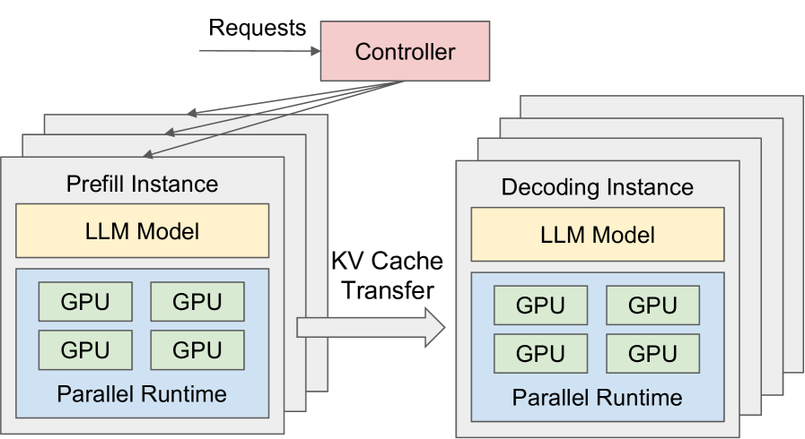
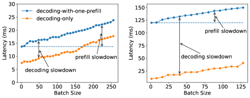
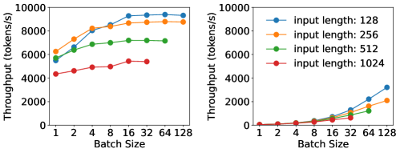
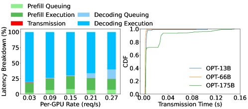
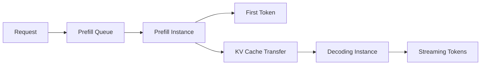
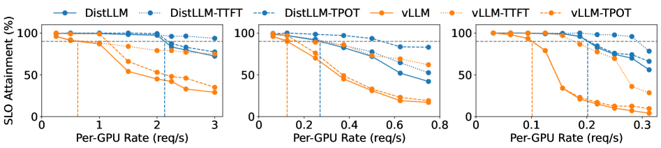
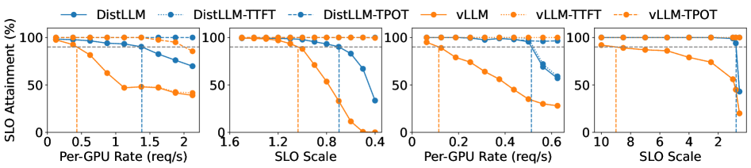
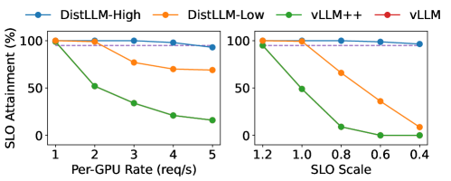

# DistServe: Disaggregating Prefill and Decoding for Goodput-optimized Large Language Model Serving

## 0. 论文定位

DistServe 的核心问题不是“怎样让单个请求更快”，而是：**在 TTFT 和 TPOT 都有 SLO 的在线服务里，怎样用更少 GPU 支撑更多满足延迟要求的请求？**

它的回答是：把 prefill 与 decoding 拆到不同 GPU 上，分别做资源配置、并行策略选择和 placement。这样既消除 prefill/decode 干扰，也解除两阶段共享同一并行策略的限制。



## 1. 关键概念

### 1.1 TTFT、TPOT 与 goodput

LLM 服务的用户体验通常不是一个单一 latency：

- **TTFT**：time to first token，首 token 延迟，主要对应 prefill。
- **TPOT**：time per output token，平均每个后续 token 的生成时间，主要对应 decoding。
- **SLO attainment**：满足 TTFT 和 TPOT 要求的请求比例。
- **per-GPU goodput**：在达到 SLO attainment 目标时，每张 GPU 能支撑的最大请求率。

DistServe 强调：只看 token/s 会误导系统设计。一个系统可能总吞吐很高，但很多请求 TPOT 或 TTFT 超标，对在线服务来说这些请求不是有效吞吐。

### 1.2 colocate 的两个问题

第一是 **prefill-decoding interference**。

Prefill step 通常比单个 decode step 长得多。当它们被放进同一个 batch 或同一 GPU 队列时：

- decode 请求可能要等长 prefill 完成，TPOT 被拉长；
- prefill batch 中混入 decode，也会增加 prefill 完成时间；
- 即使不混 batch，只要共享同一 GPU 队列，也会互相排队。



第二是 **resource and parallelism coupling**。

Prefill 和 decode 对并行策略的偏好不同：

- prefill 为了降低 TTFT，可能更适合 intra-op parallelism 或更多 GPU 来缩短执行时间；
- decode 为了提高 rate capacity 和控制 TPOT，可能更适合不同的 pipeline/intra-op 组合；
- colocate 迫使两阶段使用同一套资源和 parallelism plan。

## 2. 计算特性分析

### 2.1 Prefill instance

Prefill 处理整个 prompt。输入 token 数多时，大 GEMM 和 attention 计算很容易把 GPU 变成 compute-bound。

论文中的经验结论是：当 prompt 足够长，继续增加 prefill batch size 不一定提高吞吐，反而会把 batch 中所有请求的 TTFT 拉长。因此 prefill instance 的 batching 需要谨慎，通常要先 profile 出一个临界长度 `L_m`：

```text
如果当前 prompt length >= L_m:
    不再积极合并更多 prefill 请求
否则:
    可以适度 batching 以提高 GPU 利用率
```



### 2.2 Decoding instance

Decode 每一步只处理一个新 token，但要读取历史 KV cache。它的特点是：

- 单步 GEMM 规模小，算力利用率偏低；
- 每步 attention 要读历史 KV，因此受显存带宽影响明显；
- 增大 decode batch 往往能提高吞吐，直到 KV cache 容量或 bandwidth 成为瓶颈。

这意味着 decode instance 常常可以用较少或不同配置的 GPU 承担多个 prefill instance 的后续 token 生成。

### 2.3 为什么传输 KV cache 可以接受

拆分之后，prefill 完成后必须把 KV cache 传给 decoding instance。对一个请求来说，KV cache 大小近似为：

```text
KV_bytes = 2 * num_layers * hidden_size * prompt_tokens * bytes_per_element
```

这里的 `2` 对应 K 和 V。对于 tensor parallelism，还要考虑每张 GPU 持有的 shard。

DistServe 的关键判断是：现代 GPU 集群中，合理 placement 后 KV cache 传输开销相对端到端服务时间很小。论文在 OPT-175B 上做 latency breakdown，显示 KV cache transmission 占总延迟比例很低。



## 3. 系统设计

### 3.1 instance 抽象

DistServe 用 instance 表示一个完整模型副本的执行单元：

- **prefill instance**：只处理 prompt，生成 first token 和 KV cache。
- **decoding instance**：接收 KV cache，继续生成后续 token。

一个 instance 可以包含多张 GPU，因为模型可能通过 tensor parallelism、pipeline parallelism 或 inter/intra-op parallelism 分布执行。

### 3.2 请求生命周期

一个请求在 DistServe 中大致经历：

1. 客户端请求进入 orchestration layer。
2. 请求被分配到 prefill instance。
3. prefill instance 执行 prompt forward，得到 first token 与 KV cache。
4. KV cache 被传给 decoding instance。
5. decoding instance 进行连续 token generation。
6. 输出流式返回客户端。

可把它理解为：



### 3.3 placement 要解决什么

拆分后，系统多了很多配置变量：

- 给 prefill 分多少 GPU？
- 给 decode 分多少 GPU？
- prefill 用什么 parallelism？
- decode 用什么 parallelism？
- 哪些 prefill instance 与哪些 decoding instance 放在同一节点或高速链路附近？

DistServe 的 placement/search algorithm 目标是最大化 per-GPU goodput，同时满足 TTFT 和 TPOT SLO。

直观上它做的是：

```text
枚举 prefill 并行策略与资源规模
枚举 decoding 并行策略与资源规模
估计每个组合下的 TTFT、TPOT、rate capacity
过滤掉无法满足 SLO attainment 的组合
按 per-GPU goodput 选择最优组合
按集群带宽拓扑放置 prefill/decode 实例，降低 KV cache 传输开销
```

## 4. 实现视角

### 4.1 orchestration layer

DistServe 是推理引擎之上的 orchestration layer。它不需要从零实现 Transformer kernel，而是调度底层 inference engine：

- 请求 dispatch；
- prefill/decode instance 管理；
- KV cache transmission；
- parallel worker 管理；
- 结果流式返回。

论文提到它集成了常见优化，如 continuous batching、FlashAttention 和 PagedAttention。也就是说，DistServe 不是替代 vLLM/FlashAttention，而是站在它们之上做阶段拆分和资源调度。

### 4.2 KV cache 传输

实现层面，KV cache 传输要解决三个问题：

1. **地址问题**：KV cache 在底层引擎里可能是 PagedAttention 的 block layout，不一定连续。
2. **同步问题**：decoding instance 必须知道哪些 KV block 已经可用。
3. **带宽问题**：跨节点链路远慢于节点内 NVLink，需要尽量让通信留在高带宽区域。

DistServe 使用 NCCL 和异步 cudaMemcpy 处理 GPU 间通信。工程上可以把它想成：

```text
for each request:
    prefill_instance.run_prompt()
    kv_handles = prefill_instance.export_kv_cache()
    transfer(kv_handles, target_decoding_instance)
    decoding_instance.import_kv_cache(kv_handles)
    decoding_instance.enqueue_decode(request)
```

真正实现时，`export/import` 不应该复制成 CPU 中间态，而应尽量保持 GPU-to-GPU transfer。

### 4.3 与 PagedAttention 的关系

如果底层使用 vLLM/PagedAttention，KV cache 是 block-based 的。拆分时传输的不是一个简单连续数组，而是若干 KV blocks。

工程上会需要：

- 请求到 block table 的映射；
- block 物理地址或可传输 handle；
- 目标 decoding instance 上重新分配 block；
- block table 重建；
- 引用计数与生命周期管理。

这部分是把 DistServe 落地到现代 serving runtime 时最容易复杂化的地方。

## 5. 实验结论

DistServe 在 4 节点、32 张 A100-80GB GPU 上评估，模型包括 OPT-13B、OPT-66B、OPT-175B，workload 包括 ShareGPT、HumanEval 和 LongBench。





主要结果：

- ShareGPT chatbot：可支撑约 2.0x 到 3.41x 更高请求率。
- HumanEval code completion：约 3.2x 更高请求率。
- LongBench summarization：最高约 4.48x 更高请求率，并可满足约 10.2x 更严格 SLO。

一个很有价值的结果是 ablation：只调 parallelism 不拆阶段并不够。只要 prefill/decode 仍然 colocate，干扰还在，资源和并行策略仍然耦合。



## 6. 我的理解

DistServe 的关键不是“多加一个网络传输步骤”，而是用这个步骤换来了三个自由度：

1. **性能隔离**：prefill 不再拖慢 decode，decode 也不再影响 prefill。
2. **资源独立缩放**：prefill 和 decode 可拥有不同 GPU 数量。
3. **并行策略独立**：TTFT 与 TPOT 可以分别优化。

这个交换在现代 GPU 集群中通常划算，因为 KV cache 传输的代价可被 placement 和高带宽链路控制，而 colocate 带来的延迟干扰会持续作用于每个请求。

## 7. 局限与开放问题

- 网络拓扑变差时，KV cache 传输可能从小开销变成瓶颈。
- workload 分布改变后，prefill/decode 配比需要重新搜索或动态调整。
- 对 PagedAttention/RadixAttention 等复杂 KV cache runtime，跨实例迁移 KV cache 的实现成本不低。
- 论文重点是单模型服务；多模型、多租户、priority class 与 speculative decoding 的组合还需要额外设计。

## 8. 与 Splitwise 的关系

DistServe 和 Splitwise 都认为 prefill/decode 不应无脑 colocate，但重点不同：

- Splitwise 强调硬件异质性、成本、功耗和 cluster provisioning。
- DistServe 强调 TTFT/TPOT SLO、per-GPU goodput 和 placement search。

如果要设计真实系统，我会把二者合并理解：

```text
Splitwise 决定“哪些硬件适合哪个阶段”
DistServe 决定“在 SLO 下如何配置实例、并行策略和拓扑 placement”
```
