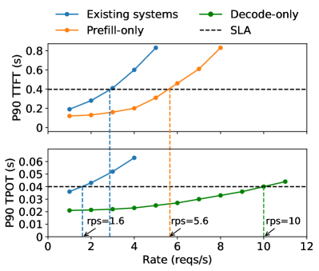
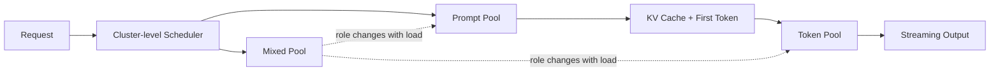
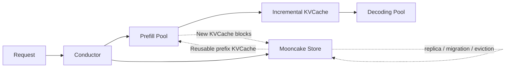

# Prefill/Decode Disaggregation 专题：Splitwise、DistServe 与 Mooncake

## 0. 阅读定位

这个专题研究的是同一个核心问题：**LLM 推理为什么要把 prefill 和 decode 拆开？拆开之后系统到底多了哪些自由度，又会付出什么代价？**

本专题包含三篇强相关论文：

- `patelSplitwiseEfficientGenerative2024`：Splitwise: Efficient Generative LLM Inference Using Phase Splitting
- `DistServeDisaggregatingPrefill`：DistServe: Disaggregating Prefill and Decoding for Goodput-optimized Large Language Model Serving
- `qinMooncakeTradingMore`：Mooncake: Trading More Storage for Less Computation - A KVCache-centric Architecture for Serving LLM Chatbot

一句话区分：

- **Splitwise** 更像“架构与集群资源视角”：prompt phase 与 token generation phase 的硬件需求不同，因此可以分配到不同机器池，甚至使用不同 GPU 代际、功耗上限和成本模型。
- **DistServe** 更像“服务质量与调度优化视角”：prefill 和 decoding colocate 会造成干扰，并把资源与并行策略绑死；拆开后可以针对 TTFT/TPOT SLO 优化 per-GPU goodput。
- **Mooncake** 更像“KVCache 生命周期与生产系统视角”：在 prefill/decode 分离基础上，把 CPU、DRAM、SSD、NIC 和 GPU 显存组织成全局 KVCache pool，用 KVCache 复用、迁移和复制减少长上下文服务中的重复 prefill 计算。

## 1. 两阶段推理到底差在哪里

自回归 LLM 推理天然分成两个阶段：

1. **Prefill / prompt processing**
   - 输入是完整 prompt，长度记为 `L_in`。
   - 模型一次 forward 处理所有 prompt token。
   - 产物是第一个输出 token，以及之后 decode 要用的 KV cache。
   - 主要影响用户看到首字的速度，即 TTFT。

2. **Decode / token generation**
   - 每一步只输入上一步生成的新 token。
   - 每一步都要读取历史上下文的 KV cache。
   - 反复执行，直到生成结束。
   - 主要影响流式输出速度，即 TPOT 或 TBT。

两阶段看起来跑的是同一个 Transformer，但硬件行为完全不同。

### 1.1 Prefill 更接近 compute-bound

Prefill 的 batch 维度可以看成“很多 token 一起进入模型”。矩阵乘法形状较大，GPU 的 tensor cores 更容易被喂饱。对一个长度为 `L` 的 prompt，单层大致包括：

- QKV projection：大 GEMM
- attention score：`QK^T`
- attention output：`PV`
- MLP：两到三个大 GEMM

当 `L` 足够大时，prefill 的瓶颈更靠近算力。也就是说，提高 GPU FLOPs 或使用更强的并行策略，往往能直接改善 TTFT。

### 1.2 Decode 更接近 memory-bandwidth-bound

Decode 每一步只处理一个新 token。虽然也要跑完整层，但单步矩阵形状小，算力并不容易充分利用。同时它必须访问历史 KV cache：

```text
per-step KV reads ~= 2 * layers * batch * context_length * hidden_per_layer
```

随着上下文变长，decode 的每一步都要读越来越多历史 K/V。它的瓶颈更常落在显存容量和带宽，而不是 GPU 峰值 FLOPs。

### 1.3 这就是拆分的根

如果两个阶段对硬件、batch、并行策略、延迟指标的偏好都不同，把它们强行放在同一批 GPU 上会出现三种浪费：

- **干扰**：长 prefill 拖慢短 decode step，decode 排队又影响 prefill。
- **耦合**：prefill 和 decode 被迫使用同一资源配置与并行策略。
- **过度配置**：为了同时满足 TTFT 和 TPOT，只能堆更多 GPU。



## 2. 三篇论文的共同推理链

这三篇论文的共同起点可以压缩成一条链：

```text
自回归推理 = prefill + decode                          
prefill compute-heavy, decode memory-heavy
colocation 造成干扰和资源耦合
拆分阶段会引入 KV cache transfer
如果 KV transfer 开销小于 colocation 损失
    phase disaggregation 成立
否则
    继续 colocate 或只做 chunked-prefill 更合适
```

关键判断是第五步：KV cache transfer 是否划算。三篇论文都接受“传 KVCache 可能值得”的前提，但它们回答的后续问题不同：

- `patelSplitwiseEfficientGenerative2024` 问：传输 KVCache 之后，能不能把不同阶段放到更合适、更便宜或更省电的机器池？
- `DistServeDisaggregatingPrefill` 问：传输 KVCache 之后，能不能解除 TTFT/TPOT 的互相干扰，并最大化 SLO 内 per-GPU goodput？
- `qinMooncakeTradingMore` 问：既然 KVCache 已经成为跨阶段状态，能不能进一步把它做成全局可复用资源，用更多存储和网络换取更少 prefill 计算？

KV cache 大小可以粗略估计为：

```text
KV_bytes = 2 * num_layers * hidden_size * prompt_tokens * bytes_per_element
```

例如 FP16 下，`bytes_per_element = 2`。模型越大、prompt 越长，传输越重。但如果有 NVLink、InfiniBand、layer-wise transfer 和 topology-aware placement，传输可以被隐藏或压低。

## 3. Splitwise：资源池与成本/功耗优化

Splitwise 的第一贡献是用生产 traces 证明阶段差异确实存在。


它的系统结构是三类机器池：



Splitwise 的重要工程点：

- prompt pool 限制 prompt batch token 数，避免 TTFT 被拉长；
- token pool 尽量积累 decode batch，提高 memory-bound 阶段吞吐；
- mixed pool 用来吸收负载波动；
- KV cache 通过 layer-wise transfer 与 prompt computation 重叠；
- cluster provisioning 可以按 throughput、cost、power 目标搜索。


Splitwise 更适合回答：

- token phase 能否用便宜一点、功耗低一点、算力没那么强但内存合适的硬件？
- prompt-heavy 和 output-heavy workload 分别需要多少 prompt/token 机器？
- 在同成本或同功耗预算下，phase splitting 能多支撑多少请求？

## 4. DistServe：goodput 与 placement 优化

DistServe 的第一贡献是把目标函数讲清楚：在线服务不是追求 raw throughput，而是追求满足 SLO 的 effective throughput。

它把指标拆成：

- TTFT SLO：prefill 侧约束；
- TPOT SLO：decode 侧约束；
- SLO attainment：达到约束的请求比例；
- per-GPU goodput：达到约束时每张 GPU 支撑的请求率。


DistServe 的工程重点：

- 为 prefill instance 和 decoding instance 分别选择 GPU 数量；
- 为两阶段分别选择 parallelism strategy；
- 搜索满足 TTFT/TPOT 的资源配置；
- 根据集群带宽拓扑放置 prefill/decode instance；
- 尽量让 KV cache 传输走高速链路。

它更适合回答：

- 在给定 TTFT/TPOT SLO 下，每张 GPU 最多能支撑多少请求？
- prefill 和 decode 各自应该用什么 parallelism？
- 两阶段 instance 应该怎么放到多节点集群上？


## 5. Mooncake：全局 KVCache 与生产级长上下文服务

Mooncake 的第一贡献是把问题从“prefill/decode 要不要拆”推进到“拆开之后 KVCache 应该如何成为全局资源”。它面向 Kimi 这样的长上下文聊天服务，观察到多轮对话、tool/agent 固定系统提示词和长文档问答中存在大量 prefix reuse。此时，如果每个请求都重新 prefill，浪费的是大量 GPU 计算时间。

Mooncake 的核心结构是：



Mooncake 的重要工程点：

- Mooncake Store 把 KVCache 切成 paged blocks，并用 block key 做去重和 prefix sharing；
- Conductor 在选择 prefill instance 时同时考虑 prefix hit length、prefill queue time、KVCache transfer time 和 TTFT SLO；
- 热点 KVCache block 会自动复制到多个节点，缓解单个 cache location 的访问拥塞；
- transfer engine 支持 RDMA、多 NIC 分片、topology-aware path selection、endpoint pooling 和故障重试；
- 长上下文 prefill 使用 chunked pipeline parallelism，避免跨节点 tensor parallelism 每层频繁 all-reduce。

Mooncake 更适合回答：

- 高 prefix reuse 的长上下文服务中，如何最大化全局 cache hit rate？
- KVCache 该放在哪里、复制几份、何时迁移或换出？
- 什么时候“读远端 KVCache”比“重新 prefill”更划算？
- 生产集群中如何把 RDMA、DRAM、SSD、VRAM 和调度器合成一个端到端系统？

根据 `qinMooncakeTradingMore` 的 PDF 正文与摘要，Mooncake 在真实 traces 上相对 baseline 提高 effective request capacity 约 59% 到 498%；生产部署中已运行于数千节点，每天处理超过 100 billion tokens，并在 A800/H800 集群中相较此前系统分别多处理 115% 和 107% 请求。论文还报告全局 cache hit rate 最高达到 local cache 的 2.36x，最多节省 48% prefill computation time。

## 6. 三篇论文的差异

| 维度 | Splitwise (`patelSplitwiseEfficientGenerative2024`) | DistServe (`DistServeDisaggregatingPrefill`) | Mooncake (`qinMooncakeTradingMore`) |
|---|---|---|---|
| 主要目标 | throughput / cost / power | TTFT/TPOT SLO 下的 per-GPU goodput | 长上下文与 prefix reuse 场景下的 effective request capacity |
| 核心抽象 | prompt pool / token pool / mixed pool | prefill instance / decoding instance | Conductor + Mooncake Store + distributed KVCache pool |
| 关键洞察 | prompt 与 token generation 的硬件、功耗、batching 行为不同 | colocate 造成 prefill/decode 干扰和资源/并行策略耦合 | KVCache 不只是阶段间状态，而是可跨请求复用、迁移、复制的全局资源 |
| 调度重点 | 机器池配比、mixed pool、cluster provisioning | resource allocation、parallelism、topology-aware placement | prefix hit、cache distribution、queue time、hotspot migration、admission control |
| KVCache 处理 | prefill 后通过 layer-wise transfer 交给 token machine | prefill instance 将 KVCache 传给 decoding instance，placement 降低传输开销 | KVCache blocks 存入全局 pool，支持复用、复制、迁移、换出和跨节点加载 |
| 工程侧重点 | 异构硬件与成本/功耗建模 | SLO goodput 搜索与实例 placement | RDMA transfer engine、全局 cache metadata、生产部署与故障处理 |
| 最适合负载 | prompt/output 比例可预测、希望用异构硬件降成本 | TTFT/TPOT SLO 明确、需要高 goodput 的在线服务 | 长上下文、多轮对话、tool/agent、高 prefix reuse |
| 主要风险 | 资源池比例随 workload 漂移；异构硬件调度复杂 | placement/search 依赖 profile；跨实例 KV 迁移仍复杂 | 系统复杂度高；强依赖高速网络和 prefix reuse |

## 7. 技术实现路线

如果要从零实现一个简化版 phase-disaggregated serving system，可以按下面层次做。

### 6.1 底层推理引擎

先要有支持两种入口的 inference engine：

```text
run_prefill(request_id, prompt_tokens) -> first_token, kv_cache_handle
run_decode(request_id, last_token, kv_cache_handle) -> next_token
```

现代实现通常还需要：

- FlashAttention 或高性能 attention kernel；
- PagedAttention 风格 KV block 管理；
- continuous batching；
- tensor parallelism / pipeline parallelism。

### 6.2 KV cache export/import

这是最关键的接口：

```text
export_kv(request_id):
    return list of KV blocks or device pointers

import_kv(request_id, remote_blocks):
    allocate local blocks
    copy remote blocks into local layout
    rebuild block table
```

如果底层是 PagedAttention，必须传 block table，而不是只传连续 tensor。

### 6.3 Scheduler

需要两个队列：

```text
prefill_queue:
    optimize for TTFT
    small or token-limited batching

decode_queue:
    optimize for TPOT/TBT
    larger continuous batches
```

再加一个 router：

```text
on_request_arrival(req):
    p = choose_prefill_instance(req)
    d = choose_decode_instance(req)
    enqueue_prefill(req, p, target_decode=d)
```

### 6.4 Placement / provisioning

离线或周期性搜索：

```text
for prefill_config in candidate_prefill_configs:
    for decode_config in candidate_decode_configs:
        estimate TTFT distribution
        estimate TPOT distribution
        estimate KV transfer overhead
        if SLO attainment >= target:
            compute goodput / cost / power
choose best configuration
```

Splitwise 更强调 cost/power 目标，DistServe 更强调 goodput/SLO 目标，Mooncake 则要求额外维护全局 KVCache metadata、block replica、cache eviction 和 transfer engine。

## 8. 什么时候不该拆或不该做全局 KVCache

Phase disaggregation 和全局 KVCache 都不是银弹。以下情况可能不划算：

- prompt 和 output 都很短，colocation 干扰不明显；
- 网络差，KV cache transfer 成为主瓶颈；
- 模型太小，单机 batching 已经足够；
- 请求分布高度波动，但 scheduler 不能及时调整；
- 多租户隔离、故障恢复和 KV cache 迁移成本过高。
- prefix reuse 很低，Mooncake 式全局 cache 命中率不足以抵消 metadata、复制和传输开销。

## 9. 与其他 serving 论文的关系

这个专题可以放在更大的 LLM serving 系统脉络里：

- **Orca**：解决 iteration-level scheduling，让 decode 请求能每步进出 batch。
- **PagedAttention/vLLM**：解决 KV cache 动态显存管理。
- **Splitwise/DistServe**：解决 prefill/decode 阶段资源解耦。
- **Mooncake**：将分离后的 KVCache 扩展为全局可复用、可迁移、可复制的生产级资源。
- **SGLang**：解决程序级 prefix/cache 复用和结构化生成。

它们不是替代关系，而是层层叠加：

```text
kernel efficiency -> KV memory management -> continuous batching -> phase disaggregation -> global KVCache orchestration -> program-level runtime
```

## 10. 客观比较：优势、劣势与“谁更精妙”

三篇论文的共同价值是把 LLM serving 的优化单位从“请求”进一步拆开：Splitwise 和 DistServe 拆到“阶段”，Mooncake 则继续拆到“KVCache block 与生命周期”。这件事很重要，因为 prefill 与 decode 共享同一个模型，却不共享同一种瓶颈；而长上下文服务中的 KVCache 也不只是显存占用，它还是可复用的计算结果。

客观地看：

- `patelSplitwiseEfficientGenerative2024` 的优势是问题定义清楚、资源池思想直观，特别适合解释为什么 decode 阶段不一定需要最新最强 GPU。它的劣势是目标更偏 provisioning，对复杂 SLO、parallelism search、全局 cache 复用展开较少。
- `DistServeDisaggregatingPrefill` 的优势是把 TTFT/TPOT、SLO attainment 和 per-GPU goodput 讲得最系统，适合指导在线 serving 的资源配置和 placement。它的劣势是主要优化阶段拆分后的资源/并行策略，对跨请求 KVCache 复用不是中心问题。
- `qinMooncakeTradingMore` 的优势是把阶段拆分、prefix caching、全局 KVCache、RDMA transfer、热点复制和生产部署连成一个闭环。它的劣势是工程复杂度最高，并且收益更依赖长上下文、高 prefix reuse 和高速网络。

如果只问“处理方式最精妙”，我会给出有条件的判断：**Mooncake 最精妙**。原因不是它比另外两篇更早提出 prefill/decode 分离，而是它把分离架构中的副产物 KVCache 重新定义为核心资产：可复用、可复制、可迁移、可换出、可调度。这个思路把“传输 KVCache 的额外成本”转化为“全局减少重复计算的机会”，系统味道最浓。

如果问“可实施性和工程性最强”，也要分场景：

- 对一般研究原型或中等规模在线服务，`DistServeDisaggregatingPrefill` 更容易作为工程起点，因为它的 instance、SLO、placement 抽象清晰，不必先实现完整分布式 KVCache store。
- 对希望用异构硬件降低成本和功耗的集群，`patelSplitwiseEfficientGenerative2024` 的方案最直接，尤其适合做 capacity planning。
- 对真实大规模长上下文聊天、agent 和高 prefix reuse 服务，`qinMooncakeTradingMore` 的工程性最强，因为它给出了从调度、cache、传输到生产部署的完整系统路径；但它也是实现门槛最高、最依赖基础设施的一种。

因此，最稳妥的综合结论是：**Splitwise 是资源池化的清晰起点，DistServe 是 SLO/goodput 优化的最科学框架，Mooncake 是长上下文生产系统中最完整也最精妙的工程化方案。**

如果后续继续研究，可以重点看三个方向：

- 与 PagedAttention/RadixAttention 的 KV cache 迁移如何统一；
- 与 speculative decoding、prefix cache、chunked-prefill 如何组合；
- 在多模型、多租户集群中如何动态调整 prompt/decode 配比。
