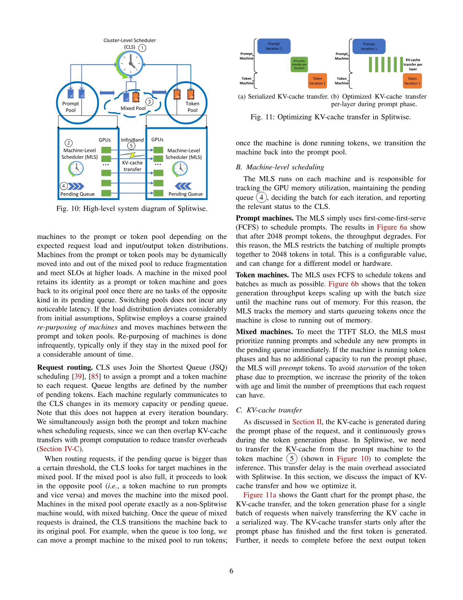
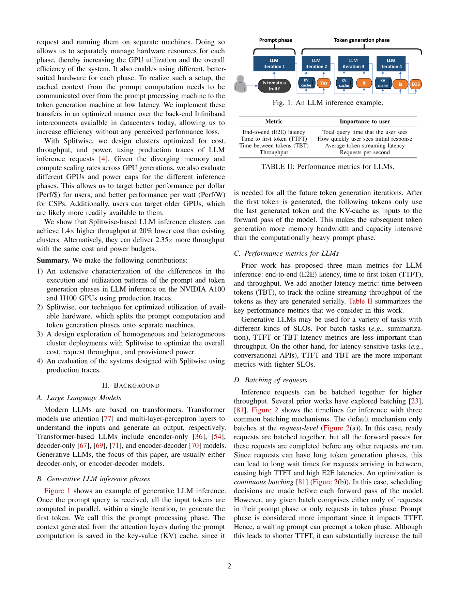
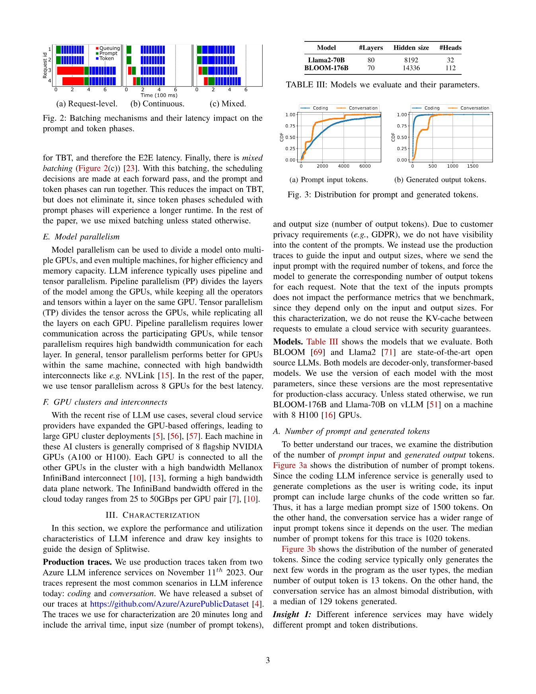
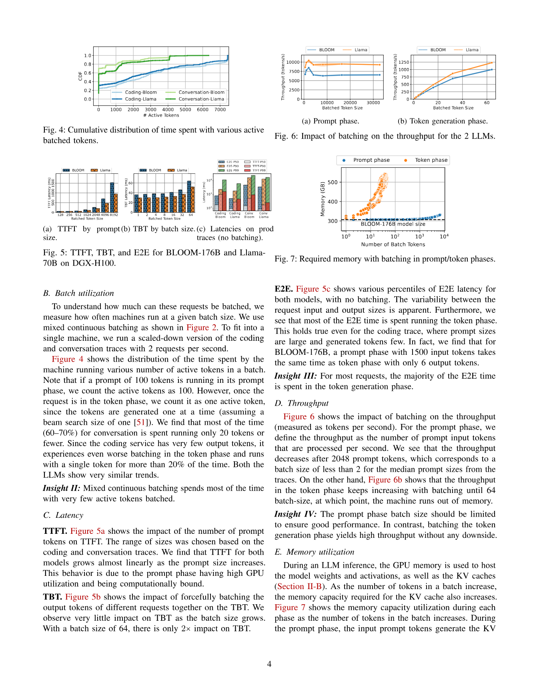
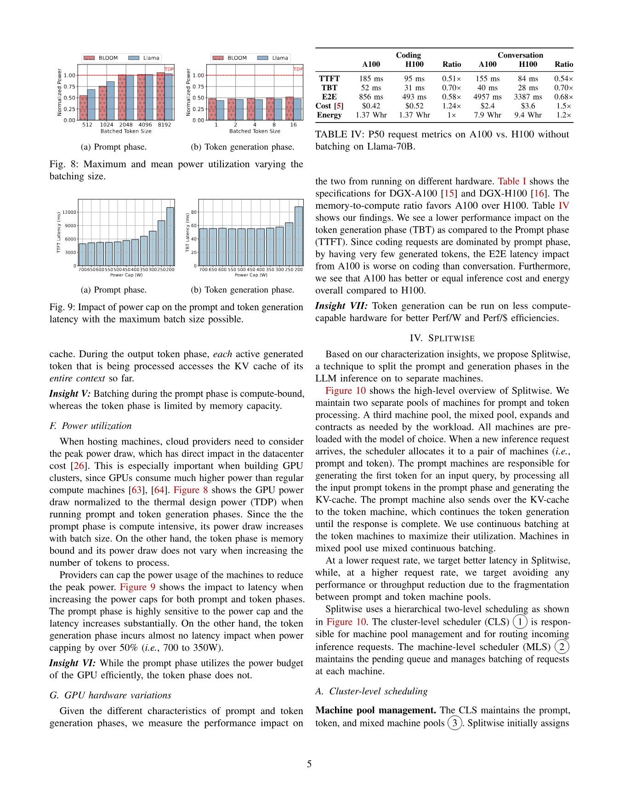
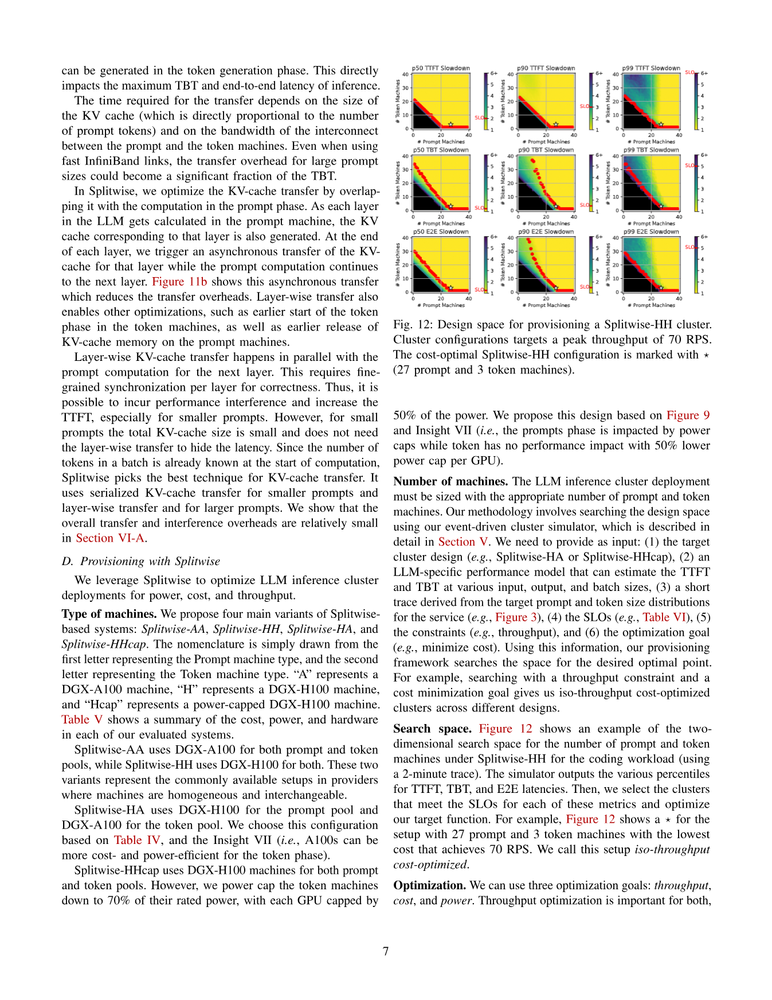
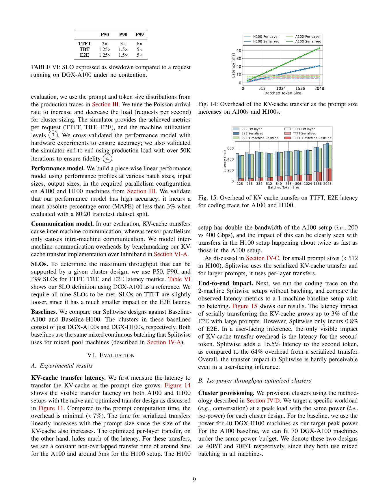
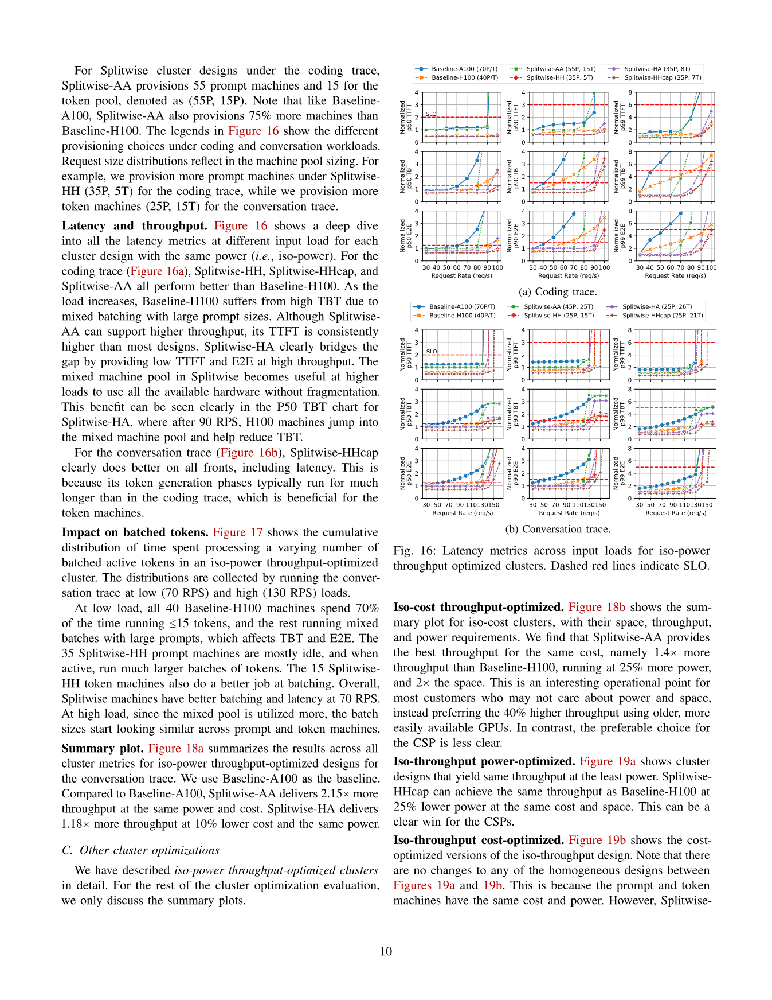
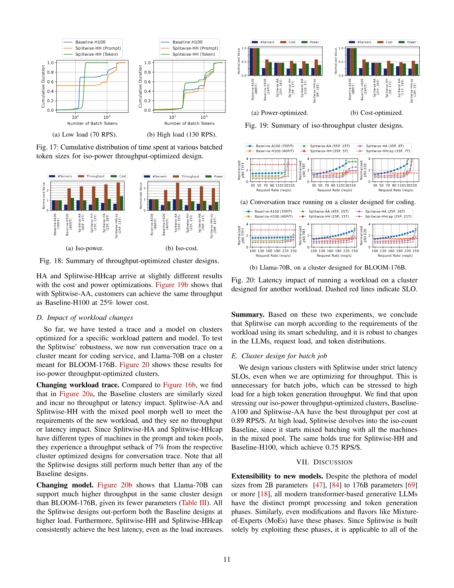

# Splitwise: Efficient Generative LLM Inference Using Phase Splitting

## 0. 论文定位

Splitwise 的核心问题是：**既然 prompt processing 和 token generation 的硬件需求完全不同，为什么还要让它们长期共享同一组机器？**

论文用 Azure 生产 traces 证明两阶段的资源特性不同，然后提出把它们拆到不同机器池：prompt pool、token pool 和可动态伸缩的 mixed pool。目标是提高吞吐、降低成本和降低功耗。



## 1. 背景：LLM 推理的两个阶段

### 1.1 Prompt phase

Prompt phase 接收完整输入 prompt，一次性计算所有输入 token，生成 first token，并产生 KV cache。

如果 prompt 长度是 `L_in`，batch 大小是 `B`，那么这一阶段的主要计算可以粗略理解为：

```text
大 GEMM:   O(B * L_in * hidden^2)
attention: O(B * L_in^2 * hidden)
MLP:      O(B * L_in * hidden * ffn_hidden)
```

大矩阵乘法让 GPU 算力更容易被利用。因此 prompt phase 往往对新 GPU 的 FLOPs 更敏感。

### 1.2 Token generation phase

Token generation phase 每次只生成一个 token。每一步都需要读取历史 KV cache，并追加新的 KV。

如果当前上下文长度是 `L_ctx`，decode batch 是 `B`，每层 attention 至少要读：

```text
K/V reads ~= 2 * B * L_ctx * hidden_per_layer
```

这里的瓶颈更接近显存容量和带宽，而不是 tensor core 算力。也就是说，最新最贵的 GPU 对 decode 阶段不一定性价比最高。



## 2. 生产 trace 带来的关键洞察

Splitwise 很有价值的一点是它不只靠直觉，而是用生产 traces 做 characterization。

### 2.1 输入/输出长度分布差异大

论文使用两个 Azure 服务 trace：coding 和 conversation。它们的 prompt/output 分布不同：

- coding 服务通常 prompt 较长，因为要包含已有代码上下文；
- coding 输出通常较短，因为只是补全后续片段；
- conversation 的输出更长，甚至呈现更复杂的分布。



结论：不同业务不能用同一套固定 serving 配比。prompt-heavy 与 output-heavy workload 需要不同的 prompt/token 机器比例。

### 2.2 混合 continuous batching 并不总能解决问题

continuous batching 可以让请求在每步生成之间进出 batch，但 Splitwise 观察到：机器大量时间仍然运行很少的 active tokens。尤其 token phase 单步计算小，即使 batching，算力利用率仍然不理想。

这解释了为什么仅靠 Orca/vLLM 风格的 continuous batching 还不够：它改善调度粒度，但没有改变两阶段共享同一硬件池的事实。

### 2.3 Prompt 与 token 的 batch 规律相反

论文的实验显示：

- prompt phase 的 throughput 在 prompt token 太多时会下降，batch size 不宜盲目增大；
- token generation phase 的 throughput 随 batch 增大而提高，直到显存容量耗尽。



这给出一个调度规则：

```text
Prompt machine:
    限制 batch token 数，优先保护 TTFT

Token machine:
    尽量积累更多 active decode tokens，直到显存/带宽接近上限
```

### 2.4 功耗行为也不同

Prompt phase 是 compute-intensive，因此功耗随 batch 增大而增加，也更容易受 power cap 影响。

Token generation phase 更偏 memory-bound，降低 GPU power cap 对 token latency 影响较小。论文据此提出，可以对 token pool 使用较低功耗配置。



## 3. Splitwise 系统设计

### 3.1 三类机器池

Splitwise 维护三类机器池：

- **Prompt pool**：专门处理 prompt phase。
- **Token pool**：专门处理 token generation phase。
- **Mixed pool**：根据负载动态切换角色，缓解某一阶段临时资源不足。

所有机器都预加载同一个模型。请求到达后，cluster-level scheduler 选择 prompt machine 和 token machine。Prompt machine 生成 first token 和 KV cache，然后将 KV cache 传输给 token machine。


### 3.2 Cluster-level scheduler

Cluster-level scheduler 负责：

- 管理 prompt/token/mixed pool；
- 为请求选择 prompt machine；
- 为请求选择 token machine；
- 根据负载移动 mixed pool 机器角色；
- 让整体配置贴合 prompt/output 长度分布。

Splitwise 的 scheduler 不只是“把请求丢给空机器”，而是在维护阶段级资源平衡。

### 3.3 Machine-level scheduler

Machine-level scheduler 运行在每台机器上，负责本机队列和 batching：

- prompt machine 限制 prompt batch token 数，避免 TTFT 被大 batch 拉长；
- token machine 尽量增加 active decode tokens，提高 memory-bound 阶段吞吐；
- mixed machine 根据当前角色采用对应策略。

这让 Splitwise 的 batching 规则与两阶段硬件特性一致。

## 4. KV cache 传输实现

Splitwise 拆分阶段后，核心工程挑战是：prompt machine 的 KV cache 必须快速移交给 token machine。

### 4.1 要传什么

对于 decoder-only Transformer，KV cache 约为：

```text
KV_bytes = 2 * num_layers * prompt_tokens * hidden_size * bytes_per_element
```

其中 `2` 是 K 和 V。若使用 tensor parallelism，单张 GPU 持有的 KV shard 会相应变小，但跨机器仍需要把每层的 KV state 正确放到目标机器。

### 4.2 naive transfer 的问题

最朴素方法是等 prompt phase 完全结束后，一次性传完整 KV cache。这会让 token machine 等待更久，并把传输延迟暴露给用户。

### 4.3 layer-wise transfer

Splitwise 的优化是 layer-wise transfer：prompt machine 每算完一层的 KV，就尽早把该层 KV 发给 token machine。这样传输可以与后续层计算重叠。


直观流程：

```text
for layer in transformer_layers:
    run_prefill_layer(layer)
    async_send(kv_cache[layer], token_machine)

signal_all_layers_ready()
token_machine.start_decode()
```

论文实现使用 MSCCL++，通过 GPU-driven communication 和 one-sided put 发送 KV cache。同步则通过 semaphore 完成。

如果落到 vLLM/PagedAttention 这样的运行时，传输还需要处理 block layout：

```text
prompt side:
    collect KV blocks for request
    group contiguous blocks when possible
    async put blocks to token machine

token side:
    allocate destination KV blocks
    rebuild block table
    wait on semaphore
    enqueue request into decode batch
```

## 5. Provisioning：机器数量怎么定

Splitwise 用 simulator 搜索 cluster design。输入包括：

- workload trace；
- 模型性能 profile；
- cluster spec；
- SLO；
- scheduler config；
- 优化目标：throughput、cost 或 power。

输出是 prompt/token 机器数量和设计方案。比如 Splitwise-HH 表示 prompt 与 token 都使用 H100；Splitwise-HA 表示 prompt 用 H100，token 用 A100。



这个搜索很关键，因为 prompt-heavy workload 和 output-heavy workload 的最优比例不同：

```text
coding:
    prompt 更重，prompt machines 比例更高

conversation:
    token generation 更重，token machines 比例更高
```

## 6. 评估结果

Splitwise 的主要结果可以从三个角度看。

### 6.1 KV cache 传输开销

论文显示，优化后的 KV cache transfer 相对 prompt computation 和端到端延迟开销较小。尤其 layer-wise transfer 能隐藏大部分传输时间。



### 6.2 Iso-power / iso-cost 设计

Splitwise 比 baseline 更能满足 SLO，同时提升 throughput。论文报告：

- 在某些配置下，Splitwise 可达到约 1.4x 更高吞吐，并降低约 20% 成本；
- 在同功耗同成本预算下，可达到约 2.35x 更高吞吐；
- token pool 使用 power cap 时，可以降低功耗而不显著伤害 token latency。





### 6.3 Robustness

Splitwise 还测试了 workload 或模型变化时的效果。由于 mixed pool 可以调整角色，它对 workload 变化有一定适应性。但如果 prompt/token pool 使用不同硬件，配置不匹配时仍可能出现 throughput setback。

## 7. 我的理解

Splitwise 的本质是把 LLM inference 从“一个请求在一台机器上连续跑完”改成“一个请求在阶段级资源池之间流动”。

这个设计成立有三个条件：

1. Prompt 和 token phase 的硬件需求确实不同。
2. KV cache transfer 可以被高速互联和 layer-wise transfer 控制住。
3. Scheduler 能持续维持 prompt/token 两个队列的资源平衡。

如果这三个条件成立，拆分阶段就很划算。它把原本混在一起的资源瓶颈拆开，让 prompt 机器追求低 TTFT，让 token 机器追求高 decode batching 和更低成本/功耗。

## 8. 局限与开放问题

- 强依赖集群互联质量；低带宽或高拥塞网络会削弱 phase splitting 收益。
- Scheduler 复杂度高，特别是 mixed pool 角色切换和负载预测。
- 多模型、多租户、priority、speculative decoding 与 prefix cache 共享没有充分展开。
- 真实业务中 prompt/output 分布会漂移，需要持续重新 provisioning。

## 9. 与 DistServe 的关系

Splitwise 和 DistServe 的共同点是都拆 prefill/decode；区别是目标函数不同：

- Splitwise：成本、功耗、异构硬件、cluster provisioning。
- DistServe：TTFT/TPOT SLO、per-GPU goodput、parallelism 和 topology-aware placement。

工程上可以把 Splitwise 作为“资源池架构”，把 DistServe 作为“goodput-aware 的 placement 和 serving optimizer”。
