# Mooncake: Trading More Storage for Less Computation - A KVCache-centric Architecture for Serving LLM Chatbot

`qinMooncakeTradingMore`

元数据说明：Zotero 条目 `data/zotero/01_ToRead.bib` 未包含 year、venue、DOI 字段；PDF 封面显示论文收录于 FAST 2025。本文分析只使用 Zotero 条目、PDF 正文和 PDF 摘要中出现的信息。

## 0. 论文定位

Mooncake 的核心问题是：**在长上下文聊天服务中，能不能用更多分布式存储和高速传输，换取更少重复 prefill 计算，并在 TTFT/TBT SLO 下提高有效请求容量？**

它与 Splitwise、DistServe 一样采用 prefill/decode 分离，但它的重心不止于阶段拆分。Mooncake 把 KVCache 本身作为系统的中心资源：在 GPU 集群中聚合 CPU、DRAM、SSD、NIC 和 VRAM，形成分布式 KVCache pool，再由全局调度器围绕 KVCache 命中、迁移、复制和 SLO 做请求分配。

## 1. 为什么只拆 prefill/decode 还不够

Splitwise 和 DistServe 关注的是 prefill 与 decode 的阶段异质性：prefill 更偏计算，decode 更偏显存容量和带宽。Mooncake 接受这个判断，但进一步指出：在 Kimi 这类长上下文、多轮会话和 tool/agent 工作负载中，许多请求存在可复用 prefix。如果系统每次都重新 prefill，浪费的不只是调度机会，而是大量重复计算。

Mooncake 的判断可以写成：

```text
长上下文请求 + prefix reuse
    => prefill 计算成本很高
    => KVCache 复用比重新计算更划算
    => KVCache 应成为可跨节点迁移、复制和调度的全局资源
```

这使 Mooncake 的优化对象从“阶段”进一步扩大到“KVCache 生命周期”。

## 2. 系统结构

Mooncake 的架构由三部分构成：

- **Prefill Pool**：负责加载可复用 prefix KVCache，并对未命中部分执行 prefill。
- **Decoding Pool**：负责使用完整 KVCache 进行 continuous batching 和流式生成。
- **Mooncake Store**：管理分布式 KVCache pool，提供跨 DRAM/VRAM 的 batch transfer、replica 调整和元数据管理。

全局调度器 **Conductor** 负责为每个请求选择 prefill instance 与 decoding instance。选择依据包括 prefix cache 命中长度、prefill 队列、KVCache transfer time、decoding 侧 TBT 约束和 cache block 分布。

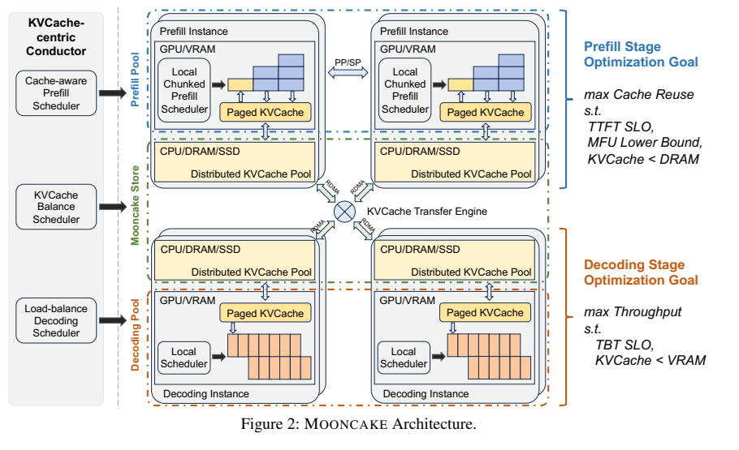

请求生命周期大致是：

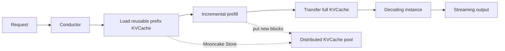

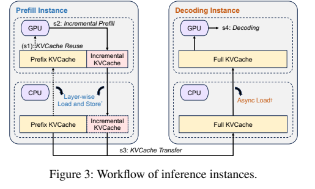

## 3. Mooncake Store：全局 KVCache 的工程化

Mooncake Store 将 KVCache 组织为 paged blocks。每个 block 有 hash key，key 由自身内容和 prefix 信息共同决定，用于去重和 prefix sharing。一个 block 可以在多个节点上拥有 replica，热点 block 被复制以缓解访问拥塞，冷块则可被 LRU eviction。

它提供 object-style API，包括 `put`、`get`、`change_replica`，底层通过 batch transfer API 支持 DRAM 与 GPU VRAM 的传输。论文特别强调 transfer engine 的工程设计：

- 多 RDMA NIC 分摊传输任务；
- topology-aware path selection，优先选择离 CPU/GPU buffer 更近的 NIC；
- endpoint pooling，避免连接数量过多拖慢请求处理；
- 连接失败时自动切换可达路径并重试。

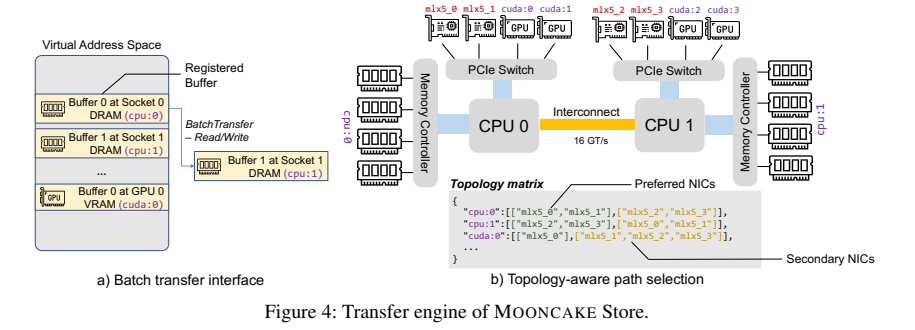

从工程视角看，Mooncake Store 是这篇论文最“硬”的部分。它把论文中的 KVCache reuse 变成一个可操作的分布式对象系统，而不是只停留在调度策略。

## 4. KVCache-aware Scheduling

普通 serving 系统常按请求数或负载选择实例。Mooncake 的 Conductor 会先计算请求 prompt 的 block keys，再比较每个 prefill instance 的 prefix match length。随后它估计：

```text
预计 TTFT =
    KVCache transfer time
  + prefill queue waiting time
  + prefill execution time after prefix reuse
```

如果某个 instance 的 prefix 命中更长，但队列过长，Conductor 可能选择另一个实例，并将需要的 KVCache 从最佳 cache location 迁移过去。这样做的副作用是热点 cache 会自然复制到更多节点，形成 heuristic-based hotspot migration。

论文实验显示，global cache-aware scheduling 相比 local cache-aware scheduling 进一步降低平均 TTFT；相较 random 和普通 load balancing，KVCache-aware 策略明显更优。

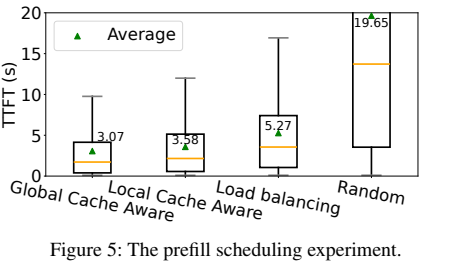

## 5. Prefill Pool 与长上下文

Mooncake 保留独立 prefill pool 的理由是：chunked prefill 虽可降低 decode 干扰，但仍难以同时最大化 prefill MFU 和满足 decode 侧 TBT SLO。

对长上下文请求，Mooncake 没有简单把 tensor parallelism 扩展到跨节点，因为跨节点 TP 会在每层引入昂贵 all-reduce，并与 KVCache transfer 争用网络。论文采用 **chunked pipeline parallelism**：把输入 token 切成 chunk，不同节点流水处理不同 chunk，以降低 TTFT，同时减少跨节点通信频率。

这个选择体现了 Mooncake 的工程取向：它不是只追求理论上最通用的 parallelism，而是在长上下文 prefill、网络争用和实现复杂度之间取一个较稳的折中。

## 6. 实验与部署结论

Mooncake 的实验与部署证据集中在长上下文和高 prefix reuse 场景：

- 真实 traces 上，Mooncake 在满足 SLO 的前提下，相比 baseline 提高 effective request capacity 约 59% 到 498%。
- 在生产部署中，Mooncake 已运行于数千节点，每天处理超过 100 billion tokens；在 A800 与 H800 集群中，相比此前系统分别多处理 115% 和 107% 请求。
- 全局 cache 相比 local cache 提高 cache hit rate，论文报告最高可达 2.36x，并最多节省 48% prefill computation time。
- transfer engine 在 40 GB KVCache 传输场景中，正文报告在 4x200 Gbps 和 8x400 Gbps 网络下分别达到约 87 GB/s 和 190 GB/s。
- 网络带宽是关键条件。论文指出超过 100 Gbps 时平均 TTFT 可明显低于 recomputation baseline；低于该水平时性能会显著受损。

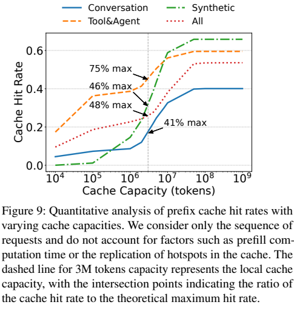

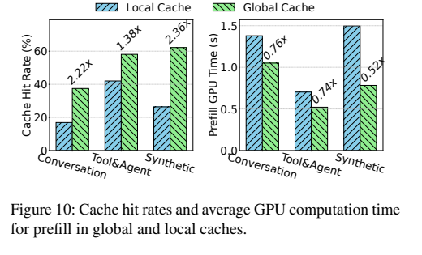

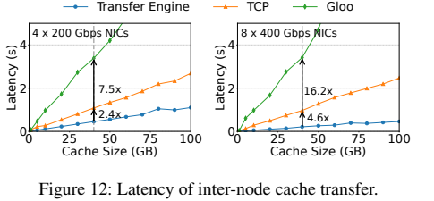

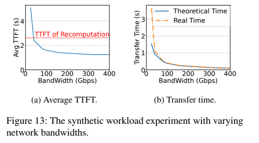

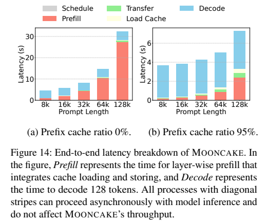

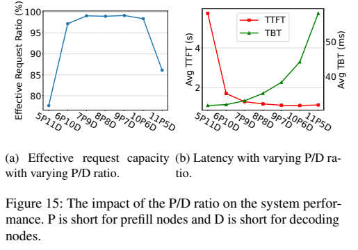

这些结论说明 Mooncake 的收益不是来自单一机制，而是来自 prefix reuse、全局 cache、阶段拆分、调度和高速传输共同作用。

## 7. 优势与劣势

**优势**：

- 面向真实生产 workload，尤其长上下文、多轮聊天、tool/agent 系统提示词等高复用场景。
- 不只拆分 prefill/decode，还把 KVCache 变成全局可调度资源，直接减少重复 prefill。
- 工程细节完整，包括 transfer engine、RDMA 多 NIC、topology-aware path、endpoint pooling、cache replication 和故障处理。
- 有真实部署规模和 replayed traces 证据，工程可信度较强。

**劣势**：

- 系统复杂度显著高于 Splitwise 和 DistServe，需要维护全局 metadata、cache replica、迁移、eviction、transfer status 和 SLO admission control。
- 对高速网络依赖强；低带宽或高拥塞环境会削弱甚至抵消收益。
- 对 prefix reuse 和长上下文比例敏感；如果 workload 以短 prompt、低复用请求为主，全局 KVCache 的收益会下降。
- 对异构硬件成本/功耗建模不如 Splitwise 清晰，对 per-GPU goodput 和 parallelism search 的系统化程度不如 DistServe。

## 8. 与 Splitwise / DistServe 的关系

Mooncake 可以理解为：

```text
Splitwise / DistServe:
    把 prefill 和 decode 拆开，释放阶段级资源自由度

Mooncake:
    在阶段拆分基础上，把 KVCache 变成跨请求、跨会话、跨节点的全局资源
```

因此，Mooncake 的“精妙”不在于发现 prefill/decode 应该分离，而在于它把“分离后产生的 KVCache 迁移问题”反过来变成系统优势：既然 KVCache 必须被传输和管理，那就把它做成可复用、可复制、可调度的全局资源。
