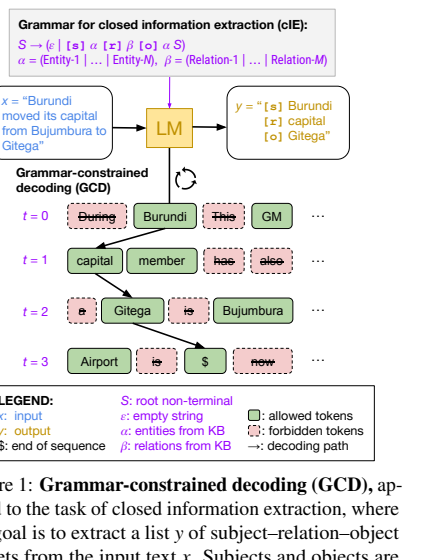
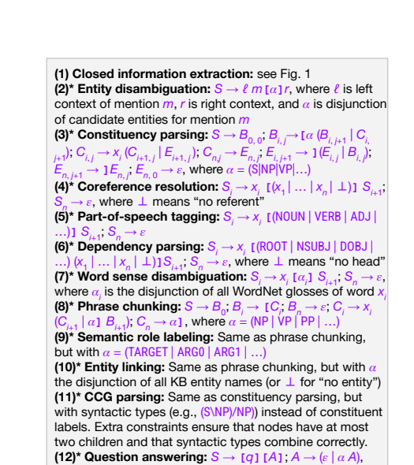
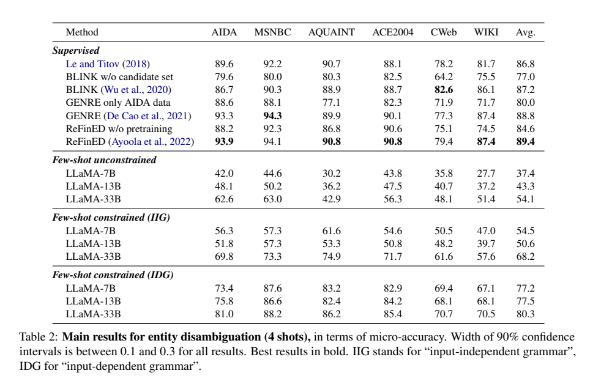
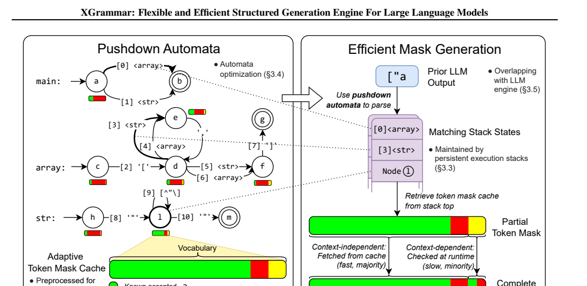
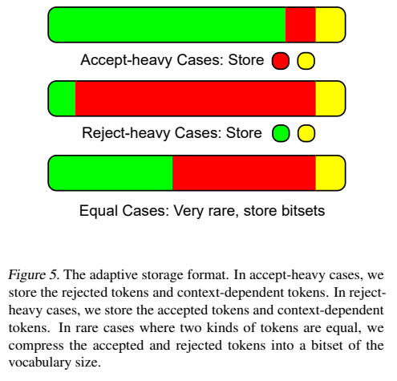
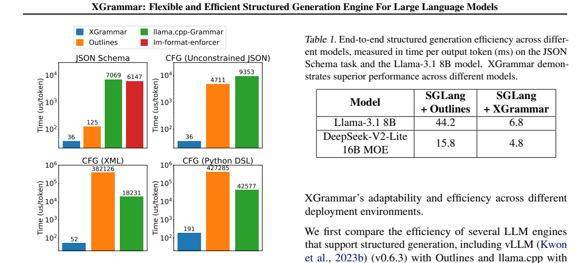
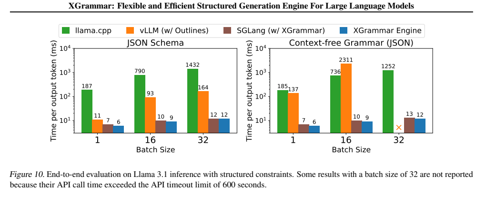
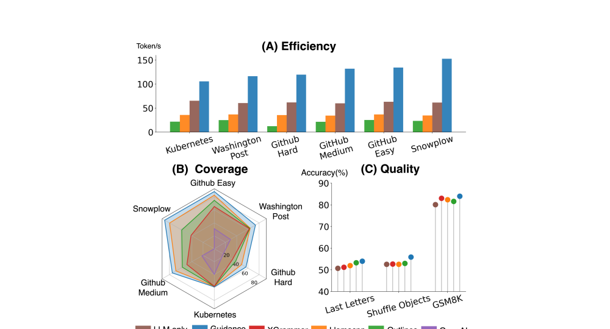
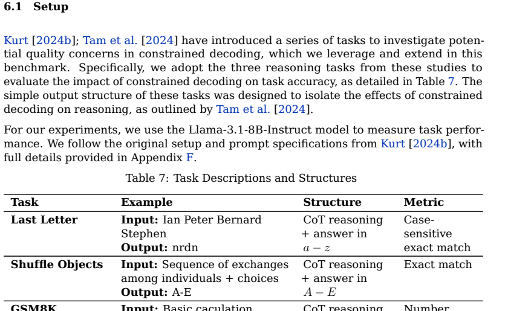

# Structured Generation / Constrained Decoding 专题：从 GCD 到 XGrammar 与 JSONSchemaBench

## 0. 阅读定位

这个专题研究的是同一个核心问题：**当 LLM 输出要被程序、API、工具或下游系统消费时，如何让模型稳定地产生符合结构约束的输出，同时不牺牲太多速度、覆盖能力和任务质量？**

本专题包含 `01_ToRead.bib` 中三篇论文：

- `gengGrammarConstrainedDecodingStructured2024`：Grammar-Constrained Decoding for Structured NLP Tasks without Finetuning
- `dongXGrammarFlexibleEfficient2025`：XGrammar: Flexible and Efficient Structured Generation Engine for Large Language Models
- `gengJSONSchemaBenchRigorousBenchmark2025`：JSONSchemaBench: A Rigorous Benchmark of Structured Outputs for Language Models

一句话区分：

- **GCD** 证明形式语法可以把许多结构化 NLP 任务统一成 constrained decoding 问题，并提出 input-dependent grammars。
- **XGrammar** 解决语法约束解码的工程瓶颈，把 CFG / JSON Schema 约束执行做成低开销 structured generation engine。
- **JSONSchemaBench** 反过来评测现实 JSON Schema 约束，说明“支持 structured outputs”不能只看是否保证格式合法，还要看效率、覆盖和质量。

## 1. 共同问题：结构合法性不是全部

自由文本生成的目标通常是“语义上合理”。结构化生成的目标更苛刻：

```text
输出必须语义正确
输出必须结构合法
输出必须能被机器解析
约束执行不能拖垮推理吞吐
约束覆盖不能只支持玩具 schema
```

这三篇论文构成一个递进链条：

```text
gengGrammarConstrainedDecodingStructured2024
    语法约束解码可作为结构化 NLP 的统一框架

dongXGrammarFlexibleEfficient2025
    语法约束解码要进入 serving 系统，必须解决 mask generation 延迟

gengJSONSchemaBenchRigorousBenchmark2025
    真实 JSON Schema 很复杂，必须系统评测效率、覆盖和质量
```

换句话说，GCD 回答“为什么能用语法约束”，XGrammar 回答“怎样高效执行语法约束”，JSONSchemaBench 回答“真实世界里这些方法到底表现如何”。

## 2. GCD：把结构化 NLP 任务转成语法约束解码

`gengGrammarConstrainedDecodingStructured2024` 的核心主张是：许多结构化 NLP 任务的输出空间可以用形式语法描述，因此可在 decoding 时过滤非法 token，而不必为每个任务 finetune 一个专门模型。



论文的重要扩展是 **input-dependent grammars**。有些任务的合法输出不是固定集合，而依赖输入。例如 entity disambiguation 的候选实体集合、constituency parsing 中必须复现输入 token 的叶节点，都需要根据输入动态生成语法。



它的实验覆盖三类任务：closed information extraction、entity disambiguation、constituency parsing。论文报告 GCD-enhanced LMs 相比 unconstrained LMs 有显著提升，在一些任务上甚至接近或超过特定任务 finetuned 方法；但 constituency parsing 仍明显落后于专门 parser。



GCD 的优势是把结构化任务的“输出合法性”讲得非常清楚；局限是它更偏方法框架，工程性能和复杂 schema 覆盖不是主线。论文也指出，语法约束可能与 LM 概率分布产生 mismatch，例如模型倾向生成空输出，需要 length normalization 等修正。


## 3. XGrammar：让约束执行进入高吞吐 serving

`dongXGrammarFlexibleEfficient2025` 的出发点是：CFG 很灵活，但朴素执行会在每个 decoding step 对词表做大量合法性检查，带来不可忽略开销。XGrammar 的目标是把结构化生成引擎做得足够快，使它能和 LLM serving engine 结合。



XGrammar 的核心思想是把 token 分成两类：

- **context-independent tokens**：合法性可预处理，可从 cache 快速取 mask；
- **context-dependent tokens**：必须结合当前 stack state 在运行时解释。

围绕这个划分，论文提出 adaptive token mask cache、context expansion、persistent execution stack、PDA 结构优化，并与 LLM engine 重叠执行 grammar computation。




论文报告 XGrammar 在 mask generation 上可达到最高约 100x speedup；结合 LLM inference engine 后，在 Llama 3.1 structured constraints 的 end-to-end 场景中可显著降低 TPOT，并在一些设置中接近零额外开销。





XGrammar 的优势是工程性强，直接面向 serving runtime；局限是它优化的是“约束执行效率”，不等于自动解决所有 JSON Schema 覆盖、schema 语义等价和任务质量问题。这一点正好由 JSONSchemaBench 继续展开。

## 4. JSONSchemaBench：真实 schema 下的系统评测

`gengJSONSchemaBenchRigorousBenchmark2025` 的核心问题是：现在很多系统声称支持 structured outputs 或 JSON Schema constrained decoding，但实际表现不能只看“是否能产出合法 JSON”。它提出从三维度评估：

- **Efficiency**：生成速度，包括 grammar compilation time、TTFT、TPOT；
- **Coverage**：支持多少真实 JSON Schema 特性；
- **Quality**：约束是否影响下游任务准确率。



论文构建 JSONSchemaBench，包含约 10K real-world JSON schemas，并结合官方 JSON Schema Test Suite 评估特性覆盖。Zotero 摘要列出的被评测框架包括 Guidance、Outlines、Llamacpp、XGrammar、OpenAI 和 Gemini。


这篇论文最有价值的地方是把 coverage 拆开：declared coverage、empirical coverage、true coverage。一个系统可能声明支持某类 schema，但生成时超时、拒绝、过约束或欠约束；也可能只在简单 schema 上看起来很好。


论文报告 Guidance 在多项覆盖与综合评测上表现最好；同时也显示不同框架存在不同失败模式。XGrammar 在 JSONSchemaBench 中的表现说明：一个高效的 grammar engine 在真实 JSON Schema 覆盖上仍可能遇到语义和实现边界。




## 5. 三篇论文的差异

| 维度 | GCD (`gengGrammarConstrainedDecodingStructured2024`) | XGrammar (`dongXGrammarFlexibleEfficient2025`) | JSONSchemaBench (`gengJSONSchemaBenchRigorousBenchmark2025`) |
|---|---|---|---|
| 核心问题 | 如何用形式语法统一结构化 NLP 任务 | 如何高效执行 CFG / JSON Schema 约束 | 如何评测真实 structured outputs 框架 |
| 主要贡献 | input-dependent grammars；GCD 用于 cIE/ED/CP | context-independent / dependent token 划分；mask cache；persistent stack；engine overlap | 10K JSON schemas；效率/覆盖/质量三维评测；官方 test suite 覆盖分析 |
| 关注层级 | 方法范式 / 任务建模 | 系统实现 / serving 性能 | Benchmark / 可靠性评估 |
| 优势 | 解释力强，说明语法约束的任务通用性 | 工程优化深入，性能证据直接 | 评价框架完整，能暴露真实 schema 难点 |
| 局限 | 对 serving 性能和 schema 覆盖展开较少 | 高效不等于覆盖完整或质量最优 | 主要是评测，不直接提出新 decoding engine |
| 最适合回答 | 结构化任务能不能不用 finetune？ | constrained decoding 能不能低开销上线？ | 哪个 structured output 框架在真实 schema 下更可靠？ |

## 6. 相对判断

如果从“科学问题”看，`gengGrammarConstrainedDecodingStructured2024` 最基础：它把结构化 NLP 任务与形式语言约束连接起来，说明 constrained decoding 不只是 JSON 输出技巧，而是一种任务建模框架。

如果从“工程精妙性”看，`dongXGrammarFlexibleEfficient2025` 最突出：它抓住 constrained decoding 的真正热路径，即 per-token mask generation，把多数 token 前移到 cache，把少数 context-dependent token 留给运行时，并用 persistent stack 支撑分支和回滚。这个处理方式非常系统化。

如果从“客观评估与落地风险”看，`gengJSONSchemaBenchRigorousBenchmark2025` 最重要：它提醒我们，结构化输出的工程落地不能只问“能不能生成合法 JSON”，还要问“支持哪些 schema 特性、失败时是 over-constrained 还是 under-constrained、是否影响任务准确率”。

综合判断：

- **最像理论/任务范式入口**：`gengGrammarConstrainedDecodingStructured2024`
- **最像高性能系统核心组件**：`dongXGrammarFlexibleEfficient2025`
- **最像生产选型与验收标准**：`gengJSONSchemaBenchRigorousBenchmark2025`

如果要实现一个真实 structured output 系统，最合理的顺序不是三选一，而是组合：

```text
用 GCD 的思想定义输出空间
用 XGrammar 类引擎降低约束执行开销
用 JSONSchemaBench 类基准验收效率、覆盖和质量
```

## 7. 后续研究问题

- 语法约束与模型概率分布不匹配时，怎样避免空输出、短输出或语义退化？
- CFG / JSON Schema / Regex / FSM 之间应该怎样选择和互相转换？
- high coverage 的 schema support 与 low latency 的 mask generation 是否存在根本 trade-off？
- constrained decoding 与 speculative decoding、batching、KV cache、tool calling runtime 如何协同？
- 真实业务中是否需要 schema-aware prompt design 和 schema linting，避免 schema 本身诱导质量下降？
