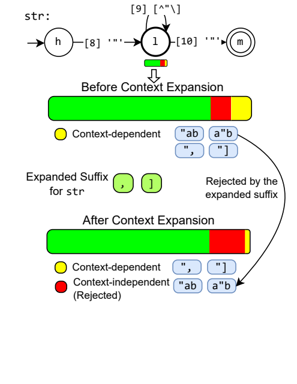
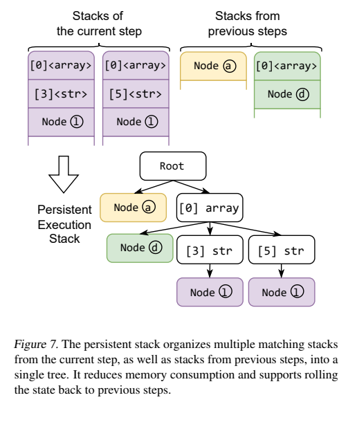
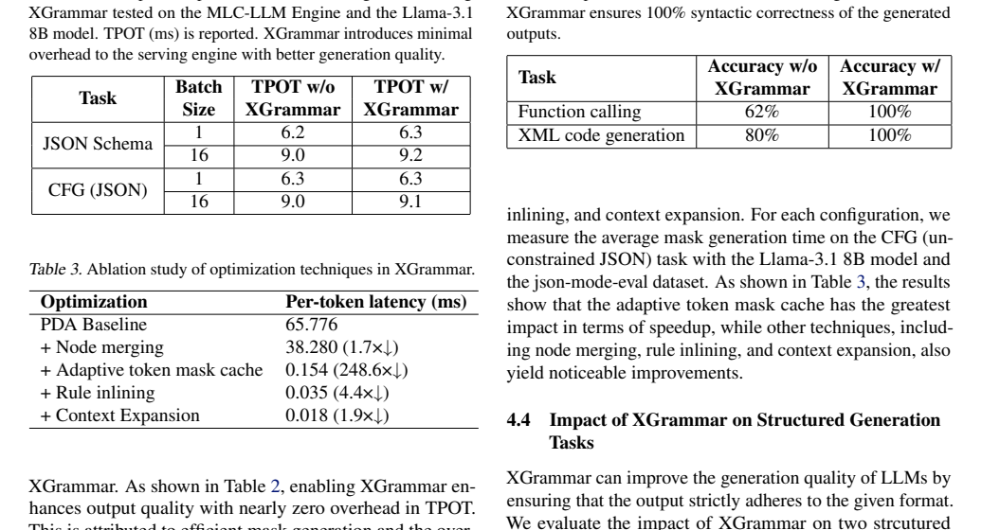

# XGrammar: Flexible and Efficient Structured Generation Engine for Large Language Models

`dongXGrammarFlexibleEfficient2025`

## 0. 论文定位

XGrammar 的核心问题是：**context-free grammar 足够灵活，但 constrained decoding 每步都要生成 token mask，如何把这部分开销降到接近 serving 系统可接受的水平？**

## 1. 核心机制

XGrammar 把词表 token 分为 context-independent 与 context-dependent。前者可以在预处理阶段缓存合法性结果，后者才需要根据运行时 stack state 解释。这个划分把大部分 token 的检查从热路径移走。

为了进一步减少 context-dependent token，论文提出 context expansion：利用语法上下文提前排除不可能完成上层规则的 token。

persistent execution stack 则用于共享多个 matching stacks 的公共前缀，并支持 rollback / branching，这对于树状生成、jump-forward 或 speculative decoding 一类场景很重要。

## 2. 实验证据

论文报告 XGrammar 在 per-token mask generation latency 上相比已有实现有数量级优势，摘要中称最高可达约 100x speedup。

端到端实验中，XGrammar 与 LLM inference engine 结合后降低 structured constraints 下的 TPOT；论文也报告启用 XGrammar 对 serving engine 的额外开销很小，并提升结构正确性。

## 3. 优势与局限

优势：

- 抓住 constrained decoding 的核心性能瓶颈，即 mask generation。
- 设计有清晰的分层：cache、context expansion、persistent stack、engine overlap。
- 适合和 SGLang/vLLM 一类 serving engine 结合，工程可实施性强。

局限：

- 高效执行 CFG / JSON Schema 约束不等于完整支持所有真实 JSON Schema 特性。
- 对任务质量的讨论相对少；如果 schema 本身诱导模型走向分布外输出，engine 只能保证结构，不保证语义。
- 论文重点是引擎优化，生产选型仍需结合 JSONSchemaBench 这类覆盖和质量评测。
