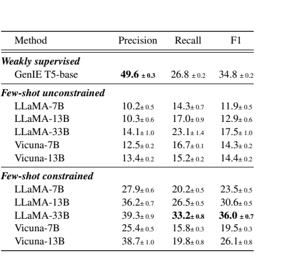
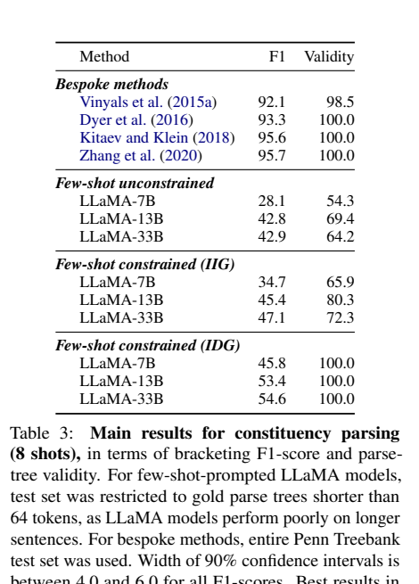
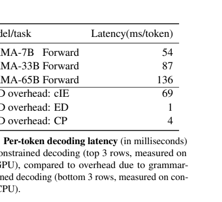

# Grammar-Constrained Decoding for Structured NLP Tasks without Finetuning

`gengGrammarConstrainedDecodingStructured2024`

## 0. 论文定位

这篇论文的核心问题是：**能不能不用 finetuning，而是用 formal grammar 在 decoding 时约束 LLM，使其完成结构化 NLP 任务？**

## 1. 方法贡献

论文将 closed information extraction、entity disambiguation、constituency parsing 等任务统一为 grammar-constrained decoding。关键是：结构化任务的输出空间可以由形式语法描述，decoding 时只允许符合语法的 token continuation。

更重要的是 input-dependent grammars：合法输出空间可以依赖输入。例如 ED 的候选实体集合来自输入上下文，CP 的叶节点必须匹配输入句子。

## 2. 实验证据

论文报告 GCD-enhanced LMs 在 cIE、ED、CP 三类任务中显著优于 unconstrained LMs。在 ED 中，input-dependent grammar 相比 input-independent grammar 更强，因为它能利用输入特定候选集合。

在 constituency parsing 上，GCD 保证输出 parse tree 有效，但性能仍低于专门 parser；这说明结构合法性与任务语义能力不是一回事。

论文还测量了 grammar constraint 的 per-token latency。ED 和 CP 的额外开销较小，cIE 因 grammar 规模更大而开销更高。

## 3. 优势与局限

优势：

- 把 constrained decoding 从特定格式技巧提升为结构化 NLP 的统一框架。
- input-dependent grammar 是关键扩展，使候选集合、输入 token 等动态约束可表达。
- 对低资源、难以 finetune 的结构化任务有现实意义。

局限：

- 需要人为设计 grammar，任务复杂时 grammar 编写和调试成本高。
- 语法约束只能保证结构合法，不能保证语义正确。
- 约束可能与 LM likelihood 不匹配，论文讨论了 empty-string / length normalization 等问题。
