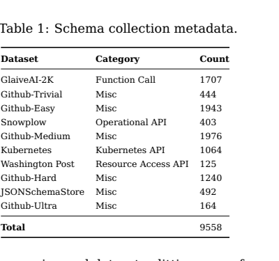
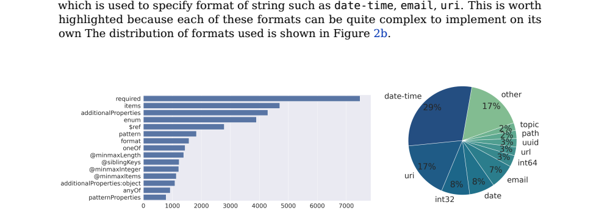
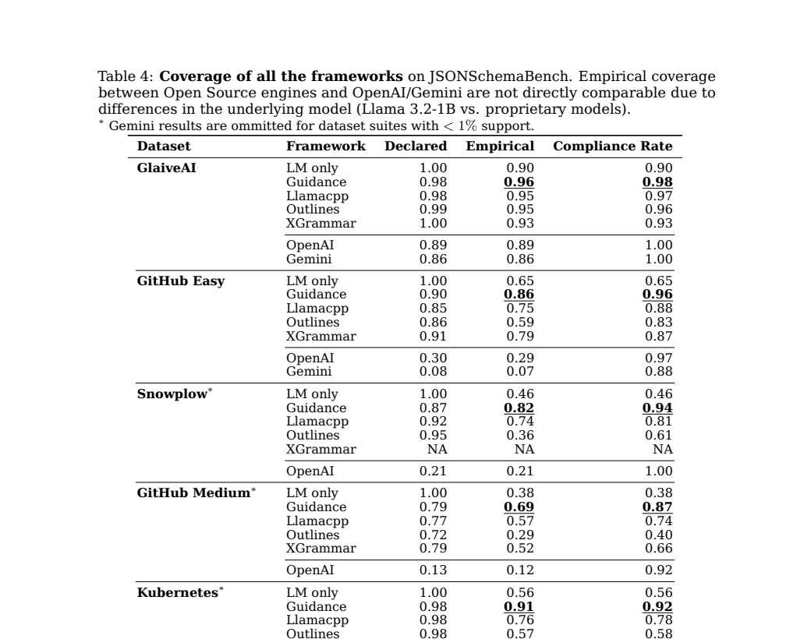
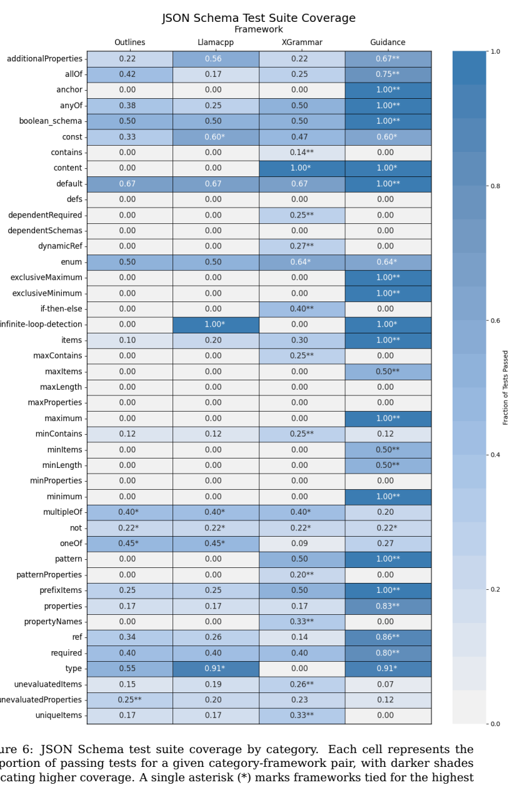
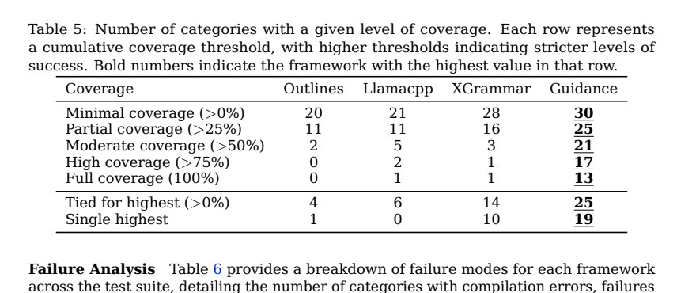

# JSONSchemaBench: A Rigorous Benchmark of Structured Outputs for Language Models

`gengJSONSchemaBenchRigorousBenchmark2025`

## 0. 论文定位

JSONSchemaBench 的核心问题是：**structured output 框架在真实 JSON Schema 上到底是否高效、覆盖充分且不伤害任务质量？**

## 1. Benchmark 设计

论文构建约 10K real-world JSON schemas，并将评测分成三维：

- efficiency：grammar compilation time、TTFT、TPOT；
- coverage：declared / empirical / true coverage；
- quality：约束生成是否影响任务准确率。

真实 schema 的特性分布并不均匀，常见约束和冷门约束都会影响框架覆盖。

## 2. 关键发现

论文评测 Guidance、Outlines、Llamacpp、XGrammar、OpenAI、Gemini 等框架。一个重要发现是：不同框架的 declared support、empirical coverage 和 compliance rate 差异明显，不能只看“是否支持 JSON Schema”。

官方 JSON Schema Test Suite 进一步显示，不同关键字类别上的支持差距很大。论文报告 Guidance 在覆盖层级上整体领先，但各框架都有边界。

质量评测则提醒：constrained decoding 原则上只过滤非法 token，但由于 tokenization ambiguity、分布偏移和 schema/prompt 设计，它仍可能影响任务准确率。

## 3. 优势与局限

优势：

- 将 structured outputs 的评测从单一合法性扩展到 efficiency、coverage、quality。
- 使用真实 JSON Schema 和官方 Test Suite，能暴露生产系统中会遇到的边界。
- 为框架选型提供了可操作指标，而不是只比较示例 demo。

局限：

- 它是 benchmark 论文，不直接提出新的 decoding engine。
- empirical coverage 仍只是 true coverage 的近似；完整语义等价很难自动验证。
- 具体结果依赖框架版本、模型、后端和 schema 集合，后续需要持续更新。
