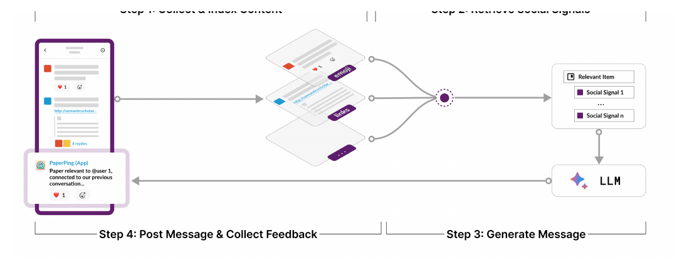
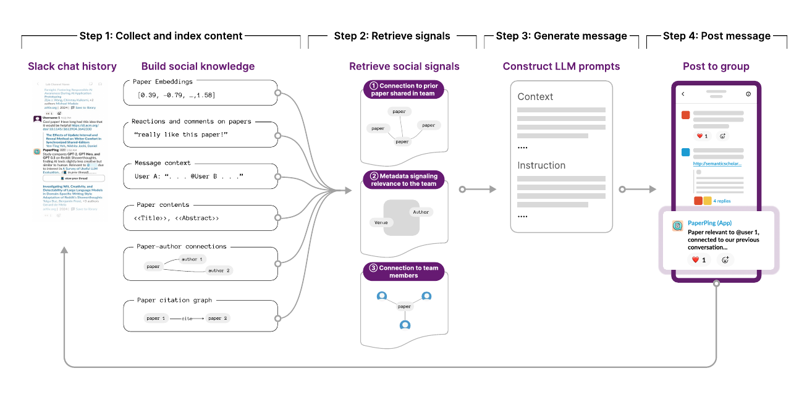
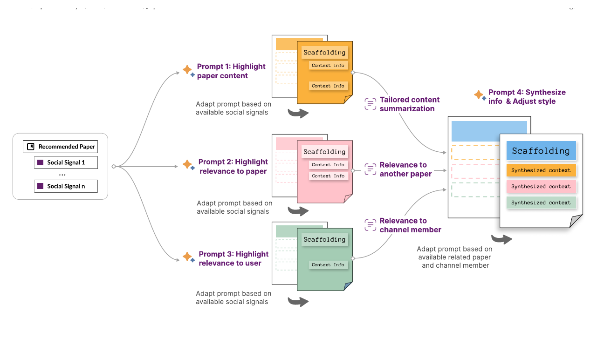
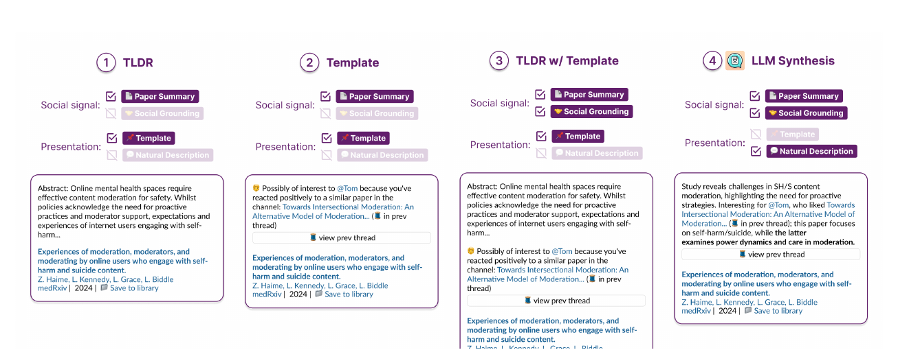

# `wangSocialRAGRetrievingGroup2025` 深度解读

## 0. 文献信息

- citation key：`wangSocialRAGRetrievingGroup2025`
- 题名：Social-RAG: Retrieving from Group Interactions to Socially Ground AI Generation
- 作者：Wang Ruotong; Zhou Xinyi; Qiu Lin; Chang Joseph Chee; Bragg Jonathan; Zhang Amy X.
- 年份：2025
- 类型：arXiv preprint，cs.HC
- DOI：`10.48550/arXiv.2411.02353`
- Zotero PDF：`/Users/edy/Zotero/storage/NKULJ7QL/Wang 等 - 2025 - Social-RAG Retrieving from Group Interactions to Socially Ground AI Generation.pdf`

## 1. 一句话定位

这篇论文提出 **Social-RAG**：一种面向群体空间中 AI Agent 主动发言的 RAG 工作流。它不是只检索事实知识，而是从群体历史互动中抽取和检索“社会事实”或社会信号，再把这些信号作为上下文输入 LLM，使 Agent 生成更贴合群体兴趣、规范和共同背景的消息。

对本课题而言，它最有价值的地方不是“推荐论文”这个应用本身，而是把 **群体历史互动 → 社会信号 → 生成约束 → 主动介入** 串成了一个可实现、可部署、可评估的技术链路。

## 2. 研究问题：为什么普通 RAG 不够

论文关注的是在线群体空间中的主动 AI Agent，例如群聊里的推荐机器人、协作空间中的促进型 Agent。问题在于，这类 Agent 的消息即使内容正确，也可能因为不符合群体语境而显得打扰、不合时宜或“不懂这个组”。

普通 RAG 通常检索外部知识库、网页、论文摘要或领域文档，主要目标是提高事实性和任务相关性。Social-RAG 的问题设定不同：

```text
普通 RAG：检索事实知识，使回答更准确。
Social-RAG：检索群体互动历史，使消息更符合群体兴趣和社会规范。
```

论文把这种差异称为 social grounding。也就是说，Agent 不仅需要知道“推荐什么”，还需要知道：

- 这个群体过去讨论过什么；
- 哪些话题或论文被积极回应；
- 哪些成员可能对某个内容感兴趣；
- 这个群体习惯怎样推荐、评论和反馈；
- 什么时候、用什么方式发消息才不破坏群体原有实践。

这对多人决策动态介入非常关键。因为多人决策中的介入并不只是“给出正确建议”，还要考虑群体当下是否愿意听、谁应该被点名、是否会打断讨论、是否会压制成员自主表达。

## 3. Social-RAG 总体流程

论文的 Figure 1 给出 Social-RAG 的总览：先收集并索引群体历史互动，形成 social knowledge base；当 Agent 要生成消息时，检索相关 item 和 social signals；再把这些社会信号输入 LLM 生成 socially grounded message；最后把消息发回群体空间，并把后续反馈继续纳入索引。



图 1 来自论文第 1 页。它可以被理解为一个闭环：

```text
历史互动
  → 社会知识库
  → 检索社会信号
  → LLM 生成社会适配消息
  → 群体反馈
  → 更新社会知识库
```

这个闭环的重要性在于：Agent 的行为不只是由设计者预设模板决定，而是可以随着群体互动持续更新。对动态介入系统而言，这意味着介入策略可以逐渐从“通用提示”转向“群体适配提示”。

## 4. PaperPing：Social-RAG 的系统实例

论文实现了一个具体系统 **PaperPing**，场景是研究群组的 Slack 频道。系统会主动推荐论文，并用 LLM 生成解释，说明为什么这篇论文对该群体或某些成员相关。

PaperPing 的流程如 Figure 3 所示。



图 3 来自论文第 7 页。系统从两个数据源构建社会知识：

- Semantic Scholar：论文内容、作者关系、引用图等；
- Slack chat history：群体中曾经分享过的论文、emoji reactions、comments、用户互动。

然后系统使用三类启发式检索社会信号：

1. 推荐论文的元数据是否与团队相关；
2. 推荐论文是否与过去在群聊中被讨论过的论文相似；
3. 哪些成员最可能对这篇论文感兴趣。

这些信号再进入 LLM prompt chain，生成一条自然语言推荐消息。最后，PaperPing 把消息发到群聊中，并收集 emoji、回复等反馈。

这套设计对本课题的启发是：多人决策中的 Agent 也可以把“讨论历史、成员反应、发言关系、信息覆盖情况”变成可检索的状态线索，而不是只在当前轮次临时生成。

## 5. Prompt pipeline：社会信号如何进入生成

论文 Figure 4 展示了 PaperPing 的 prompt pipeline。它不是把所有检索结果直接塞给一个 prompt，而是将社会信号拆成多个子任务，再汇总生成最终消息。



图 4 来自论文第 8 页。pipeline 包括：

- Prompt 1：突出论文内容；
- Prompt 2：突出与过去论文或讨论的关联；
- Prompt 3：突出与某个群体成员的关联；
- Prompt 4：综合上述信息，并调整表达风格，生成最终输出。

这个结构值得注意，因为它把“生成一条推荐消息”拆成了几个可控的中间环节。对多人决策动态介入，可以类比为：

```text
Prompt A：识别当前讨论的信息缺口
Prompt B：识别哪个成员可能掌握相关信息
Prompt C：判断此时是否适合介入
Prompt D：生成低打扰、可解释、适配群体语境的介入话语
```

换句话说，Social-RAG 的贡献不只是“用 RAG”，而是展示了怎样把社会信号结构化地放入生成链路。

## 6. 评估设计与主要发现

论文的评估包含两类证据：

- formative studies：39 名研究者，用于理解研究者如何在群体空间中分享论文、回应论文推荐，以及他们希望 AI Agent 如何参与；
- field deployment：PaperPing 在 18 个 Slack 频道中部署三个月，覆盖 500+ 名研究者。

论文还设计了离线评估条件，用来比较不同消息呈现方式。Figure 5 展示了四种 PaperPing 条件和示例解释。



图 5 来自论文第 10 页。它说明 PaperPing 不只是生成一段普通摘要，还会比较不同社会 grounding 方式对用户感知的影响。

从论文摘要和正文讨论看，主要发现包括：

- PaperPing 生成的消息被认为与群体语境相关；
- 与普通论文摘要相比，LLM 生成的群体语境化解释更适合说明“为什么这篇论文值得发到这个群”；
- PaperPing 在许多频道中没有破坏既有社会实践；
- 一些用户认为它有助于维持频道活跃，提醒成员继续分享论文；
- 但 PaperPing 并不能自动建立原本不存在的讨论规范，也不能保证所有群体都更积极互动。

这里的关键判断是：Social-RAG 的目标不是最大化推荐准确率，而是降低主动 Agent 在群体空间中“说错场合话”的风险。

## 7. 论文自己的局限

论文第 7 节讨论了当前实现的局限。核心包括：

### 7.1 可观察互动不等于完整群体动态

PaperPing 主要依赖群聊中的可观察互动，如分享、reaction 和评论。但群体偏好、权力关系、线下交流和未表达的兴趣并不一定体现在聊天记录中。因此，social knowledge base 可能是偏的。

对本课题而言，这提示我们不能只把“说出来的话”当成状态。多人决策中的沉默、犹豫、被忽视、线下关系和权力差异同样重要。

### 7.2 低活跃群体缺少足够社会信号

如果群体本来就很少分享或回应，系统可检索的社会信号会不足。论文提到在 less active groups 中，PaperPing 的推荐和解释质量会下降。

这对应多人决策中的一个难点：当讨论刚开始、成员发言少、信息尚未展开时，Agent 很难只靠历史行为做出可靠判断。可能需要结合显式提问、任务结构或用户画像来补充。

### 7.3 历史互动可能过时

群体兴趣会变化。过去的互动不一定代表当前任务需求。论文提到有些参与者觉得很难让系统转向新话题，甚至通过新建频道来表达新兴趣。

这对动态介入尤其重要：系统需要区分长期偏好、近期讨论焦点和当前决策目标，不能机械继承历史记录。

### 7.4 emoji 与反馈解释存在歧义

论文指出，PaperPing 对 emoji 的解释有硬编码假设，例如把 thumbs-up 解释为正向兴趣，但不同群体或成员可能把同一 emoji 用作确认、礼貌回应或其他含义。

这提示我们：用户状态和社会信号不能简单规则化。尤其面对老年用户和多人语音讨论时，非语言反馈、停顿、附和和沉默都可能有多种解释。

### 7.5 主动 Agent 的节奏可能造成打扰

论文讨论了 PaperPing 对群体动态的不同影响。有些频道变得更活跃，有些频道则因为系统发帖节奏与自然互动节奏不匹配而出现负担或弃用。

这正是“动态介入时机”的核心问题：好的介入不只是内容相关，还要在合适的时间、合适的频率、合适的强度出现。

## 8. 技术性评价

这篇论文不是模型训练论文，也没有在 Zotero 与 PDF 中确认其训练或微调了新的模型。它的技术性主要体现在：

- 将 RAG 从事实检索扩展到社会语境检索；
- 构建 social knowledge base；
- 将历史互动、外部论文知识、用户反馈结合成可检索信号；
- 用多阶段 prompt pipeline 组织社会信号；
- 在真实群体空间中部署并评估主动 Agent。

因此，它更适合作为 **系统工作流与社会信号建模论文**，而不是作为模型训练论文引用。

## 9. 对本课题的启发

### 9.1 状态感知应包含社会语境

本课题如果只识别“当前讨论到哪一步”，还不够。多人决策中的状态应至少包含：

- 信息状态：哪些关键信息被提出，哪些仍缺失；
- 参与状态：谁发言多，谁沉默，谁的观点没有被回应；
- 社会状态：群体是否过早收敛，是否有权力不平衡，是否存在从众；
- 人机关系状态：用户是否愿意此时被帮助，是否感到被打扰；
- 历史语境：这个群体过去如何互动，偏好何种表达方式。

Social-RAG 提供了一个思路：把这些状态的一部分转化为可检索的 social signals。

### 9.2 介入生成需要被状态线索约束

Agent 生成介入语言时，不能只靠通用 prompt。可以借鉴 Social-RAG 的方式，在生成前先检索：

- 当前讨论中的信息缺口；
- 与当前议题相关的历史讨论；
- 哪个成员可能掌握相关信息；
- 群体过去对类似提醒的接受方式；
- 当前互动节奏是否适合发言。

这样生成的介入更可能贴近群体语境，而不是“正确但突兀”。

### 9.3 评估指标不能只看最终决策正确率

Social-RAG 的评估提醒我们，动态介入系统需要评估：

- 介入内容是否相关；
- 是否打扰群体讨论节奏；
- 是否促进共同理解；
- 是否增强成员之间的信息可见性；
- 是否让用户保留控制感；
- 是否引发过度依赖或忽视人类讨论。

这对开题中的用户实验设计很有价值。

## 10. 可迁移到本课题的技术路线

可以把 Social-RAG 迁移为以下链路：

```text
多人讨论记录
  → 结构化状态抽取
  → 信息缺口与社会信号检索
  → 介入时机判断
  → 社会适配的介入语言生成
  → 用户反馈与状态更新
```

其中，Social-RAG 主要支撑“社会信号检索”和“社会适配生成”两个环节。本课题仍需要进一步补足“多人决策过程建模”和“动态介入时机判断”。

## 11. 适合在综述中支撑的论点

- `wangSocialRAGRetrievingGroup2025` 可支撑“群体历史互动和社会反馈可以作为 Agent 生成建议的上下文，使建议更符合群体兴趣、规范和共同背景”。
- 它也可支撑“主动 Agent 的有效性不仅取决于内容正确，还取决于与群体互动节奏、社会规范和反馈机制的适配”。
- 对本课题而言，它是从“内容生成”走向“群体语境化介入”的关键参考。

## 12. 需要谨慎表述的点

- 不应把这篇论文说成模型训练或微调论文；现有证据表明它是 RAG workflow、prompt pipeline 和系统部署研究。
- 不应把 PaperPing 的成功外推为所有多人决策任务中 Agent 介入都会提升决策质量；它的应用场景是研究群聊中的论文推荐。
- 不应把 social grounding 等同于完整的用户状态识别；它主要依赖可观察的群体互动，还不足以覆盖沉默、权力关系、认知负荷等隐性状态。

