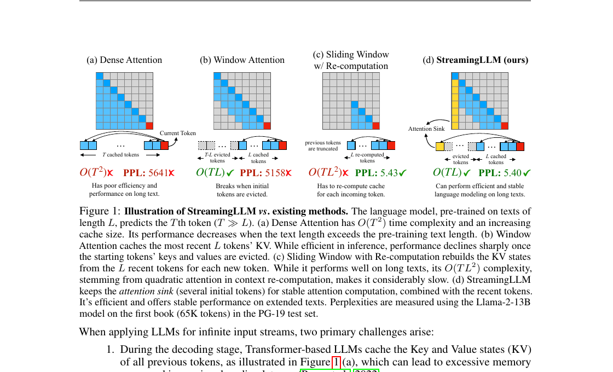
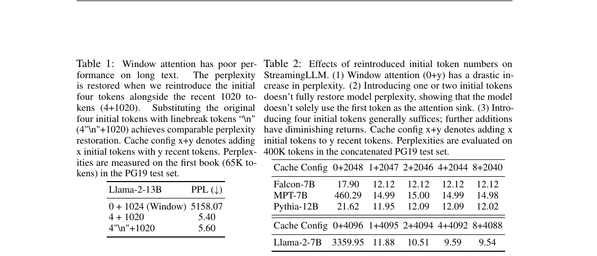
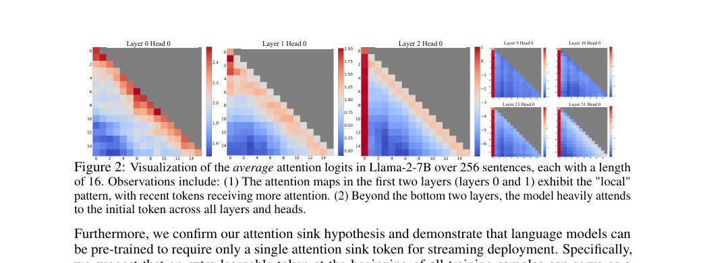
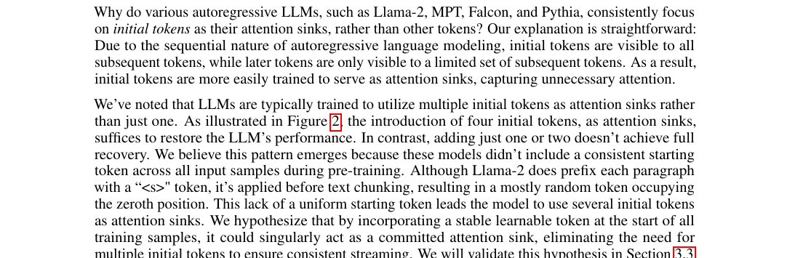
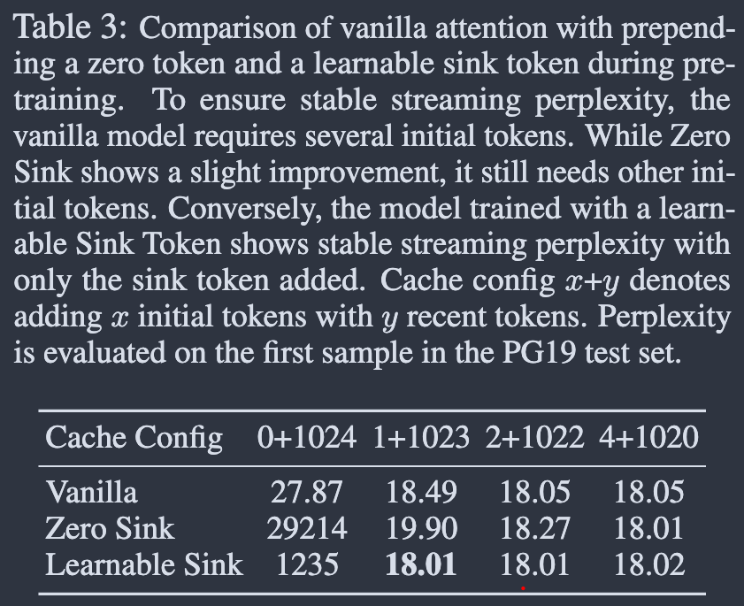
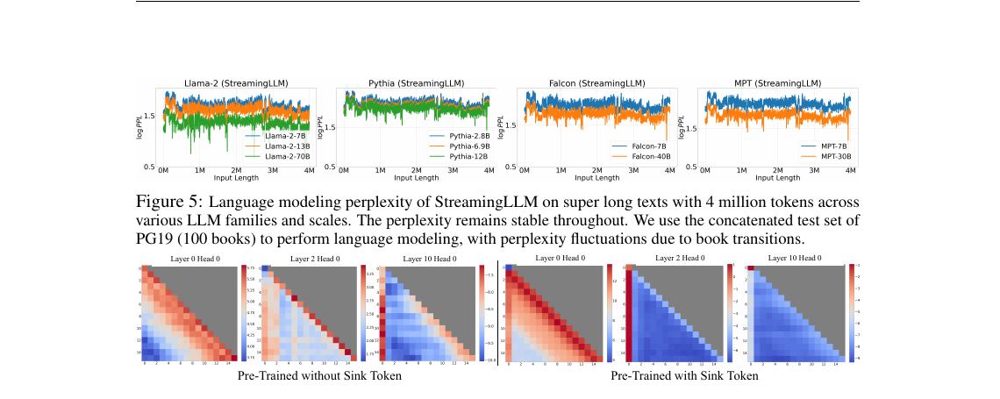
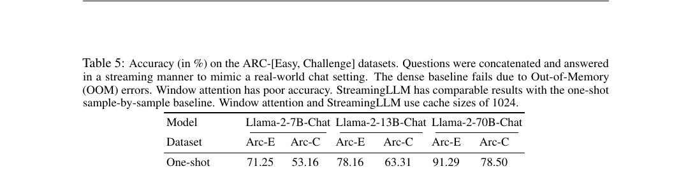
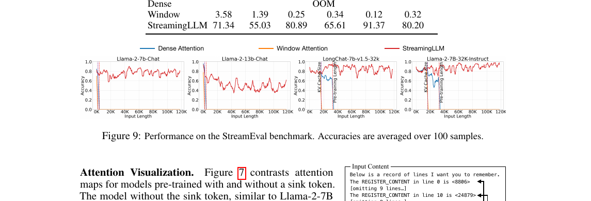
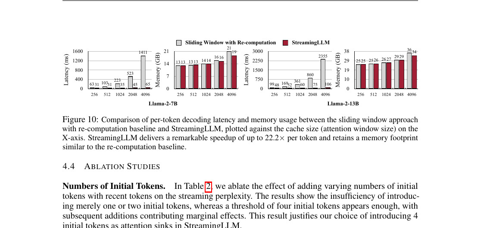

# Efficient Streaming Language Models with Attention Sinks 深度研究

Citation key: `xiaoEfficientStreamingLanguage2024`

文献：Guangxuan Xiao, Yuandong Tian, Beidi Chen, Song Han, Mike Lewis, *Efficient Streaming Language Models with Attention Sinks*, ICLR 2024.

来源：Zotero collection `01_ToRead`；元数据来自 `data/zotero/01_ToRead.bib`；PDF 路径来自 Zotero 条目。本文只使用 Zotero 条目和 PDF 正文中可见信息。

## 0. 论文定位

这篇论文要解决的问题不是传统意义上的“长上下文理解”，而是 **流式部署中的无限长度输入**：模型长期在线，输入不断追加，例如多轮对话或日常助手；系统希望显存占用和单 token latency 保持稳定，同时模型仍能基于最近上下文生成连贯文本。

作者给出的核心判断是：普通 dense attention 会随着历史增长不断累积 KV cache，显存和 latency 不可控；只保留最近窗口的 window attention 虽然省显存，但一旦初始 token 的 KV 被移出缓存，困惑度会突然崩溃。StreamingLLM 的做法是在 rolling KV cache 中固定保留少量初始 token 作为 attention sink，同时保留最近 token，从而在不微调已有模型的情况下实现稳定流式生成。`xiaoEfficientStreamingLanguage2024`



## 1. 一句话总结

StreamingLLM 的关键贡献是把流式 LLM 推理的缓存从“只保留最近窗口”改成“少量初始 sink token + 最近 rolling window”：初始 token 不是因为语义重要，而是因为 autoregressive 训练和 softmax 归一化让模型把大量冗余注意力分配给序列开头；保留这些 token 的 KV 可以稳定注意力分布，而最近窗口负责提供实际语义上下文。`xiaoEfficientStreamingLanguage2024`, pp. 2-5

## 2. 研究问题：为什么 window attention 会崩

### 2.1 三种直接方案的失败点

论文把流式场景下的推理方法分成四类：

| 方法 | 缓存策略 | 复杂度/资源特征 | 论文中的问题 |
| --- | --- | --- | --- |
| Dense attention | 保留全部历史 KV | KV cache 随历史增长 | 长度超过预训练窗口后性能下降，显存和 latency 增长 |
| Window attention | 只保留最近 L 个 token 的 KV | O(TL)，显存稳定 | 初始 token 被逐出后困惑度急剧恶化 |
| Sliding window with re-computation | 每步用最近窗口重新计算 KV | 质量接近可用 | 因每步窗口内重算 attention，latency 高 |
| StreamingLLM | 保留初始 sink token + 最近窗口 | O(TL)，显存稳定 | 质量接近 re-computation，速度显著更快 |

作者在 Figure 1 中用 Llama-2-13B 和 PG-19 第一本文本展示：window attention 的困惑度非常高，sliding window with re-computation 与 StreamingLLM 的困惑度接近，但 StreamingLLM 避免了每个新 token 的窗口内重算。`xiaoEfficientStreamingLanguage2024`, p. 2

### 2.2 崩溃发生在初始 token 被逐出时

论文在 20K token 文本上观察到一个关键现象：window attention 的困惑度在输入长度超过 cache size 后急剧上升。作者将原因归结为初始 token 的 KV 被移出缓存，而这些 token 在许多层和头中承接了异常高的注意力。`xiaoEfficientStreamingLanguage2024`, p. 4

这说明 window attention 的问题不是“最近上下文不够语义信息”，而是“注意力计算的分布锚点被拿掉”。这个区分很重要：如果问题只是缺少语义信息，保留几个无意义开头 token 不应恢复困惑度；但论文实验显示，用换行 token 替代原始前四个 token 后也能恢复接近的困惑度。`xiaoEfficientStreamingLanguage2024`, pp. 4-5



## 3. Attention sink 现象

### 3.1 文献发现

作者在 Llama-2-7B 上可视化平均 attention logits，发现底层若干层偏局部注意力，而更高层和多数 head 会持续关注初始 token。论文将这些初始 token 称为 attention sinks：它们语义上未必重要，但承接了大量注意力分数。`xiaoEfficientStreamingLanguage2024`, pp. 2-4



### 3.2 作者主张

作者认为 attention sink 的根源与 softmax 归一化有关。对每个 query，注意力权重必须在上下文 token 上归一化为一个分布；当当前 token 不需要强烈关注很多历史 token 时，多余的注意力仍要被分配到某些位置。由于 autoregressive 训练中初始 token 对后续 token 都可见，它们更容易被训练成这种“冗余注意力接收器”。`xiaoEfficientStreamingLanguage2024`, pp. 4-5

这个解释也说明为什么“固定的专用 sink token”可能更好：如果预训练时每个样本开头都有同一个可学习 token，模型可以把冗余注意力稳定地交给它，而不是被迫把多个普通内容 token 当作 sink。`xiaoEfficientStreamingLanguage2024`, pp. 5-7

### 3.3 Codex 综合推断

Attention sink 可以理解为一种 **注意力分布的数值锚点**，而不是可读语义记忆。它的价值在于维持模型熟悉的注意力统计形态，避免 window attention 删除开头 KV 后改变 softmax denominator 与注意力分配结构。因此，StreamingLLM 的“保留开头 token”更像是保留 attention computation 的稳定器，而不是保留长程事实。

## 4. StreamingLLM 机制

### 4.1 Rolling KV cache with attention sinks

StreamingLLM 的 KV cache 分成两段：

| 部分 | 内容 | 作用 |
| --- | --- | --- |
| Attention sinks | 通常保留前 4 个初始 token 的 KV | 稳定注意力分布 |
| Rolling KV cache | 保留最近 token 的 KV | 提供当前生成所需的短期语义上下文 |

论文默认使用 4 个初始 token 作为 sink。Table 2 显示，在 Falcon-7B、MPT-7B、Pythia-12B 和 Llama-2-7B 上，0 个初始 token 的 window attention 会显著恶化；1 或 2 个初始 token 在部分模型上仍不足；4 个通常已经接近稳定。`xiaoEfficientStreamingLanguage2024`, pp. 5, 9



### 4.2 位置编码细节

论文特别强调：StreamingLLM 在计算相对距离和位置编码时，应使用 cache 内部的连续位置，而不是原文中的绝对 token 位置。例子是，当 cache 中有 `[0, 1, 2, 3, 6, 7, 8]` 并生成第 9 个 token 时，应把它们映射成连续 cache positions，而不是保留原始文本位置的跳跃。`xiaoEfficientStreamingLanguage2024`, p. 5

对 RoPE，作者缓存 rotary transformation 之前的 Key，然后在每个 decode 阶段对 rolling cache 中的 Key 应用位置变换；对 ALiBi，则使用连续 linear bias，而不是带跳跃的 bias。这个实现细节决定了 StreamingLLM 能否在超过预训练窗口后仍稳定工作。`xiaoEfficientStreamingLanguage2024`, p. 5

### 4.3 与 PagedAttention/vLLM 的关系

StreamingLLM 和 PagedAttention 解决的是不同层面的问题：

| 技术 | 主要问题 | 对 KV cache 的改变 |
| --- | --- | --- |
| StreamingLLM | 长时间流式生成时如何保持固定缓存和稳定质量 | 决定保留哪些 token 的 KV：初始 sink + 最近窗口 |
| PagedAttention/vLLM | 多请求 serving 中如何高效管理 KV cache 内存 | 决定 KV cache 如何分页、共享和分配 |

因此二者可以互补：StreamingLLM 是 token selection / cache policy，PagedAttention 是 memory management / serving substrate。对服务系统来说，StreamingLLM 减少每个请求长期运行时的缓存增长，PagedAttention 则减少多请求场景下的碎片和预留浪费。

## 5. 专用 sink token 预训练

作者进一步提出：未来模型可以在预训练样本开头加入一个可学习 sink token，让模型从一开始就有稳定的冗余注意力接收器。

论文比较了三种 160M 参数模型：

| 方法 | 做法 | 论文结论 |
| --- | --- | --- |
| Vanilla | 标准 softmax attention | 流式场景需要多个初始 token 才能稳定 |
| Zero Sink | 类似 SoftMax-off-by-One，相当于加入零 Key/Value 的虚拟项 | 有缓解，但仍依赖其他初始 token |
| Learnable Sink | 每个训练样本前加入可学习 sink token | 只保留 sink token + 最近窗口即可稳定 |

Table 3 显示，learnable sink token 在 `1+1023`、`2+1022`、`4+1020` 配置下困惑度基本一致，说明专用 sink token 能替代多个普通初始 token。`xiaoEfficientStreamingLanguage2024`, p. 6



作者还在 Pythia-160M 训练设置下比较了有无 sink token 的模型，报告二者训练收敛趋势相近，并在 ARC、HellaSwag、LAMBADA、OpenbookQA、PIQA、Winogrande 等 zero-shot benchmark 上表现接近。作者据此主张，预训练加入 sink token 不会明显损害常规能力。`xiaoEfficientStreamingLanguage2024`, p. 7

## 6. 实验结论

### 6.1 长文本语言建模

作者在 PG-19 test set 的 100 本书拼接文本上评估。对 Llama-2 使用 2048 cache size；对 Falcon、Pythia、MPT 使用 1024 cache size。Figure 3 显示 StreamingLLM 在 20K token 上能接近 sliding window with re-computation 的困惑度，而 dense attention 和 window attention 分别在超过预训练窗口或 cache size 后失败。`xiaoEfficientStreamingLanguage2024`, pp. 6-7

Figure 5 进一步展示 StreamingLLM 在 Llama-2-[7,13,70]B、Falcon-[7,40]B、Pythia-[2.8,6.9,12]B、MPT-[7,30]B 上可稳定处理超过 4 million tokens 的语言建模。这里的“稳定”应理解为困惑度随流式长度不崩溃，而不是模型能记住 4 million tokens 之前的信息。`xiaoEfficientStreamingLanguage2024`, pp. 6-7



### 6.2 流式问答

论文用 instruction-tuned Llama-2 Chat 模型模拟多轮 QA，把 ARC-Easy 和 ARC-Challenge 的问答串成连续流，并在每个答案位置评估 exact match。Table 5 显示 dense baseline 出现 OOM；window attention 准确率几乎崩溃；StreamingLLM 与 one-shot sample-by-sample baseline 接近，甚至在表中略高。`xiaoEfficientStreamingLanguage2024`, p. 8



作者还构造 StreamEval：每 10 行新增信息后查询一次，答案通常位于最近 20 行附近。Figure 9 显示，当查询所需信息位于 cache 内时，StreamingLLM 在接近 120K token 的输入长度下仍保持合理准确率；dense attention 与 window attention 分别在预训练长度和 cache size 附近失败。`xiaoEfficientStreamingLanguage2024`, p. 8



### 6.3 延迟与显存

Efficiency 实验将 StreamingLLM 与 sliding window with re-computation 比较，使用 HuggingFace Transformers，在单张 NVIDIA A6000 上测试 Llama-2-7B 和 Llama-2-13B。Figure 10 显示，随着 cache size 增加，re-computation 的 per-token latency 增长更快；StreamingLLM 最多达到 22.2x per-token speedup，同时显存占用与 re-computation baseline 接近。`xiaoEfficientStreamingLanguage2024`, p. 9



## 7. 局限与边界

### 7.1 不是长程记忆

作者在正文和附录中反复强调：StreamingLLM 不扩展模型上下文窗口，也不增强长期记忆；它只能基于当前 cache 中的信息生成。对于需要长期依赖的任务，例如长文档 QA 和 summarization，StreamingLLM 不适合。`xiaoEfficientStreamingLanguage2024`, pp. 3, 15-17

附录 C 的 StreamEval 距离实验显示，当 query-answer 距离超过 cache capacity，准确率会下降甚至归零。附录 D 的 LongBench 结果也显示，`4+3496` 配置在长文档 QA 和 summarization 上低于保留开头与结尾信息的 truncation baseline；当把 attention sink 数量调到 1750、等价于保留大段开头信息时，表现才接近 truncation baseline。`xiaoEfficientStreamingLanguage2024`, pp. 16-17

### 7.2 依赖最近上下文

StreamingLLM 最适合的问题是“答案或生成依据位于最近窗口内”。如果应用需要跨很长历史检索事实，必须结合外部 memory、RAG、summary memory、retrieval cache 或真正长上下文模型。否则，StreamingLLM 只能让模型不断在线，而不能让模型记住已被逐出的历史。`xiaoEfficientStreamingLanguage2024`, pp. 15-17

### 7.3 cache size 增大不总是带来困惑度下降

Table 6 显示，增大 StreamingLLM 的最近窗口并不总是单调降低困惑度。作者将其作为一个潜在限制：模型可能并不能充分利用给定上下文。`xiaoEfficientStreamingLanguage2024`, p. 9

这与长上下文研究中的 “lost in the middle” 类问题相呼应：即便 token 位于上下文或 cache 中，模型也未必有效使用它。

## 8. 与相关方向的关系

### 8.1 与 context window extension

Context window extension 试图扩大模型一次可 attend 的最大上下文，例如位置插值、RoPE scaling、长上下文微调等。StreamingLLM 不扩大这个窗口，而是让模型在固定窗口内长期在线。论文也指出，StreamingLLM 可以与 context extension 结合：长上下文方法扩大最近窗口，StreamingLLM 负责流式稳定运行。`xiaoEfficientStreamingLanguage2024`, pp. 3, 8

### 8.2 与 sparse attention

Sparse attention 通常需要改变 attention pattern 或训练结构，例如 local/global/random pattern。作者认为这些方法常需特定 kernel、重训或不适配已有 dense autoregressive LLM。StreamingLLM 的优势是能直接用于已有使用 RoPE 或 ALiBi 的 autoregressive 模型，不需要微调。`xiaoEfficientStreamingLanguage2024`, pp. 15-16

### 8.3 与 serving systems

从 serving 角度看，StreamingLLM 给 KV cache policy 提供了一个简单但有力的规则：

```text
-+-+-+-+-+-+
| sink K/V | + | recent rolling K/V |
+-+-+-+-+-+-+

固定少量初始 KV 负责稳定 attention；
最近窗口 KV 负责短期语义；
超过窗口的中间历史直接逐出。
```

这对在线服务很有价值，因为它让单个长会话的 KV cache 不再随会话时长无限增长。它也降低了长期会话中 periodic cache reset 或 repeated recomputation 的必要性。`xiaoEfficientStreamingLanguage2024`, pp. 2, 9, 15

## 9. 证据矩阵

| 论点 | 证据类型 | 证据位置 | 可追溯 citation |
| --- | --- | --- | --- |
| Window attention 在初始 token 被逐出后崩溃 | 语言建模困惑度曲线、机制分析 | Figure 3, Section 3.1 | `xiaoEfficientStreamingLanguage2024`, p. 4 |
| 初始 token 的语义不是关键，绝对开头位置更关键 | 替换前 4 个 token 为换行 token 后困惑度恢复 | Table 1 | `xiaoEfficientStreamingLanguage2024`, p. 5 |
| 多个模型存在 attention sink 现象 | attention logits 可视化 | Figure 2, Figure 11-13 | `xiaoEfficientStreamingLanguage2024`, pp. 3, 17-19 |
| 4 个初始 token 通常足以稳定已有模型 | ablation | Table 2 | `xiaoEfficientStreamingLanguage2024`, p. 5 |
| StreamingLLM 由 attention sinks 与 rolling KV cache 组成 | 方法图与文字说明 | Figure 4, Section 3.2 | `xiaoEfficientStreamingLanguage2024`, p. 5 |
| 专用 sink token 预训练可减少对多个初始 token 的依赖 | 160M 模型对比 | Table 3, Figure 7 | `xiaoEfficientStreamingLanguage2024`, pp. 6-8 |
| StreamingLLM 可在多模型家族上稳定处理 4M+ tokens | PG-19 拼接语言建模 | Figure 5 | `xiaoEfficientStreamingLanguage2024`, pp. 6-7 |
| StreamingLLM 在流式 QA 中接近 one-shot baseline | ARC 流式问答 | Table 5 | `xiaoEfficientStreamingLanguage2024`, p. 8 |
| StreamingLLM 不等于长程记忆 | 距离实验、LongBench | Table 7, Table 8 | `xiaoEfficientStreamingLanguage2024`, pp. 16-17 |
| StreamingLLM 最高 22.2x per-token speedup | latency/memory 实验 | Figure 10 | `xiaoEfficientStreamingLanguage2024`, p. 9 |

## 10. 对后续研究/实现的启发

### 10.1 做系统 benchmark 时要区分三类长度

StreamingLLM 提醒我们，LLM serving 中至少有三类“长度”：

| 长度 | 含义 | StreamingLLM 的影响 |
| --- | --- | --- |
| 会话总长度 | 用户和系统累计交互总 token | 可无限增长，但中间历史会被逐出 |
| 可 attend 的 cache 长度 | sink tokens + recent rolling tokens | 固定，决定短期信息可见范围 |
| 可记忆的事实距离 | 任务所需信息与当前 query 的距离 | 超出 cache 后无法保证 |

因此 benchmark 不能只说“支持 4M tokens”；还要问：模型是否需要访问 4M token 之前的信息？如果需要，StreamingLLM 本身并不能解决。

### 10.2 对 agent / tool-use workload 的意义

对长时间运行的 agent，历史会不断积累：system prompt、工具说明、工具结果、多轮对话都会拉长上下文。StreamingLLM 可用于“持续会话但只依赖最近状态”的模式，例如最近几轮工具调用、当前任务局部状态、短期对话上下文。

但如果 agent 需要长期任务记忆，应该把 StreamingLLM 与外部记忆机制结合：

- session summary：把被逐出的历史压缩成短摘要；
- retrieval memory：把历史工具结果或决策存入可检索库；
- prefix/prompt cache：复用稳定 system prompt 与工具 schema；
- long-context model：处理需要跨大段文本定位的任务。

### 10.3 对模型预训练的启发

专用 sink token 的发现很有工程价值：如果模型训练阶段就显式提供一个 attention sink，推理框架就不必保留多个普通开头 token。更重要的是，这将“冗余注意力应该流向哪里”从偶然的初始内容 token 变成模型结构的一部分。`xiaoEfficientStreamingLanguage2024`, pp. 6-8

## 11. 关键结论

StreamingLLM 的本质不是让模型拥有无限上下文，而是让模型在 **有限、固定大小的 KV cache** 中无限期运行。它抓住了一个反直觉现象：已有 autoregressive LLM 依赖开头 token 作为 attention sink；删除这些 token 会破坏注意力分布。只要保留少量初始 KV，再配合最近窗口，模型就能在长期流式输入中维持稳定生成质量。

这篇论文在 LLM serving 技术栈中的位置可以概括为：

```text
PagedAttention / vLLM: KV cache 如何管理
Prefix cache / Mooncake: KV cache 如何复用与迁移
StreamingLLM: KV cache 长期流式场景下保留哪些 token
Long-context / RAG: 超出 cache 的信息如何仍可访问
```

因此，StreamingLLM 最适合被放在“长会话推理缓存策略”这一层理解：它让缓存大小可控、质量稳定、速度接近 window attention，但代价是牺牲被逐出历史的可访问性。
