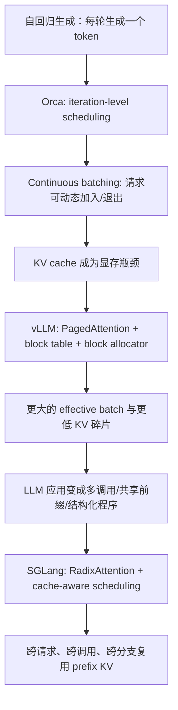
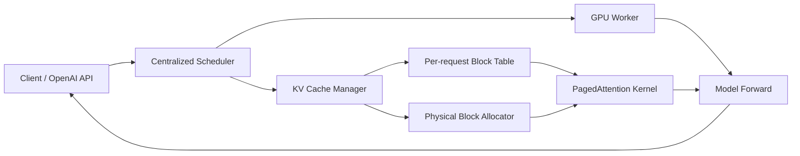
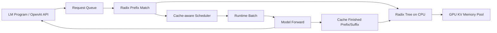

# 调研报告 1：主流推理引擎对比

本文基于 `benchmark_results/runs/20260616_025640_qwen35-sglang-vllm` 中 2026-06-16 新增的 benchmark 结果，对同一模型 `Qwen/Qwen3.5-4B` 在 SGLang 与 vLLM 两种推理引擎上的表现进行对比。架构分析参考 `research/notes/deep_dives/llmServingSystems` 中关于 Orca、PagedAttention/vLLM 与 SGLang 的专题分析。

## 1. 结论摘要

在本轮实验矩阵下，SGLang 在整体吞吐、输出 token 吞吐、TPOT 和大多数 TTFT 指标上优于 vLLM：

| 指标 | SGLang | vLLM | SGLang / vLLM |
| --- | ---: | ---: | ---: |
| 平均 req/s | 4.30 | 3.17 | 1.36x |
| 平均 output tok/s | 135.8 | 101.9 | 1.33x |
| 平均 TTFT | 266.3 ms | 345.6 ms | 0.77x |
| 平均 TPOT | 27.61 ms | 39.41 ms | 0.70x |
| 平均 E2E latency | 1120.7 ms | 1573.7 ms | 0.71x |

需要注意两点：

1. 本轮 workload 是 `identical` 场景，所有请求共享相同 prompt 模板和内容，天然有利于 SGLang 的 RadixAttention / prefix cache 机制发挥作用。
2. `max_tokens=64/256/512` 是生成上限维度，但实际输出平均只有约 32 token/请求，因此本轮数据更能反映短生成、长 prompt、共享 prefix 场景下的 prefill/cache/scheduling 差异，而不是长输出 decode 极限吞吐。

## 2. Benchmark 矩阵

### 2.1 实验配置

| 维度 | 配置 |
| --- | --- |
| Run ID | `20260616_025640_qwen35-sglang-vllm` |
| 模型 | `Qwen/Qwen3.5-4B` |
| 模型路径 | `/nfs100/xiaoyixiao/models/Qwen3.5-4B` |
| GPU | A100-SXM4-40GB |
| SGLang GPU | GPU 1 |
| vLLM GPU | GPU 7 |
| 请求协议 | OpenAI Chat API |
| prompt 场景 | `identical` |
| batch sizes | 1, 2, 4, 8, 16 |
| prompt lengths | 128, 512, 2048, 8192 |
| max_tokens | 64, 256, 512 |
| repeat batches | 5 |
| warmup batches | 0 |
| temperature | 0.0 |
| thinking | disabled |
| reset prefix cache | false |
| 总 case 数 | 120 |
| 失败请求 | 0 |

### 2.2 引擎启动参数

| 引擎 | 关键启动参数 |
| --- | --- |
| SGLang | `--context-length 32768 --mem-fraction-static 0.70 --reasoning-parser qwen3 --skip-server-warmup --disable-cuda-graph` |
| vLLM | `--max-model-len 32768 --gpu-memory-utilization 0.80 --enforce-eager` |

### 2.3 完整矩阵展开

本轮矩阵为：

```text
2 engines
  x 1 prompt scenario: identical
  x 5 batch sizes: 1, 2, 4, 8, 16
  x 4 prompt lengths: 128, 512, 2048, 8192
  x 3 generation caps: 64, 256, 512
= 120 benchmark cases
```

每个 case 的请求数为 `batch_size x repeat_batches`。由于 `repeat_batches=5`，单个 case 的请求数分别为 5、10、20、40、80。两个引擎各完成 60 个 case、1860 个请求，失败数均为 0。

## 3. 架构对比

### 3.1 Serving 系统演进视角



### 3.2 vLLM 架构要点



vLLM 的核心是 PagedAttention：把每个请求的 KV cache 从连续内存改成固定大小 physical block，并通过 block table 做间接寻址。这样可以减少 reserved waste、internal fragmentation 和 external fragmentation，使 continuous batching 能在同样显存下容纳更多活跃请求。

### 3.3 SGLang 架构要点



SGLang 的核心是 RadixAttention：用 radix tree 记录 token prefix 到 KV cache 的映射，新请求进入时做最长前缀匹配，命中部分直接复用 KV，只对 suffix 做 prefill。对于本轮 `identical` prompt 场景，这个机制尤其关键，因为不同请求之间共享大量相同前缀。

## 4. 特性矩阵

| 维度 | vLLM | SGLang | 本轮结果中的相关影响 |
| --- | --- | --- | --- |
| 核心抽象 | 高吞吐 serving engine | LM program runtime + serving engine | 本轮使用 OpenAI Chat API，但 identical prompt 仍能触发 prefix 复用差异 |
| 调度基础 | continuous batching / request scheduling | cache-aware scheduling + batching | batch 增大时两者吞吐均上升，SGLang 多数 batch 下 req/s 更高 |
| KV 管理 | PagedAttention，block table，physical block pool | RadixAttention，radix prefix tree，KV memory pool | 共享 prefix 场景下 SGLang TTFT/TPOT 更低 |
| 复用粒度 | KV block / request-level block sharing | token prefix / program-level prefix sharing | `identical` workload 更贴近 SGLang 优势区 |
| 结构化输出 | 依赖引擎与上层约束实现 | compressed FSM 等结构化执行优化 | 本轮未测试 JSON/regex，不能据此给出结构化输出结论 |
| 多调用程序 | 通常把每次调用当请求处理 | 前端 primitive 暴露 fork/join/gen/select 等结构 | 本轮未测试多调用程序，不能据此扩展结论 |
| 本轮启动配置 | `--enforce-eager` | `--disable-cuda-graph` | 两者都未启用 CUDA graph 路径；本报告不推断 CUDA graph 场景 |
| 本轮显存基线 | 平均起始约 31993 MiB | 平均起始约 29487 MiB | 两者启动配置不同，显存占用不能直接作为绝对优劣判断 |

## 5. Benchmark 结果

### 5.1 按 batch size 聚合

| batch | SGLang req/s | vLLM req/s | S/V | SGLang out tok/s | vLLM out tok/s | S/V | SGLang TTFT ms | vLLM TTFT ms | SGLang TPOT ms | vLLM TPOT ms |
| ---: | ---: | ---: | ---: | ---: | ---: | ---: | ---: | ---: | ---: | ---: |
| 1 | 0.87 | 0.68 | 1.28x | 28.0 | 21.9 | 1.28x | 863.8 | 355.1 | 26.73 | 33.85 |
| 2 | 1.76 | 1.27 | 1.38x | 56.8 | 41.1 | 1.38x | 99.2 | 288.8 | 26.86 | 36.38 |
| 4 | 3.28 | 2.41 | 1.36x | 105.9 | 77.8 | 1.36x | 112.1 | 295.7 | 26.58 | 38.70 |
| 8 | 5.93 | 4.29 | 1.38x | 183.2 | 138.1 | 1.33x | 118.6 | 350.3 | 27.45 | 42.17 |
| 16 | 9.69 | 7.20 | 1.35x | 304.8 | 230.5 | 1.32x | 137.7 | 437.8 | 30.42 | 45.95 |

观察：

- 两个引擎都随着 batch 增大获得更高吞吐，说明 continuous batching / batch execution 在本轮配置下有效。
- SGLang 在所有 batch size 上 req/s 都高于 vLLM，提升幅度约 1.28x 到 1.38x。
- 除 batch=1 外，SGLang TTFT 显著低于 vLLM；batch=1 的平均 TTFT 被 SGLang 的一个异常 case 拉高。
- TPOT 上 SGLang 稳定低于 vLLM，说明本轮短输出 decode 阶段 SGLang 的每 token 延迟更低。

### 5.2 按 prompt length 聚合

| prompt tokens | SGLang req/s | vLLM req/s | S/V | SGLang total tok/s | vLLM total tok/s | S/V | SGLang TTFT ms | vLLM TTFT ms | SGLang TPOT ms | vLLM TPOT ms |
| ---: | ---: | ---: | ---: | ---: | ---: | ---: | ---: | ---: | ---: | ---: |
| 128 | 6.37 | 4.98 | 1.28x | 994.2 | 785.8 | 1.27x | 584.0 | 235.4 | 28.95 | 35.37 |
| 512 | 5.34 | 4.05 | 1.32x | 2917.2 | 2212.9 | 1.32x | 132.7 | 188.3 | 26.91 | 35.25 |
| 2048 | 4.35 | 2.67 | 1.63x | 9050.7 | 5555.7 | 1.63x | 188.1 | 408.0 | 28.84 | 39.23 |
| 8192 | 1.16 | 0.98 | 1.18x | 9560.9 | 8071.3 | 1.18x | 160.4 | 550.5 | 25.73 | 47.79 |

观察：

- prompt 越长，prefill 成本越重要。SGLang 在 2048 prompt tokens 下相对优势最大，req/s 与 total tok/s 都达到 1.63x。
- 8192 prompt tokens 下 SGLang 仍领先，但相对优势收窄到 1.18x。这可能说明极长上下文下，两者都更多受 prefill 计算和显存带宽约束，prefix cache 之外的基础算子成本占比变高。
- vLLM 的 TPOT 随 prompt length 增长更明显，尤其 8192 tokens 时达到 47.79 ms；SGLang 在 8192 tokens 下仍保持 25.73 ms。
- 128 tokens 的 SGLang TTFT 平均偏高，主要来自一个异常 case：`bs=1, prompt=128, max_tokens=64` 的 TTFT 为 7356.4 ms。

### 5.3 按 generation cap 聚合

| max_tokens | SGLang req/s | vLLM req/s | S/V | SGLang out tok/s | vLLM out tok/s | S/V | SGLang TTFT ms | vLLM TTFT ms | SGLang TPOT ms | vLLM TPOT ms |
| ---: | ---: | ---: | ---: | ---: | ---: | ---: | ---: | ---: | ---: | ---: |
| 64 | 3.96 | 3.11 | 1.28x | 124.8 | 100.0 | 1.25x | 597.3 | 400.8 | 29.33 | 39.93 |
| 256 | 4.48 | 3.20 | 1.40x | 140.8 | 102.8 | 1.37x | 100.0 | 318.0 | 26.81 | 39.22 |
| 512 | 4.47 | 3.20 | 1.40x | 141.7 | 102.9 | 1.38x | 101.6 | 317.9 | 26.69 | 39.08 |

观察：

- 256 与 512 两档几乎重合，原因是实际输出并没有接近上限。
- `max_tokens=64` 的 TTFT 偏高，主要同样受 SGLang 首个异常 case 影响。
- 因此，本轮不能用来判断长生成上限下 decode-heavy workload 的最终差异，只能说明短回答场景中 SGLang 的平均吞吐和 TPOT 更好。

### 5.4 Prompt length x batch size 矩阵

下表对每组 prompt length 与 batch size，在三个 generation cap 上取平均。

| prompt | batch | SGLang req/s | vLLM req/s | S/V | SGLang out tok/s | vLLM out tok/s | S/V | SGLang TTFT | vLLM TTFT | SGLang TPOT | vLLM TPOT |
| ---: | ---: | ---: | ---: | ---: | ---: | ---: | ---: | ---: | ---: | ---: | ---: |
| 128 | 1 | 0.92 | 0.76 | 1.20x | 27.5 | 22.9 | 1.20x | 2484.9 | 487.7 | 34.65 | 33.53 |
| 128 | 2 | 2.24 | 1.54 | 1.45x | 67.2 | 46.2 | 1.45x | 66.3 | 207.2 | 28.52 | 37.40 |
| 128 | 4 | 4.62 | 3.36 | 1.37x | 138.5 | 100.9 | 1.37x | 85.4 | 149.4 | 26.45 | 35.06 |
| 128 | 8 | 9.24 | 6.78 | 1.36x | 244.8 | 203.4 | 1.20x | 106.3 | 148.0 | 25.80 | 34.55 |
| 128 | 16 | 14.81 | 12.44 | 1.19x | 419.4 | 370.3 | 1.13x | 177.1 | 184.8 | 29.34 | 36.31 |
| 512 | 1 | 1.11 | 0.80 | 1.38x | 37.6 | 27.2 | 1.38x | 102.9 | 116.5 | 23.67 | 33.77 |
| 512 | 2 | 2.09 | 1.50 | 1.40x | 71.2 | 50.9 | 1.40x | 68.7 | 146.8 | 26.06 | 34.72 |
| 512 | 4 | 3.91 | 2.95 | 1.32x | 132.8 | 100.3 | 1.32x | 112.6 | 153.5 | 26.47 | 35.01 |
| 512 | 8 | 6.93 | 5.52 | 1.25x | 235.6 | 187.8 | 1.25x | 187.6 | 214.1 | 27.71 | 35.10 |
| 512 | 16 | 12.68 | 9.49 | 1.34x | 431.1 | 322.8 | 1.34x | 191.9 | 310.4 | 30.63 | 37.63 |
| 2048 | 1 | 0.83 | 0.68 | 1.22x | 28.3 | 23.2 | 1.22x | 478.7 | 269.1 | 23.98 | 34.18 |
| 2048 | 2 | 1.71 | 1.32 | 1.29x | 58.2 | 45.0 | 1.29x | 161.2 | 255.4 | 27.60 | 34.62 |
| 2048 | 4 | 3.35 | 2.34 | 1.43x | 114.0 | 78.9 | 1.44x | 147.6 | 331.2 | 27.58 | 36.10 |
| 2048 | 8 | 6.12 | 3.60 | 1.70x | 208.1 | 121.8 | 1.71x | 76.3 | 485.1 | 29.81 | 42.58 |
| 2048 | 16 | 9.72 | 5.40 | 1.80x | 320.7 | 183.6 | 1.75x | 76.7 | 699.0 | 35.23 | 48.64 |
| 8192 | 1 | 0.60 | 0.46 | 1.32x | 18.7 | 14.2 | 1.32x | 388.7 | 547.3 | 24.60 | 33.89 |
| 8192 | 2 | 0.98 | 0.72 | 1.37x | 30.5 | 22.2 | 1.37x | 100.6 | 545.8 | 25.28 | 38.80 |
| 8192 | 4 | 1.24 | 1.01 | 1.23x | 38.4 | 31.2 | 1.23x | 103.1 | 548.6 | 25.83 | 48.63 |
| 8192 | 8 | 1.43 | 1.27 | 1.13x | 44.5 | 39.3 | 1.13x | 104.2 | 553.9 | 26.47 | 56.43 |
| 8192 | 16 | 1.55 | 1.46 | 1.06x | 48.1 | 45.2 | 1.06x | 105.1 | 557.1 | 26.49 | 61.23 |

## 6. 差异原因分析

### 6.1 为什么 SGLang 在 identical prompt 下更占优

本轮 prompt 场景为 `identical`，所有请求共享相同材料模板和问题形式。对这种 workload，性能关键不是“每个请求都从零 prefill”，而是系统能否识别并复用已经计算过的 prefix KV。

SGLang 的 RadixAttention 正好针对这类冗余：

- 请求进入时，在 radix tree 上做最长前缀匹配；
- 命中的 prefix KV 直接复用；
- 只对未命中的 suffix 做 prefill；
- cache-aware scheduling 倾向于让共享 prefix 的请求连续执行，降低刚计算出的 KV 被驱逐后又重算的概率。

这解释了为什么在 batch 2 到 16 的大多数场景中，SGLang 的 TTFT 明显低于 vLLM。TTFT 主要包含排队、prefill 和首 token 生成；当 prompt 长、prefix 高度共享时，减少 prefill 重算会直接体现在 TTFT 上。

### 6.2 为什么 vLLM 仍然稳定，但相对优势不在本轮 workload

vLLM 的 PagedAttention 解决的是 KV cache 内存管理问题：通过 block table 和 physical block pool 降低碎片，让同样显存容纳更多活跃请求。它的核心收益通常体现在：

- 动态长度请求；
- 多请求 continuous batching；
- KV cache 显存压力较高；
- beam search / parallel sampling 等 block sharing 场景。

本轮实验中，vLLM 没有失败，吞吐也随 batch 增大稳定提升，说明它的 serving 路径工作正常。但由于 workload 是 identical prompt，SGLang 的 prefix-level cache 复用比 vLLM 的 block-level 内存管理更贴近本轮瓶颈，因此 SGLang 表现更好。

换句话说，本轮不是证明 vLLM 的 PagedAttention 无效，而是说明：在“共享长 prefix + 短输出”的测试条件下，程序级/prefix 级复用比单纯降低 KV 碎片更直接。

### 6.3 为什么 2048 prompt tokens 下 SGLang 相对优势最大

从聚合表看，SGLang 在 prompt=2048 时 req/s 与 total tok/s 都达到 1.63x，相对优势最大。一个合理解释是：

- 128/512 tokens 时，prefill 本身较短，复用 prefix 节省的绝对计算量有限；
- 2048 tokens 时，prefill 成本已经足够高，prefix cache 命中能显著减少重复计算；
- 8192 tokens 时，虽然可复用部分更多，但超长上下文带来的 attention、内存访问和调度成本也更重，基础算子成本占比上升，相对优势收窄。

这与 serving system 专题中的主线一致：当系统瓶颈从普通 batch execution 转向 KV 生命周期与 prefix 复用时，能显式利用 prefix 结构的 runtime 会更占优。

### 6.4 为什么 TPOT 上 SGLang 更低

TPOT 是首 token 之后平均每个输出 token 的延迟。本轮 SGLang TPOT 平均 27.61 ms，vLLM 为 39.41 ms。可能原因包括：

- SGLang 在命中 prefix 后，活跃请求的 KV 组织和调度状态更适合当前 identical workload；
- 本轮 vLLM 使用 `--enforce-eager`，SGLang 使用 `--disable-cuda-graph`，两者都没有走 CUDA graph 优化路径，但具体 runtime 调度与 kernel 路径仍不同；
- 输出很短，TPOT 统计对调度开销、首轮后少量 decode iteration 的实现差异更敏感。

由于本轮没有长输出数据，不能进一步推断长 decode 场景下 SGLang 是否仍保持同等 TPOT 优势。

### 6.5 异常点与数据边界

本轮最大的异常点是：

| 引擎 | batch | prompt | max_tokens | TTFT | E2E | req/s |
| --- | ---: | ---: | ---: | ---: | ---: | ---: |
| SGLang | 1 | 128 | 64 | 7356.4 ms | 8968.8 ms | 0.11 |

它显著拉高了 SGLang 在 batch=1、prompt=128、max_tokens=64 下的 TTFT 均值。由于本轮 `warmup_batches=0`，且这是 SGLang 的第一个 case，可能包含冷态、首次请求初始化、cache 尚未建立等影响。因此，报告对 batch=1 的 TTFT 不做过度解释，更重视 batch>=2 的稳定趋势。

显存数据也需要谨慎解读：

| 引擎 | 平均起始显存 | 平均峰值显存 | 平均 delta | 最大 delta |
| --- | ---: | ---: | ---: | ---: |
| SGLang | 29487 MiB | 29499 MiB | 11.8 MiB | 368 MiB |
| vLLM | 31993 MiB | 31993 MiB | 0.2 MiB | 6 MiB |

两者启动参数中的静态显存预留不同：SGLang 为 `--mem-fraction-static 0.70`，vLLM 为 `--gpu-memory-utilization 0.80`。因此这里更适合说明“本轮运行时显存稳定”，不适合直接作为引擎显存效率的绝对比较。

## 7. 选型建议

以下建议严格基于本轮已有数据，不引入未测试 workload 的外推结论。

### 7.1 当前 workload 优先选择 SGLang

如果目标场景与本轮 benchmark 接近，即：

- 同一模型 `Qwen/Qwen3.5-4B`；
- 单卡 A100 40GB；
- OpenAI Chat API；
- prompt 大量共享或完全 identical；
- 输出较短；
- 关注吞吐、TTFT、TPOT；

则建议优先选择 SGLang。本轮数据中，SGLang 整体 req/s 为 vLLM 的 1.36x，output tok/s 为 1.33x，TPOT 约为 vLLM 的 70%。

### 7.2 若 workload 不共享 prefix，本轮数据不足以判断

本轮只有 `identical` 场景，没有 random prompt、低 prefix overlap、多租户混合 prompt 或真实线上分布。因此不能基于本轮数据断言 SGLang 在所有 workload 下都优于 vLLM。

如果后续目标是无共享前缀或低共享前缀请求，应补充测试：

- random prompt；
- partial shared prefix；
- 多 prompt 模板混合；
- 长输出 decode-heavy；
- warmup 后重复运行；
- CUDA graph on/off 对照。

这些不属于本轮选型依据，但属于后续验证必要项。

### 7.3 若只看稳定性，两者本轮都通过

两个引擎在 120 个 case、3720 个总请求中均无失败。就本轮数据而言，不能用稳定性区分两者。

### 7.4 推荐结论

本轮建议：

| 场景 | 推荐 |
| --- | --- |
| 共享 prompt / 相同模板 / 短输出中文摘要类任务 | SGLang |
| 当前 benchmark 对应的 Qwen3.5-4B 单卡服务 | SGLang |
| 仅要求本轮稳定完成，不关心吞吐差异 | SGLang 或 vLLM 均可 |
| 低 prefix overlap、长输出、多样化真实流量 | 本轮数据不足，需补充 benchmark 后再定 |

## 8. 附：原始数据位置

- Benchmark 汇总：`benchmark_results/runs/20260616_025640_qwen35-sglang-vllm/summary.csv`
- Benchmark JSON：`benchmark_results/runs/20260616_025640_qwen35-sglang-vllm/summary.json`
- 请求明细：`benchmark_results/runs/20260616_025640_qwen35-sglang-vllm/requests.jsonl`
- GPU 采样：`benchmark_results/runs/20260616_025640_qwen35-sglang-vllm/gpu_samples.jsonl`
- 运行配置：`benchmark_results/runs/20260616_025640_qwen35-sglang-vllm/resolved_config.json`
- Serving system 专题：`research/notes/deep_dives/llmServingSystems/analysis.md`
- vLLM / PagedAttention 分析：`research/notes/deep_dives/llmServingSystems/kwonEfficientMemoryManagement2023/analysis.md`
- SGLang 分析：`research/notes/deep_dives/llmServingSystems/zhengSGLangEfficientExecution/analysis.md`

## 9. 补充实验：GuideLLM synthetic workload + CUDA graph / prefix cache 对齐

### 9.1 补充实验目的

第一次测试使用 legacy benchmark runner，结论更偏向“identical prompt / 共享前缀 / 短输出”场景下的对比。本次补充实验改用当前 `benchmark-vllm-v.s-sglang` 的 Matrix Runner 和 GuideLLM client，目的是检查在更接近通用 synthetic serving 压测的请求构造下，vLLM 与 SGLang 的表现是否仍保持第一次测试中的相对关系。

本次补充实验中，两边服务端特性和响应解析路径尽量对齐：

| 维度 | vLLM | SGLang |
| --- | --- | --- |
| CUDA graph | 开启；未使用 `--enforce-eager` | 开启；未使用 `--disable-cuda-graph` |
| prefix cache | `--enable-prefix-caching` | Radix cache 默认开启；未使用 `--disable-radix-cache` |
| reasoning parser | 未启用 | 未启用；week1 显式关闭 `--reasoning-parser qwen3` |
| streaming 字段 | 普通 `delta.content` | 普通 `delta.content` |
| 服务生命周期 | `per_server`，每个引擎启动一次后连续跑完自己的 60 个 case | 同左 |
| 请求数口径 | `benchmark_requests = concurrency * repeat_batches`，`repeat_batches=5` | 同左 |
| GPU | GPU 4 | GPU 4 |
| client | GuideLLM `openai_http` / `/v1/chat/completions` | 同左 |

最终有效 run：

| 引擎 | Run ID | 状态 |
| --- | --- | --- |
| vLLM | `week1_task1_formal_perserver_cudagraph_on_cache_on_gpu4_repeat5_20260702_2016` | vLLM 60 个 case 成功；该 run 中 SGLang 后续失败，不纳入 SGLang 结论 |
| SGLang | `week1_task1_sglang_only_perserver_cudagraph_on_cache_on_noparser_skipwarmup_repeat5_20260703_1000` | SGLang 60 个 case 全部成功；无 reasoning parser，使用 `--skip-server-warmup` 避开内部 warmup 502 路径 |

### 9.2 与第一次测试的关键区别

| 维度 | 第一次测试 | 本次补充实验 | 对结果解释的影响 |
| --- | --- | --- | --- |
| runner | legacy `serving_benchmark.py`，服务由外部常驻启动 | 新 `matrix_runner.py`，已改成 `server_lifecycle=per_server` | 两者都接近长生命周期服务，但本次结果记录在 Matrix Runner 新目录结构下 |
| prompt 构造 | 自定义中文模板，`identical` 场景下请求共享相同 prompt 内容 | GuideLLM synthetic text，`prompt_tokens=...,output_tokens=...`，随机种子固定但不同请求不是完全同一文本 | 第一次更有利于 prefix reuse；本次更接近随机 synthetic serving workload |
| `prompt_scenario=identical` 含义 | 真的复用相同 prompt | 当前 Matrix Runner 中主要进入 case id，不控制 GuideLLM 的 prompt 生成 | 不能把本次视为 identical/shared-prefix 测试 |
| 请求数 | `requests = batch_size * repeat_batches`，`repeat_batches=5` | 已对齐为 `requests = concurrency * repeat_batches`，`repeat_batches=5` | 避免低并发 case 被固定 80/256 请求过度放大 |
| 输出长度 | `max_tokens` 是上限，实际输出均值约 32 token/请求 | GuideLLM synthetic 基本按 `output_tokens` 生成，输出均值约 64/256/512 token/请求 | 本次更能反映 decode-heavy 输出吞吐 |
| CUDA graph | vLLM `--enforce-eager`，SGLang `--disable-cuda-graph`，两者均关闭 | 两者均开启 CUDA graph | 本次更接近优化后的生产 serving 配置 |
| prefix cache | SGLang radix cache 可用；vLLM 未显式开启 prefix caching | 两者均开启 prefix caching / radix cache | cache 开关更公平，但由于 prompt 随机，命中收益有限 |
| reasoning parser | SGLang 使用 `--reasoning-parser qwen3` | 两边均不启用 reasoning parser | 两边都走 `delta.content`，GuideLLM 的 TTFT/ITL/output 统计可比 |
| SGLang warmup | `--skip-server-warmup` | SGLang 仍使用 `--skip-server-warmup`；否则内部 warmup 可能 502 后自杀 | 这是稳定性约束，不代表禁用 CUDA graph |

### 9.3 新结果摘要

下表为 60 个 vLLM case 与 60 个 SGLang case 的 GuideLLM 指标均值。本次已关闭 SGLang reasoning parser，因此 SGLang 的流式响应回到普通 `delta.content`，TTFT/ITL/输出文本统计可以与 vLLM 对齐比较。

| 指标 | SGLang | vLLM | SGLang / vLLM |
| --- | ---: | ---: | ---: |
| 平均 req/s | 2.14 | 2.52 | 0.85x |
| 平均 output tok/s | 372.0 | 432.1 | 0.86x |
| 平均 total tok/s | 4255.2 | 4716.1 | 0.90x |
| 平均 TTFT p50 | 455.1 ms | 311.0 ms | 1.46x |
| 平均 TPOT p50 | 16.92 ms | 15.28 ms | 1.11x |
| 平均 E2E p50 latency | 3827.1 ms | 3398.9 ms | 1.13x |
| 总成功请求数 | 1860 | 1859 | - |
| 成功 case 数 | 60 | 60 | - |

按并发聚合：

| concurrency | SGLang req/s | vLLM req/s | S/V | SGLang out tok/s | vLLM out tok/s | S/V | SGLang TTFT ms | vLLM TTFT ms | SGLang TPOT ms | vLLM TPOT ms |
| ---: | ---: | ---: | ---: | ---: | ---: | ---: | ---: | ---: | ---: | ---: |
| 1 | 0.53 | 0.67 | 0.80x | 93.0 | 106.3 | 0.87x | 126.5 | 130.6 | 10.88 | 9.84 |
| 2 | 1.04 | 1.29 | 0.80x | 171.0 | 202.8 | 0.84x | 121.2 | 139.4 | 11.97 | 10.21 |
| 4 | 1.84 | 2.16 | 0.85x | 314.1 | 368.5 | 0.85x | 309.9 | 252.1 | 14.37 | 12.55 |
| 8 | 2.94 | 3.39 | 0.87x | 534.5 | 611.7 | 0.87x | 541.8 | 443.1 | 19.14 | 17.21 |
| 16 | 4.34 | 5.08 | 0.86x | 747.4 | 871.2 | 0.86x | 1175.9 | 590.0 | 28.21 | 26.56 |

按 prompt length 聚合：

| prompt tokens | SGLang req/s | vLLM req/s | S/V | SGLang total tok/s | vLLM total tok/s | S/V | SGLang TTFT ms | vLLM TTFT ms | SGLang TPOT ms | vLLM TPOT ms |
| ---: | ---: | ---: | ---: | ---: | ---: | ---: | ---: | ---: | ---: | ---: |
| 128 | 2.89 | 3.46 | 0.83x | 878.7 | 1062.7 | 0.83x | 117.2 | 119.2 | 11.64 | 10.04 |
| 512 | 2.65 | 3.13 | 0.85x | 1917.3 | 2224.2 | 0.86x | 168.9 | 177.2 | 12.27 | 10.76 |
| 2048 | 1.94 | 2.28 | 0.85x | 4595.8 | 5275.6 | 0.87x | 399.4 | 265.6 | 15.45 | 13.39 |
| 8192 | 1.08 | 1.19 | 0.91x | 9628.9 | 10302.0 | 0.93x | 1134.7 | 682.1 | 28.29 | 26.92 |

按输出长度聚合：

| output tokens | SGLang req/s | vLLM req/s | S/V | SGLang out tok/s | vLLM out tok/s | S/V | SGLang TTFT ms | vLLM TTFT ms | SGLang TPOT ms | vLLM TPOT ms |
| ---: | ---: | ---: | ---: | ---: | ---: | ---: | ---: | ---: | ---: | ---: |
| 64 | 4.12 | 4.83 | 0.85x | 281.9 | 329.7 | 0.85x | 551.7 | 386.2 | 24.52 | 22.68 |
| 256 | 1.49 | 1.76 | 0.84x | 402.5 | 467.0 | 0.86x | 405.2 | 268.8 | 13.74 | 12.15 |
| 512 | 0.81 | 0.95 | 0.85x | 431.6 | 499.6 | 0.86x | 408.3 | 278.1 | 12.48 | 11.00 |

### 9.4 从架构差异解释新测评结果

第一次测试和本次补充实验的结论不同，并不矛盾，因为 workload 和可被利用的架构优势发生了变化。

第一次测试是真正的 `identical` prompt。SGLang 的 RadixAttention 会把 prefix token 序列组织成 radix tree，新请求到达时先做最长前缀匹配，命中部分直接复用已有 KV，只对 suffix 做 prefill。对“共享长 prefix + 短输出”的 workload，性能瓶颈主要在重复 prefill，因此 SGLang 的 prefix-level cache 和 cache-aware scheduling 能直接降低 TTFT 和整体请求延迟。

本次补充实验使用 GuideLLM synthetic prompt。虽然 case id 仍包含 `identical`，但实际请求文本由 GuideLLM 按 `prompt_tokens=...,output_tokens=...` 随机生成，不是同一段 prompt 内容。这样一来，SGLang radix tree 可以复用的长公共前缀明显减少，SGLang 最核心的 prefix reuse 优势没有被充分触发。

同时，本次输出长度基本达到 64 / 256 / 512 token，decode 阶段占比显著高于第一次测试。此时性能更依赖通用 serving 路径：continuous batching、KV cache 管理、decode 调度、streaming 响应处理和 kernel 执行稳定性。vLLM 的 PagedAttention 与 centralized scheduler 更偏向这类随机请求、多长度请求、持续 decode 的通用 serving 场景，因此在本次结果中表现为更高的平均 req/s、更高的 output tok/s、更低的 TTFT/TPOT 和更低的 E2E p50 latency。

SGLang 不是 token 生成能力不足，而是它的主要设计收益来自 prefix/program 结构复用：RadixAttention、prefix KV 复用、cache-aware scheduling、多调用程序执行等。随机 synthetic prompt 把这部分结构信息弱化后，SGLang 需要退回更普通的 serving 路径；此时它的优势不如第一次测试明显。

更细地看，两者的设计哲学不同：

| 维度 | vLLM 设计取向 | SGLang 设计取向 | 对本次结果的解释 |
| --- | --- | --- | --- |
| 核心目标 | 把任意请求流高效塞进统一 serving scheduler | 把有结构的 LM program / prompt prefix 执行得更省 | 本次 GuideLLM 请求缺少可复用程序结构，更贴近 vLLM 的通用 serving 假设 |
| KV cache 抽象 | PagedAttention：把 KV 当成分页内存管理，重点降低碎片和调度成本 | RadixAttention：把 KV 当成 prefix tree 上的可复用计算结果 | 随机 prompt 下 radix tree 难以命中长公共前缀，SGLang 的核心收益被削弱 |
| 调度关注点 | continuous batching、活跃请求吞吐、不同长度请求混排 | cache-aware scheduling、prefix 命中、程序分支/多调用复用 | 本次低 prefix overlap + 长输出让 decode 调度和批处理效率更重要 |
| 最适合 workload | 多租户随机请求、长度分布混合、decode-heavy serving | 共享 system prompt、RAG 模板、多轮 agent、fork/join 这类结构化调用 | 第一次测试更像 SGLang 优势区；本次补充实验更像 vLLM 优势区 |

因此，新测评不是简单说明“SGLang 变慢”或“vLLM 一定更强”，而是说明两种引擎优化目标不同：vLLM 更像通用高吞吐 serving 内核，优先解决随机请求下的调度和 KV 内存虚拟化；SGLang 更像面向结构化 LLM 应用的运行时，优先把重复 prompt、共享 prefix 和多调用程序转化为可复用的 KV 计算。workload 越有结构，SGLang 的设计收益越明显；workload 越随机、越 decode-heavy，vLLM 的通用 serving 路径越容易占优。

简言之：

| 场景 | 更容易发挥的架构优势 |
| --- | --- |
| 大量共享 prefix、短输出、多轮程序式调用 | SGLang 的 RadixAttention、prefix KV 复用、cache-aware scheduling |
| 随机 prompt、低 prefix overlap、较长 decode | vLLM 的通用 continuous batching、PagedAttention/KV block 管理、集中式 serving 调度 |

### 9.5 新旧结论如何一起理解

第一次测试和本次补充实验的结论不同，并不矛盾，因为 workload 已经变化：

1. 第一次测试中，prompt 内容真正 identical，且输出很短。SGLang 的 RadixAttention 对共享 prefix 的复用收益更直接，因此 SGLang 在 req/s、output tok/s、TTFT、TPOT 上整体领先。
2. 本次补充实验中，GuideLLM 生成 synthetic prompt，请求之间不是完全相同 prompt；同时输出 token 数基本达到 64/256/512，decode 占比显著提高。此时 vLLM 在 req/s、output tok/s、TTFT、TPOT 和 E2E p50 上整体更好。
3. 本次两边都开启 CUDA graph 和 prefix cache，且都关闭 reasoning parser，因此更适合描述“优化开关与响应字段对齐后的 synthetic serving 压测”，而不是“共享前缀场景”。
4. SGLang 在不跳过内部 server warmup 时曾出现 502 并自杀；最终稳定 run 使用 `--skip-server-warmup`，但仍保留 CUDA graph 和 radix cache。这说明 SGLang 的内部 warmup 路径在当前环境下不稳定，需要在复现实验中显式记录。

因此，选型建议需要拆分：

| 场景 | 更支持的结论 |
| --- | --- |
| 大量请求共享相同或高度相似 prefix，输出较短 | 第一次测试更相关，SGLang 优势明显 |
| 随机 synthetic prompt，输出长度按 64/256/512 真实生成 | 本次补充实验更相关，vLLM 整体 serving 指标更好 |
| 长生命周期服务、CUDA graph 和 prefix cache 均开启、普通 `delta.content` streaming | 本次补充实验更相关 |
| 需要评估 reasoning stream / `delta.reasoning_content` | 应使用专门 reasoning stream 任务，不应混入 week1 基础 serving 对比 |

### 9.6 新结果原始数据位置

- vLLM raw：`benchmark-vllm-v.s-sglang/results/raw/week1_task1_formal_perserver_cudagraph_on_cache_on_gpu4_repeat5_20260702_2016`
- vLLM summary：`benchmark-vllm-v.s-sglang/results/summary/week1_task1_formal_perserver_cudagraph_on_cache_on_gpu4_repeat5_20260702_2016.csv`
- SGLang raw：`benchmark-vllm-v.s-sglang/results/raw/week1_task1_sglang_only_perserver_cudagraph_on_cache_on_noparser_skipwarmup_repeat5_20260703_1000`
- SGLang summary：`benchmark-vllm-v.s-sglang/results/summary/week1_task1_sglang_only_perserver_cudagraph_on_cache_on_noparser_skipwarmup_repeat5_20260703_1000.csv`
