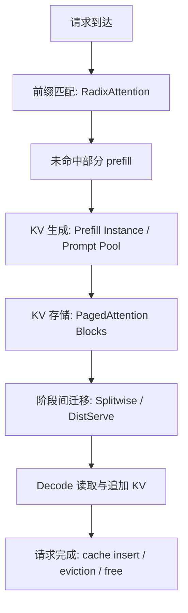

# 调研报告 2：KV Cache 优化技术栈

## 摘要

KV Cache 是大语言模型在线推理中最关键的动态资源之一。与模型权重不同，KV Cache 会随请求数量、上下文长度和输出长度动态增长；与临时 activation 不同，它需要跨多个 decode step 长期保留。因此，LLM serving 的瓶颈不仅是单次 forward 的算力，也包括 KV Cache 的显存占用、生命周期管理、跨请求共享、跨程序复用，以及在 prefill/decode 分离架构中的跨设备迁移。

本文围绕四篇代表性工作梳理 KV Cache 优化技术栈：PagedAttention/vLLM 解决 KV Cache 的显存碎片和 block 级管理问题；SGLang 的 RadixAttention 将共享前缀复用提升到语言模型程序层；Splitwise 从硬件异构、成本和功耗角度拆分 prompt/prefill 与 token generation；DistServe 从 TTFT/TPOT SLO 和 goodput 角度拆分 prefill 与 decoding，并优化资源配置和 placement。四者共同展示了 KV Cache 优化从“单机显存管理”走向“程序级复用”和“集群级资源编排”的演进路径。

## 1. 背景：为什么 KV Cache 成为推理系统核心瓶颈

Decoder-only Transformer 在自回归生成时，每生成一个 token 都需要访问此前所有 token 的 Key/Value 状态。为了避免重复计算历史 token，推理系统会保存每层 attention 的 KV Cache。对一个请求而言，KV Cache 大小可粗略表示为：

```text
KV_bytes = 2 * num_layers * hidden_size * sequence_length * bytes_per_element
```

其中 `2` 分别对应 Key 和 Value。KV Cache 的系统难点来自四个方面。

第一，KV Cache 随请求动态增长。输入 prompt 长度不同，输出长度也不可预知，系统很难提前准确分配显存。

第二，KV Cache 生命周期长。请求进入 decode 后，每一步都要保留并读取历史 K/V；当 batch 中存在大量长上下文请求时，KV Cache 会成为显存容量和带宽的主要压力。

第三，KV Cache 存在共享机会。多轮对话、few-shot prompt、beam search、parallel sampling、RAG 和 agent 分支常常共享长前缀，如果系统不能识别这些共享结构，就会重复 prefill 并重复存储相同 K/V。

第四，prefill 与 decode 对 KV Cache 的使用方式不同。Prefill 负责生成整段 prompt 的 KV Cache，更偏 compute-bound；decode 每步读取已有 KV Cache 并追加新 token，更偏 memory bandwidth-bound。两阶段混放会导致资源干扰和调度耦合。

因此，KV Cache 优化不是一个单点 kernel 问题，而是一条技术栈：从块式内存管理，到前缀复用，再到阶段拆分和集群级调度。

## 2. 技术栈总览

| 层次 | 代表技术 | 核心问题 | 关键机制 |
| --- | --- | --- | --- |
| KV 内存管理 | PagedAttention / vLLM | 连续显存分配导致碎片、预留浪费和共享困难 | fixed-size KV blocks、block table、copy-on-write |
| 前缀复用 | RadixAttention / SGLang | 多请求、多调用、多分支重复 prefill | radix tree prefix cache、cache-aware scheduling |
| 阶段拆分 | Splitwise | prefill 与 token generation 硬件需求不同 | prompt pool、token pool、mixed pool、KV transfer |
| Goodput 优化 | DistServe | prefill/decode colocate 造成 TTFT/TPOT 干扰 | disaggregated instances、parallelism search、topology-aware placement |

这四层并不是互斥方案，而是可以组合在同一 serving runtime 中。例如，底层用 PagedAttention 管理 KV blocks；上层用 RadixAttention 查找可复用前缀；集群层用 DistServe/Splitwise 将 prefill 产生的 KV Cache 迁移到 decode 资源池。

## 3. PagedAttention：把 KV Cache 变成分页式系统资源

PagedAttention 的出发点是：传统 serving 系统通常为每个请求预留连续 KV Cache 空间，但请求长度不可预知，导致 reserved waste、internal fragmentation 和 external fragmentation。论文指出，低效管理下，实际有效 token state 只占 KV Cache 显存的一小部分，这直接限制了 batch size。

PagedAttention 借鉴操作系统虚拟内存，将每个序列的 KV Cache 切分为固定大小 logical blocks，并通过 block table 映射到 physical KV blocks。物理 block 不需要连续，只有最后一个 block 可能产生内部碎片。

| 操作系统概念 | PagedAttention 对应概念 |
| --- | --- |
| process | request / sequence |
| virtual page | logical KV block |
| physical page | physical KV block |
| page table | block table |
| copy-on-write | shared prefix block 写时复制 |

vLLM 在此基础上实现了三个关键操作：`append` 用于序列增长时追加 token 并按需分配 block；`fork` 用于从已有序列派生新序列并共享 prefix blocks；`free` 用于请求结束后释放 block 或减少引用计数。对于 beam search 和 parallel sampling，多个候选序列可以共享 prompt 部分的物理 blocks；只有分叉后写入新 token 时才触发 copy-on-write。

PagedAttention 的重要意义在于，它没有改变 attention 的数学形式，而是改变 KV Cache 的地址组织方式。Attention kernel 需要通过 block table 找到每个 logical block 对应的 physical block，再读取 K/V 参与 QK、softmax 和 PV 计算。这样会引入间接寻址和非连续访存开销，但 vLLM 通过显著提高可容纳的并发 batch size，在端到端吞吐上获得更大收益。论文报告 vLLM 相比 FasterTransformer、Orca 等系统通常有 2-4 倍吞吐提升。

PagedAttention 的工程权衡集中在 block size：block 太小会增加 block table 和查表开销，太大则会增加最后一个 block 的内部碎片并降低共享粒度。论文中常见默认值为 16 tokens，可在碎片控制与 kernel 效率之间取得平衡。

## 4. RadixAttention：从块管理走向程序级前缀复用

PagedAttention 解决的是 KV Cache 如何高效存放和访问；SGLang 的 RadixAttention 进一步追问：真实 LLM 应用中，哪些 KV Cache 不应该重复计算？

现代 LLM 应用越来越像 language model programs，而不是一次 `prompt -> response` 调用。它们可能包含多轮对话、few-shot 示例、RAG 上下文、agent 工具调用、self-consistency、多分支推理、JSON/regex 结构化输出等。多个调用之间常常共享长前缀。由于某段 prefix 的 KV Cache 只依赖 prefix 本身，只要 token 序列相同，就可以复用其 K/V。

RadixAttention 使用 radix tree 组织 token prefix 与 KV Cache 的映射。新请求到达时，runtime 执行最长前缀匹配；命中的 prefix KV Cache 直接复用，只对未命中的 suffix 执行 prefill。生成结束或请求完成后，新产生的 token 序列也可以插入 radix tree，供后续请求使用。

核心操作包括：

- `match_prefix`：对输入 token 序列做最长前缀匹配。
- `insert`：把新计算出的 prefix/suffix 写入 radix tree。
- `split`：当新 token 序列与已有边部分重合时拆分节点。
- `evict`：显存不足时按 LRU 等策略驱逐叶子节点。
- `lock/ref count`：正在被请求使用的节点不能被驱逐。

SGLang 还提出 cache-aware scheduling：当等待队列中存在多个请求时，优先调度与当前 cache 共享前缀更长的请求，以提高命中率并减少刚计算出的 KV Cache 被驱逐后又重算。论文还结合 compressed FSM 加速结构化输出，使 JSON 等确定性格式片段可以 jump-forward，减少逐 token decode 的开销。

SGLang 的贡献不只是 RadixAttention 数据结构本身，而是把“程序结构”暴露给 runtime。vLLM 主要处理单请求或候选分支的 block 级共享；SGLang 则将跨请求、跨调用、跨分支的 prefix reuse 纳入统一运行时。论文报告 SGLang 在 agent control、logical reasoning、few-shot、JSON decoding、RAG、多轮对话等任务上，相比 Guidance、vLLM、LMQL 等系统最高获得约 6.4 倍吞吐提升。

## 5. Splitwise：按阶段拆分 KV Cache 的生产与消费

PagedAttention 和 RadixAttention 主要关注单机或 runtime 内的 KV Cache 管理与复用；Splitwise 将视角扩展到集群资源。它的核心判断是：prompt processing/prefill 与 token generation/decode 的硬件需求明显不同，不应总是放在同一组机器上运行。

Prefill 阶段一次处理完整 prompt，矩阵乘法规模较大，更容易利用 GPU 算力，因此更偏 compute-intensive。Decode 阶段每一步只生成一个 token，但需要反复读取历史 KV Cache，单步计算小，更偏 memory-intensive 或 memory-bandwidth-bound。Splitwise 基于 Azure 生产 traces 进一步观察到，代码生成和对话等业务的输入/输出长度分布差异很大，因此 prompt-heavy 与 output-heavy workload 的最优资源比例也不同。

Splitwise 设计三类机器池：

- Prompt pool：专门处理 prompt phase，生成 first token 和 KV Cache。
- Token pool：专门处理 token generation phase，接收 KV Cache 并继续生成。
- Mixed pool：根据负载动态切换角色，缓解某一阶段资源临时不足。

请求进入系统后，cluster-level scheduler 选择 prompt machine 和 token machine。Prompt machine 完成 prefill 后，将 KV Cache 传输到 token machine。为减少传输暴露在关键路径中的时间，Splitwise 使用 layer-wise transfer：prompt machine 每算完一层 KV，就尽早异步发送到 token machine，从而让通信与后续层计算重叠。

Splitwise 的目标函数偏向 throughput、cost 和 power。它指出 token generation 不一定需要最新、最强计算能力的 GPU，可以使用更低成本或更低 power cap 的硬件。论文报告，在一些配置下 Splitwise 可获得约 1.4 倍吞吐提升并降低约 20% 成本；在同功耗同成本预算下，可达到约 2.35 倍吞吐提升。

从 KV Cache 技术栈角度看，Splitwise 的关键贡献是把 KV Cache 从“同一 GPU 内部长期状态”变成“阶段间可迁移的请求状态”。这要求系统具备 KV Cache export/import、跨设备传输、同步和目标端重建能力。如果底层使用 PagedAttention，传输对象不再是简单连续 tensor，而是若干 KV blocks 及其 block table 映射。

## 6. DistServe：以 TTFT/TPOT SLO 为目标的 Prefill/Decode 解耦

DistServe 与 Splitwise 都主张拆分 prefill 与 decode，但关注点不同。Splitwise 更强调异构硬件、成本和功耗；DistServe 更强调在线服务质量，即在 TTFT 和 TPOT SLO 下最大化 per-GPU goodput。

DistServe 认为 colocated serving 有两个核心问题。第一是 prefill-decoding interference：长 prefill step 会阻塞 decode step，导致 TPOT 增大；decode 队列也会影响 prefill 的 TTFT。第二是 resource and parallelism coupling：prefill 和 decode 被迫共享同一资源配置和并行策略，而两者对 batch size、tensor parallelism、pipeline parallelism 的偏好并不一致。

DistServe 将系统抽象为两类 instance：

- Prefill instance：处理 prompt，生成 first token 和 KV Cache。
- Decoding instance：接收 KV Cache，执行后续自回归生成。

拆分后，系统获得三个自由度。第一，性能隔离：prefill 与 decode 不再互相排队干扰。第二，资源独立缩放：可为两阶段分配不同数量 GPU。第三，并行策略独立：prefill 可选择更有利于降低 TTFT 的策略，decode 可选择更有利于提高 rate capacity 和控制 TPOT 的策略。

DistServe 的 placement/search 会枚举 prefill 和 decoding 的资源规模、并行策略和拓扑位置，过滤掉无法满足 TTFT/TPOT SLO attainment 的方案，再以 per-GPU goodput 选择最优配置。由于拆分会引入 KV Cache 传输，系统还需要带宽感知 placement，尽量让 prefill instance 和 decoding instance 位于高速链路附近。

论文在多节点 GPU 集群上评估 OPT 系列模型，workload 包括 ShareGPT、HumanEval 和 LongBench。结果显示，在满足 TTFT/TPOT 约束的前提下，DistServe 相比已有 colocated serving 系统可支撑显著更高请求率；论文摘要报告最高可服务 7.4 倍更多请求，或满足 12.6 倍更严格的 SLO，并保持超过 90% 请求满足延迟约束。

从实现角度看，DistServe 可视为推理引擎之上的 orchestration layer。它可以与 continuous batching、FlashAttention、PagedAttention 等底层优化共存。真正复杂的部分在于跨实例 KV Cache 生命周期管理：导出源端 KV blocks、传输到目标端、分配目标端 blocks、重建 block table、维护引用计数并确保同步。

## 7. 四类技术的关系与组合方式

这四篇工作可以按“KV Cache 的生命周期”串起来理解。



一个现代 LLM serving 系统可以采用如下组合：

1. 使用 RadixAttention 在请求进入时做 prefix matching，减少重复 prefill。
2. 使用 PagedAttention 将命中和新生成的 KV Cache 统一组织为 fixed-size blocks。
3. 对 prefill-heavy 与 decode-heavy 阶段使用不同队列、batching 策略和资源池。
4. 在集群环境中，将 prefill 产生的 KV blocks 传输到 decoding instance。
5. 调度器同时考虑 arrival time、SLO、KV memory、prefix cache hit、网络拓扑和 eviction 风险。

这种组合也揭示了后续系统设计的难点：优化目标会发生冲突。例如，RadixAttention 希望保留热门 prefix，提高 cache hit rate；PagedAttention 希望有效回收 blocks，提高显存利用率；DistServe/Splitwise 希望把 KV Cache 迁移到最适合 decode 的资源池，但迁移会增加通信和状态同步复杂度。

## 8. 对比分析

| 维度 | PagedAttention / vLLM | RadixAttention / SGLang | Splitwise | DistServe |
| --- | --- | --- | --- | --- |
| 优化对象 | KV Cache 显存布局 | 共享 prefix 的 KV 复用 | prefill/decode 硬件资源池 | TTFT/TPOT SLO 下的 goodput |
| 抽象粒度 | KV block | token prefix / LM program | prompt pool / token pool | prefill instance / decoding instance |
| 主要瓶颈 | 碎片、预留、重复存储 | 重复 prefill、多调用冗余 | 阶段硬件需求不匹配 | 阶段干扰与并行策略耦合 |
| 核心机制 | block table、COW、allocator | radix tree、cache-aware scheduling | phase splitting、layer-wise KV transfer | disaggregation、placement search |
| 主要收益 | 更大 batch、更高吞吐 | 提高 prefix hit、减少重复计算 | 降低成本/功耗，提高吞吐 | 提高 SLO 内有效吞吐 |
| 主要代价 | 间接寻址、block size 调参 | tree 管理、eviction、命中率依赖 workload | KV 跨机传输、资源配比复杂 | orchestration 复杂、拓扑依赖 |

## 9. 工程落地路线

如果要实现一套 KV Cache 优化系统，可以按从低到高的顺序推进。

第一步，实现 block-based KV memory manager。需要支持 block 分配、释放、引用计数、block table、append/fork/free，以及 attention kernel 对非连续 KV blocks 的读取。

第二步，实现 prefix cache。维护 token prefix 到 KV blocks 的索引，支持最长前缀匹配、插入、拆分、锁定和驱逐。对于多轮对话、few-shot、RAG 和 agent workload，这一步通常比单纯扩大 batch 更有效。

第三步，让 scheduler 变成 cache-aware。调度不仅看请求到达时间和 batch size，也看 prefix hit、cache residency、block pressure 和 eviction cost。

第四步，拆分 prefill 与 decode 队列。Prefill 队列面向 TTFT，通常限制 batch token 数；decode 队列面向 TPOT/TBT，尽量维持较大的 active decode batch。

第五步，在多 GPU 或多节点环境中实现 KV Cache export/import。若底层是 PagedAttention，需要传输 KV blocks 和 block table 信息，并在目标端重新分配 blocks 与重建映射。

第六步，加入 provisioning 与 placement。系统需要根据 workload 的 prompt/output 分布、SLO、GPU 类型、网络拓扑、成本和功耗，周期性调整 prefill/decode 资源比例。

## 10. 本地 Week3 复测：Prefix Caching 与 Chunked Prefill

为了把上面的系统机制落到可观察的 serving 指标上，我们对 week3 的两个 KV Cache 相关任务重新做了一轮本地评测。模型为 `Qwen3.5-4B`，服务端使用 vLLM，客户端使用 `vllm bench serve --dataset-name random`。正式结果保存在 `benchmark-vllm-v.s-sglang/results/summary/`：

- Prefix caching：`formal_week3_task2_prefix_fixedlen_shard1024_2048_gpu2_20260702_2310.csv`、`formal_week3_task2_prefix_fixedlen_shard3072_4096_gpu4_20260702_2310.csv`、`formal_week3_task2_prefix_fixedlen_shard5120_6144_gpu7_20260702_2310.csv`。
- Chunked prefill：`formal_week3_task3_chunked_prefill_native_gpu3_20260702_2315.csv`。

### 10.1 Prefix Caching 复测

这次 prefix caching 复测相比旧测试做了两个关键调整。第一，加入了明确的 off baseline：同一组共享前缀长度、同一组并发、同样开启 chunked prefill，只切换 `--enable-prefix-caching` 与 `--no-enable-prefix-caching`。第二，将实际输入总长固定为 8192 tokens：`random_input_len = prompt_len - shared_prefix_len`，再配合 `random-prefix-len = shared_prefix_len`。这样不同共享前缀长度之间比较的是“同样总 prompt 长度下，共享部分占比变化”的收益，而不是“共享前缀越长、总输入也越长”的混合效应。

`vllm bench` 的 random dataset 会先生成一段固定 prefix token 序列，再对每个请求生成不同的 suffix token 序列。因此，本次 workload 更接近“多轮对话共享 system prompt / few-shot / RAG 模板，但用户消息不同”的场景：前缀完全一致，后续内容不同。

结果显示，30 组 paired case 中，开启 prefix caching 后平均 p50 TTFT 改善约 14.8%，请求吞吐和总 token 吞吐平均提升约 24.6%。收益随共享前缀长度明显增加：

| 共享前缀长度 | 平均 p50 TTFT 变化 | 平均吞吐变化 |
| --- | ---: | ---: |
| 1024 | -6.9% | -4.9% |
| 2048 | +5.1% | +7.5% |
| 3072 | +7.0% | +7.8% |
| 4096 | +17.6% | +26.8% |
| 5120 | +32.4% | +55.5% |
| 6144 | +33.4% | +55.0% |

这里的“变化”以 off baseline 为分母，正数表示开启 prefix caching 更好。可以看到，当共享前缀只有 1024 tokens 时，prefix caching 的管理和查找开销可能超过复用收益，p50 TTFT 和吞吐都略差；从 2048 tokens 开始收益转正，在 4096 tokens 以上收益变得稳定。最好的单点出现在 shared=5120、concurrency=16，请求吞吐提升约 88.6%；最差单点出现在 shared=1024、concurrency=16，吞吐下降约 7.0%。

旧版 prefix caching 测试也覆盖了 1024-6144 共享前缀和并发 1/2/4/8/16，并且额外采集了 vLLM `/metrics` 中的 prefix cache query/hit counter，因此能计算 token 级 `prefix_cache_hit_rate`。旧结果中 hit rate 随共享前缀长度从约 0、0.193、0.386 到 0.579 递增，这对解释机制很有价值。但旧测试在方法学上有两个不足：一是 on/off 作为两次独立 legacy run 管理，配置和结果归档不如新 Matrix Runner 统一；二是更容易把共享前缀长度变化与总输入长度变化混在一起。新测试更适合做 TTFT/吞吐收益归因，旧测试更适合解释 cache hit 机制。更理想的下一步，是把 legacy 的 `/metrics` hit-rate 采集逻辑接入新 Matrix Runner。

### 10.2 Chunked Prefill 复测

Chunked prefill 复测也做了调整。原 task3 依赖 `vllm bench sweep serve`，但本地 sweep wrapper 在 ready check 上卡住，没有进入实际 bench 子进程。因此本次改为 Matrix Runner 原生矩阵：server 分为 `chunked-prefill-on` 与 `chunked-prefill-off` 两组，每组只启动一次服务，扫 prompt length 8192/16384/24576、并发 1/2/4/8、输出 64 tokens，共 24 个 case。

本次 workload 不设置共享前缀，即 `random-prefix-len = 0`，目的是减少 prefix cache 复用对 chunked prefill 结论的干扰。需要注意的是，当前 on/off 仍同时切换了 prefix caching flag：on 组为 `--enable-prefix-caching --enable-chunked-prefill`，off 组为 `--no-enable-prefix-caching --no-enable-chunked-prefill`。由于请求之间没有显式共享前缀，prefix caching 的影响应较小，但严格隔离 chunked prefill 时，最好后续让 prefix caching 保持同一状态，只切换 chunked prefill。

新结果显示，12 组 paired case 中，chunked prefill 对 p50 TTFT 的平均改善只有约 2.8%，但请求吞吐和总 token 吞吐平均下降约 8.5%。按 prompt 长度看：

| Prompt 长度 | 平均 p50 TTFT 变化 | 平均吞吐变化 |
| --- | ---: | ---: |
| 8192 | +6.7% | -6.3% |
| 16384 | +7.5% | -10.2% |
| 24576 | -5.7% | -9.1% |

按并发看，chunked prefill 的收益更偏向高并发下的首 token 延迟：concurrency=1/2 时 p50 TTFT 平均变化为 -15.9%/-17.2%，即开启后更差；concurrency=4/8 时 p50 TTFT 平均改善 +14.5%/+29.9%。这符合 chunked prefill 的设计直觉：它不一定提高总吞吐，甚至可能因为切分 prefill 带来调度开销；但在多个长 prompt 并发排队时，它能减少单个长 prefill 长时间占用调度循环，从而改善高并发下的 TTFT。

旧版 chunked prefill 结果显示平均 p50 TTFT 改善约 34.9%、吞吐提升约 16.5%，看起来比本次复测更乐观。差异可能来自三点：第一，旧版每个 case 只有 3 个 measured requests，新版每个 case 使用 256 prompts，统计稳定性更好；第二，新版使用统一 Matrix Runner、统一 raw/summary 产物和 `vllm bench serve` 指标口径，减少了脚本层差异；第三，新版结果显示吞吐下降，提醒我们 chunked prefill 更像 latency/fairness 优化，而不是无条件吞吐优化。旧测试的优点是运行快，适合作为 smoke 或趋势探索；新测试更慢，但更适合正式报告中讨论延迟-吞吐权衡。

总体来看，prefix caching 的收益主要由共享前缀占比决定：短共享前缀不一定值得缓存，长共享前缀能显著改善 TTFT 和吞吐。Chunked prefill 的收益则主要由长 prompt 和并发压力决定：它能缓解高并发长 prefill 对 TTFT 的阻塞，但可能牺牲吞吐。因此，在真实系统里，这两类优化应该分别通过 cache hit rate、TTFT、TPOT 和吞吐共同评估，而不能只看单一指标。

## 11. 局限与开放问题

第一，KV Cache 复用高度依赖 workload。如果请求之间缺少共享 prefix，RadixAttention 的收益会下降，维护 radix tree 和 eviction 的成本仍然存在。

第二，阶段拆分依赖网络条件。对于长 prompt、大模型或跨节点低带宽环境，KV Cache transfer 可能成为新的瓶颈。Splitwise 和 DistServe 的结论通常建立在现代 GPU 集群高速互联和合理 placement 之上。

第三，多优化目标容易冲突。SLO、吞吐、成本、功耗、cache hit rate 和显存占用之间没有单一最优解，需要面向业务 workload 做配置搜索。

第四，底层 KV layout 与上层 runtime 的接口仍不够标准化。PagedAttention、RadixAttention、disaggregated serving 都需要操作 KV Cache，但不同系统对 KV blocks、block tables、cache handles、引用计数和迁移协议的抽象不一致。

第五，多模型、多租户和优先级调度会进一步复杂化 KV Cache 管理。热门 prefix 是否可跨租户共享、低优先级请求的 KV 是否应更早驱逐、speculative decoding 产生的临时 KV 如何回收，都是尚需深入研究的问题。

## 12. 结论

KV Cache 优化技术栈的演进可以概括为三句话。

第一，PagedAttention 将 KV Cache 从连续 tensor 变成可分页、可共享、可回收的系统资源，解决了显存碎片和动态增长问题。

第二，RadixAttention 将 KV Cache 复用从 block 级共享提升到程序级 prefix 共享，使多轮、多分支、多调用 LLM 应用能够避免重复 prefill。

第三，Splitwise 和 DistServe 将 KV Cache 视为可迁移的阶段间状态，通过 prefill/decode disaggregation 解除硬件、调度和并行策略耦合，从而优化成本、功耗和 SLO 内 goodput。

因此，未来高效 LLM serving 不会只依赖某个 attention kernel，而会依赖完整的 KV Cache 生命周期管理：生成、存储、匹配、共享、迁移、读取、追加、驱逐和回收。谁能把这些环节统一到一个稳定、可观测、可调度的 runtime 中，谁就更可能在真实在线负载下获得持续吞吐和成本优势。

## 参考文献

1. Kwon, W., Li, Z., Zhuang, S., Sheng, Y., Zheng, L., Yu, C. H., Gonzalez, J., Zhang, H., & Stoica, I. (2023). *Efficient Memory Management for Large Language Model Serving with PagedAttention*. SOSP 2023.
2. Zheng, L., Yin, L., Xie, Z., Sun, C., Huang, J., Yu, C. H., Cao, S., Kozyrakis, C., Stoica, I., Gonzalez, J. E., Barrett, C., & Sheng, Y. *SGLang: Efficient Execution of Structured Language Model Programs*.
3. Patel, P., Choukse, E., Zhang, C., Shah, A., Goiri, I., Maleki, S., & Bianchini, R. (2024). *Splitwise: Efficient Generative LLM Inference Using Phase Splitting*. ISCA 2024.
4. Zhong, Y., Liu, S., Chen, J., Hu, J., Zhu, Y., Liu, X., Jin, X., & Zhang, H. (2024). *DistServe: Disaggregating Prefill and Decoding for Goodput-optimized Large Language Model Serving*. OSDI 2024.
